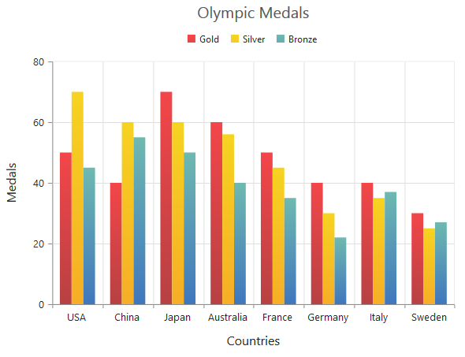
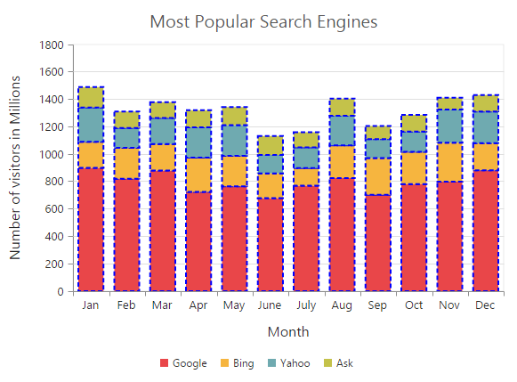
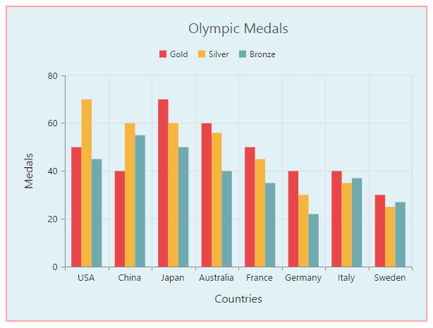
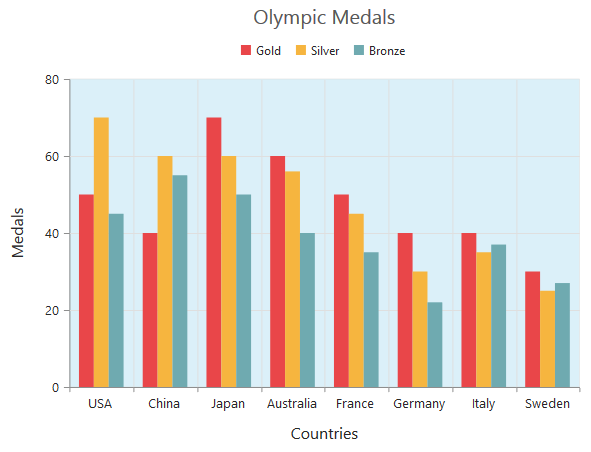
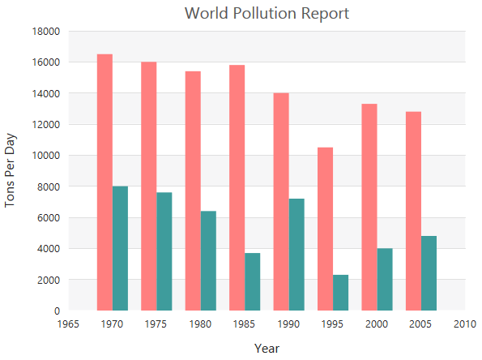

# Appearance

## Custom Color Palette

The Chart displays different series in different colors by default. You can customize the color of each series by providing a custom color palette of your choice by using the `e-palette`property. 



<html xmlns="http://www.w3.org/1999/xhtml" lang="en" ng-app="ChartApp">
    <head>
        <title>Essential Studio for AngularJS: Chart</title>
        <!--CSS and Script file References -->
    </head>
    <body ng-controller="ChartCtrl">
        

        

        
    </body>
</html>
    



N> The Color palette is applied to the points in accumulation type series

## Built-in Themes

Following are the built-in themes available in the Chart

* flatlight
* flatdark
* gradientlight
* gradientdark
* azure
* azuredark
* lime
* limedark
* saffron
* saffrondark
* gradient-azure
* gradient-azuredark
* gradient-lime
* gradient-limedark
* gradient-saffron
* gradient-saffrondark

You can set your desired theme by using the `e-theme` property. Flat light is the default theme used in the Chart.



 <html xmlns="http://www.w3.org/1999/xhtml" lang="en" ng-app="ChartApp">
    <head>
        <title>Essential Studio for AngularJS: Chart</title>
        <!--CSS and Script file References -->
    </head>
    <body ng-controller="ChartCtrl">
        

        

        
    </body>
</html>
    



## Point level customization

Marker, data label and fill color of each point in a series can be customized individually by using the `e-points` collection.


 <html xmlns="http://www.w3.org/1999/xhtml" lang="en" ng-app="ChartApp">
    <head>
        <title>Essential Studio for AngularJS: Chart</title>
        <!--CSS and Script file References -->
    </head>
    <body ng-controller="ChartCtrl">
        

        <e-series>
        <e-series>
        <e-points>
        <e-points e-x="0" e-y="210" e-fill="#E27F2D" e-marker-visible="true" >
        </e-points>
        </e-series>
        </e-series>
        

        
    </body>
</html>
    



## Series border customization

To customize the series border color, width and dashArray, you can use `e-series-border` option. 

N> Series border can be applied to all the series (except Line, Spline, HiLo, HiLoOpenClose and StepLine series).



 <html xmlns="http://www.w3.org/1999/xhtml" lang="en" ng-app="ChartApp">
    <head>
        <title>Essential Studio for AngularJS: Chart</title>
        <!--CSS and Script file References -->
    </head>
    <body ng-controller="ChartCtrl">
        

        <e-series>
        <e-series e-series-border-color="blue" e-series-border-width="2"
        e-series-border-dasharray="5,3"></e-series>
        </e-series>
        

        
    </body>
</html>
 



## Chart area customization

### Customize chart background

The Chart background can be customized by using the `e-background` property of the Chart. To customize the chart border, use `e-border` option of the chart. 



<html xmlns="http://www.w3.org/1999/xhtml" lang="en" ng-app="ChartApp">
    <head>
        <title>Essential Studio for AngularJS: Chart</title>
        <!--CSS and Script file References -->
    </head>
    <body ng-controller="ChartCtrl">
        

        

        
    </body>
</html>
   

 

**Chart Margin**

The Chart `e-margin` property is used to add the margin to the chart area at the left, right, top and bottom position.



<html xmlns="http://www.w3.org/1999/xhtml" lang="en" ng-app="ChartApp">
    <head>
        <title>Essential Studio for AngularJS: Chart</title>
        <!--CSS and Script file References -->
    </head>
    <body ng-controller="ChartCtrl">
        

        

        
    </body>
</html>
 

 

**Setting background image**

Background image can be added to the chart by using the `e-backGroundImageUrl` property.



<html xmlns="http://www.w3.org/1999/xhtml" lang="en" ng-app="ChartApp">
    <head>
        <title>Essential Studio for AngularJS: Chart</title>
        <!--CSS and Script file References -->
    </head>
    <body ng-controller="ChartCtrl">
        

        

        
    </body>
</html>
 

**Chart area background**

The Chart area background can be customized by using the `e-chartarea-background`property . 



 <html xmlns="http://www.w3.org/1999/xhtml" lang="en" ng-app="ChartApp">
    <head>
        <title>Essential Studio for AngularJS: Chart</title>
        <!--CSS and Script file References -->
    </head>
    <body ng-controller="ChartCtrl">
        

        

        
    </body>
</html>

 

### Customize chart area grid bands

You can provide different color for alternate grid rows and columns formed by the grid lines in the chart area by using the `e-primaryyaxis-alternateGridBand` property of the axis. The properties `odd` and `even` are used to customize the grid bands at odd and even positions respectively. 



 <html xmlns="http://www.w3.org/1999/xhtml" lang="en" ng-app="ChartApp">
    <head>
        <title>Essential Studio for AngularJS: Chart</title>
        <!--CSS and Script file References -->
    </head>
    <body ng-controller="ChartCtrl">
        

        

        
    </body>
</html>

 

### Animation

You can enable animation by using the `e-enableAnimation`property of the series. This animates the chart series on two occasions – when the chart is loaded for the first time or whenever you change the series type by using the type property.



 <html xmlns="http://www.w3.org/1999/xhtml" lang="en" ng-app="ChartApp">
    <head>
        <title>Essential Studio for AngularJS: Chart</title>
        <!--CSS and Script file References -->
    </head>
    <body ng-controller="ChartCtrl">
        

        <e-series>
        <e-series e-enableanimation="true"></e-series>
        </e-series>
        

        
    </body>
</html>



However, you can force the chart to animate series by calling the animate method as illustrated in the following code example,



<html xmlns="http://www.w3.org/1999/xhtml" lang="en" ng-app="ChartApp">
    <head>
        <title>Essential Studio for AngularJS: Chart</title>
        <!--CSS and Script file References -->
    </head>
    <body ng-controller="ChartCtrl">
        

        <e-series>
        <e-series e-enableanimation="true"></e-series>
        </e-series>
        

        
    </body>
</html> 



