# ChartTypes

## Line Chart

To render a Line Chart, set the series `e-type` as **"line"** in the chart series. To change the line segment color, you can use the `e-fill` property of the series.



<html xmlns="http://www.w3.org/1999/xhtml" lang="en" ng-app="ChartApp">
    <head>
        <title>Essential Studio for AngularJS: Chart</title>
        <!--CSS and Script file References -->
    </head>
    <body ng-controller="ChartCtrl">
        

        <e-series>
            <e-series  e-type="line" e-fill="#E94649"></e-series>
        </e-series>
        

        
    </body>
</html>



### Change the line width

To change the width of the line segment, you can use the `e-width` property in the series.


 <html xmlns="http://www.w3.org/1999/xhtml" lang="en" ng-app="ChartApp">
    <head>
        <title>Essential Studio for AngularJS: Chart</title>
        <!--CSS and Script file References -->
    </head>
    <body ng-controller="ChartCtrl">
        

        <e-series>
            <e-series  e-type="line" e-width="3"></e-series>
        </e-series>
        

        
    </body>
</html>



### Dashed lines

To render the line series with dotted lines, you can use the `e-dashArray` option of the series.



<html xmlns="http://www.w3.org/1999/xhtml" lang="en" ng-app="ChartApp">
    <head>
        <title>Essential Studio for AngularJS: Chart</title>
        <!--CSS and Script file References -->
    </head>
    <body ng-controller="ChartCtrl">
        

        <e-series>
            <e-series  e-type="line" e-dashArray="5,5"></e-series>
        </e-series>
        

        
    </body>
</html>



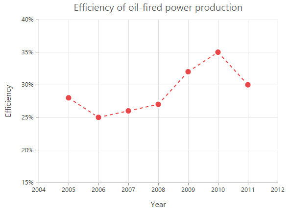

### Changing the line cap

For customizing the start and end caps of the line segment, you can use the `e-lineCap`property.  



<html xmlns="http://www.w3.org/1999/xhtml" lang="en" ng-app="ChartApp">
    <head>
        <title>Essential Studio for AngularJS: Chart</title>
        <!--CSS and Script file References -->
    </head>
    <body ng-controller="ChartCtrl">
        

        <e-series>
            <e-series  e-lineCap="square"></e-series>
        </e-series>
        

        
    </body>
</html>



### Changing the line join

You can use the `e-linejoin` property to specify how two intersecting line segments should be joined.



<html xmlns="http://www.w3.org/1999/xhtml" lang="en" ng-app="ChartApp">
    <head>
        <title>Essential Studio for AngularJS: Chart</title>
        <!--CSS and Script file References -->
    </head>
    <body ng-controller="ChartCtrl">
        

        <e-series>
            <e-series  e-lineJoin="round"></e-series>
        </e-series>
        

        
    </body>
</html>



### MultiColor Line

You can change the color of the line segments by using the `e-fill` property of the each `e-points` in the series.



html xmlns="http://www.w3.org/1999/xhtml" lang="en" ng-app="ChartApp">
    <head>
        <title>Essential Studio for AngularJS: Chart</title>
        <!--CSS and Script file References -->
    </head>
    <body ng-controller="ChartCtrl">
        

        <e-series>
            <e-series  e-points="points"></e-series>
        </e-series>
        

        
    </body>
</html>
     



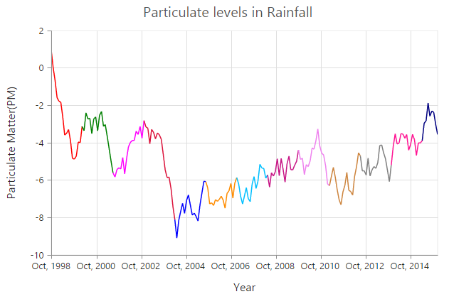

## Step Line Chart

To render a Step Line Chart, set the series `e-type` as **"stepline"** in the chart series. To change the StepLine segment color, you can use the `e-fill` property of the series.



<html xmlns="http://www.w3.org/1999/xhtml" lang="en" ng-app="ChartApp">
    <head>
        <title>Essential Studio for AngularJS: Chart</title>
        <!--CSS and Script file References -->
    </head>
    <body ng-controller="ChartCtrl">
        

        <e-series>
            <e-series  e-type="stepline" e-fill="#E94649"></e-series>
        </e-series>
        

        
    </body>
</html>



### Changing the line width

To change the line width, you can use the **width** property.  



<html xmlns="http://www.w3.org/1999/xhtml" lang="en" ng-app="ChartApp">
    <head>
        <title>Essential Studio for AngularJS: Chart</title>
        <!--CSS and Script file References -->
    </head>
    <body ng-controller="ChartCtrl">
        

        <e-series>
            <e-series  e-width="3"></e-series>
        </e-series>
        

        
    </body>
</html>


### Dashed lines

To render the step line series with dotted lines, you can use the `e-dasharray` option of the series.



<html xmlns="http://www.w3.org/1999/xhtml" lang="en" ng-app="ChartApp">
    <head>
        <title>Essential Studio for AngularJS: Chart</title>
        <!--CSS and Script file References -->
    </head>
    <body ng-controller="ChartCtrl">
        

        <e-series>
            <e-series  e-dashArray="5,5"></e-series>
        </e-series>
        

        
    </body>
</html>
    
           
   



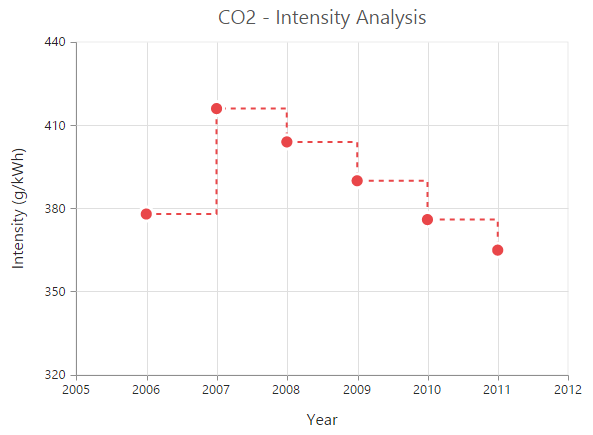

### Changing the line cap

For customizing the start and end caps of the line segment, you can use the `e-linecap` property.  



<html xmlns="http://www.w3.org/1999/xhtml" lang="en" ng-app="ChartApp">
    <head>
        <title>Essential Studio for AngularJS: Chart</title>
        <!--CSS and Script file References -->
    </head>
    <body ng-controller="ChartCtrl">
        

        <e-series>
            <e-series  e-lineCap="square"></e-series>
        </e-series>
        

        
    </body>
</html>



### Changing the line join

You can use the `e-linejoin` property to specify how two intersecting line segments should be joined.



<html xmlns="http://www.w3.org/1999/xhtml" lang="en" ng-app="ChartApp">
    <head>
        <title>Essential Studio for AngularJS: Chart</title>
        <!--CSS and Script file References -->
    </head>
    <body ng-controller="ChartCtrl">
        

        <e-series>
            <e-series  e-lineJoin="round"></e-series>
        </e-series>
        

        
    </body>
</html>



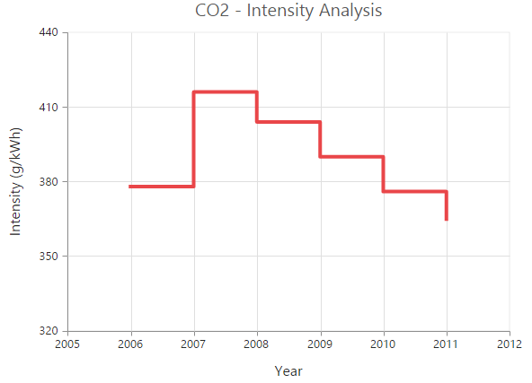

## Area Chart

To render an Area chart, you can specify the series `e-type` as **"area"** in the chart series. To change the Area color, you can use the `e-fill` property of the series.



<html xmlns="http://www.w3.org/1999/xhtml" lang="en" ng-app="ChartApp">
    <head>
        <title>Essential Studio for AngularJS: Chart</title>
        <!--CSS and Script file References -->
    </head>
    <body ng-controller="ChartCtrl">
        

        <e-series>
            <e-series  e-type="area"  e-fill = "#69D2E7"></e-series>
        </e-series>
        

        
    </body>
</html>



## Range Area Chart

To render a Range Area Chart, set the `e-type` as **"rangeArea"** in the chart series. To change the RangeArea color, you can use the `e-fill` property of the series.

Since the RangeArea series requires two y values for a point, you have to add the `e-high` and `e-low`value. High and Low value specifies the maximum and minimum range of the points.

* When you are using the `e-points` option, specify the high and low values by using the `e-high` and `e-low` option of the point.

* When you are using the `e-datasource` option to assign the data, map the fields from the dataSource that contain high and low values by using the `e-series-high` and `e-series-low` options. 



<html xmlns="http://www.w3.org/1999/xhtml" lang="en" ng-app="ChartApp">
    <head>
        <title>Essential Studio for AngularJS: Chart</title>
        <!--CSS and Script file References -->
    </head>
    <body ng-controller="ChartCtrl">
        

        <e-series>
            <e-series  e-type="rangeArea"  e-datasource="dataSource" e-xName="x"  e-high="high"  e-low="low" e-fill="Indigo"></e-series>
        </e-series>
        

        
    </body>
</html>
 


## Step Area Chart

To render a Step Area Chart, set the `e-type` as **"stepArea"** in the chart series. To change the StepArea color, you can use the `e-fill` property of the series.



<html xmlns="http://www.w3.org/1999/xhtml" lang="en" ng-app="ChartApp">
    <head>
        <title>Essential Studio for AngularJS: Chart</title>
        <!--CSS and Script file References -->
    </head>
    <body ng-controller="ChartCtrl">
        

        <e-series>
            <e-series  e-type="stepArea"  e-fill="#69D2E7"></e-series>
        </e-series>
        

        
    </body>
</html>



## Spline Area Chart

To render a Spline Area Chart, set the `e-type` as **"splineArea"** in the chart series. To change the SplineArea color, you can use the `e-fill` property of the series.



 <html xmlns="http://www.w3.org/1999/xhtml" lang="en" ng-app="ChartApp">
    <head>
        <title>Essential Studio for AngularJS: Chart</title>
        <!--CSS and Script file References -->
    </head>
    <body ng-controller="ChartCtrl">
        

        <e-series>
            <e-series  e-type="splineArea"  e-fill="#C4C24A"></e-series>
        </e-series>
        

        
    </body>
</html>



## Stacked Area Chart

To render a Stacked Area Chart, set the `e-type` as **"stackingArea"** in the chart series. To change the StackingArea color, you can use the `e-fill` property of the series.



<html xmlns="http://www.w3.org/1999/xhtml" lang="en" ng-app="ChartApp">
    <head>
        <title>Essential Studio for AngularJS: Chart</title>
        <!--CSS and Script file References -->
    </head>
    <body ng-controller="ChartCtrl">
        

        <e-series>
            <e-series  e-type="stackingArea"  e-fill="#69D2E7"></e-series>
        </e-series>
        

        
    </body>
</html>



## 100% Stacked Area Chart  

To render a 100% Stacked Area Chart, set the `e-type` as **"stackingArea100"** in the chart series. To change the StackingArea100 color, you can use the `e-fill` property of the series.   



<html xmlns="http://www.w3.org/1999/xhtml" lang="en" ng-app="ChartApp">
    <head>
        <title>Essential Studio for AngularJS: Chart</title>
        <!--CSS and Script file References -->
    </head>
    <body ng-controller="ChartCtrl">
        

        <e-series>
            <e-series  e-type="stackingArea100"  e-fill="#C4C24A"></e-series>
        </e-series>
        

        
    </body>
</html>



## Column Chart

To render a Column Chart, set the `e-type` as **"column"** in the chart series. To change the color of the column series, you can use the `e-fill` property.  



<html xmlns="http://www.w3.org/1999/xhtml" lang="en" ng-app="ChartApp">
    <head>
        <title>Essential Studio for AngularJS: Chart</title>
        <!--CSS and Script file References -->
    </head>
    <body ng-controller="ChartCtrl">
        

        <e-series>
            <e-series  e-type="column"  e-fill="#E94649"></e-series>
        </e-series>
        

        
    </body>
</html>



### Change a point color

You can change the color of a column by using the `fill` property of the point.



<html xmlns="http://www.w3.org/1999/xhtml" lang="en" ng-app="ChartApp">
    <head>
        <title>Essential Studio for AngularJS: Chart</title>
        <!--CSS and Script file References -->
    </head>
    <body ng-controller="ChartCtrl">
        

        <e-series>
        <e-series e-points="points"></e-series>
        </e-series>
        

        
    </body>
</html>



### Column width customization

Width of the column type series can be customized by using the `e-columnWidth` property. Default value of `e-columnWidth` is 0.7. Value ranges from 0 to 1. Here 1 corresponds to 100% of available width and 0 corresponds to 0% of available width.

N> Width of a column also depends upon the `e-columnSpacing` property, because `e-columnSpacing` will reduce the space available for drawing a column. This is also applicable for StackingColumn, StackingColumn100, Bar, StackingBar, StackingBar100, RangeColumn, HiLo, HiLoOpenClose, Candle and Waterfall charts.



 <html xmlns="http://www.w3.org/1999/xhtml" lang="en" ng-app="ChartApp">
    <head>
        <title>Essential Studio for AngularJS: Chart</title>
        <!--CSS and Script file References -->
    </head>
    <body ng-controller="ChartCtrl">
        

        <e-series>
            <e-series  e-columnwidth="0.8"></e-series>
        </e-series>
        

        
    </body>
</html>



### Column with rounded corners
Corners of the column chart can be customized by setting value to the `e-cornerradius` property.



<html xmlns="http://www.w3.org/1999/xhtml" lang="en" ng-app="ChartApp">
    <head>
        <title>Essential Studio for AngularJS: Chart</title>
        <!--CSS and Script file References -->
    </head>
    <body ng-controller="ChartCtrl">
        

         

        
    </body>
</html>



### Spacing between column series

Spacing between column type series can be customized using the `e-columnspacing` property. Default value of `e-columnSpacing` is 0. Value ranges from 0 to 1. Here 1 corresponds to 100% available space and 0 corresponds to 0% available space.

N> Column spacing will also affect the width of the column. For example, setting 20% spacing and 100% width will render columns with 80% of total width. This is also applicable for StackingColumn, StackingColumn100, Bar, StackingBar, StackingBar100, RangeColumn, HiLo, HiLoOpenClose, Candle and Waterfall charts.



<html xmlns="http://www.w3.org/1999/xhtml" lang="en" ng-app="ChartApp">
    <head>
        <title>Essential Studio for AngularJS: Chart</title>
        <!--CSS and Script file References -->
    </head>
    <body ng-controller="ChartCtrl">
        

        <e-series>
            <e-series  e-columnspacing="0.2"></e-series>
        </e-series>
        

        
    </body>
</html>


### Cylindrical Chart

To render a cylindrical chart, set the `e-columnfacet` property as "cylinder" in the chart series along with the series type. 

The following chart types can be rendered as cylinder in both 2D and in 3D view.

* Column Chart, Bar Chart, Stacked Column Chart, Stacked Bar Chart, 100% Stacked Column Chart, 100% Stacked Bar Chart.



<html xmlns="http://www.w3.org/1999/xhtml" lang="en" ng-app="ChartApp">
    <head>
        <title>Essential Studio for AngularJS: Chart</title>
        <!--CSS and Script file References -->
    </head>
    <body ng-controller="ChartCtrl">
        

        <e-series>
            <e-series  e-type="column" e-columnfacet="cylinder"></e-series>
        </e-series>
        

        
    </body>
</html>  



## RangeColumn Chart

To render a Range Column Chart, set the `e-type` as **"rangeColumn"** in the chart series. To change the RangeColumn color, use the `e-fill` property of the series.

Since, the RangeColumn series requires two y values for a point, add the `e-high` and `e-low` value. High and Low value specifies the maximum and minimum range of the points.

* When you are using the `e-points` option, specify the high and low values by using the `high` and `low` option of the point.

* When you are using the `e-datasource` option to assign the data, you have to map the fields from the dataSource that contains high and low values by using the `e-series-high` and `e-series-low` options.  



<html xmlns="http://www.w3.org/1999/xhtml" lang="en" ng-app="ChartApp">
    <head>
        <title>Essential Studio for AngularJS: Chart</title>
        <!--CSS and Script file References -->
    </head>
    <body ng-controller="ChartCtrl">
        

        <e-series>
            <e-series  e-type="rangeColumn"  e-datasource="dataSource" e-xName="x"  e-high="high"  e-low="low" e-fill="#E94649"></e-series>
        </e-series>
        

        
    </body>
</html>



### Change a point color 

To change the color of a range column, you can use the `fill` property of point. 



<html xmlns="http://www.w3.org/1999/xhtml" lang="en" ng-app="ChartApp">
    <head>
        <title>Essential Studio for AngularJS: Chart</title>
        <!--CSS and Script file References -->
    </head>
    <body ng-controller="ChartCtrl">
        

        <e-series>
        <e-series e-points="points"></e-series>
        </e-series>
        

        
    </body>
</html>



## Stacked Column Chart

To render a Stacked Column Chart, set the `e-type` as **"stackingColumn"** in the chart series. To change the StackingColumn color, you can use the `e-fill` property of the series.



 <html xmlns="http://www.w3.org/1999/xhtml" lang="en" ng-app="ChartApp">
    <head>
        <title>Essential Studio for AngularJS: Chart</title>
        <!--CSS and Script file References -->
    </head>
    <body ng-controller="ChartCtrl">
        

        <e-series>
            <e-series  e-type="stackingColumn"  e-fill="#E94649"></e-series>
        </e-series>
        

        
    </body>
</html>
    



### Group stacked columns

You can use the `e-stackinggroup` property to group the stacked columns. Columns with same group name are stacked on top of each other.



<html xmlns="http://www.w3.org/1999/xhtml" lang="en" ng-app="ChartApp">
    <head>
        <title>Essential Studio for AngularJS: Chart</title>
        <!--CSS and Script file References -->
    </head>
    <body ng-controller="ChartCtrl">
        

        <e-series>
            <e-series e-stackinggroup="GroupOne"></e-series>
        </e-series>
        

        
    </body>
</html>



### Change a point color

To change the color of a stacking column, you can use the `fill` property of the point. 



 <html xmlns="http://www.w3.org/1999/xhtml" lang="en" ng-app="ChartApp">
    <head>
        <title>Essential Studio for AngularJS: Chart</title>
        <!--CSS and Script file References -->
    </head>
    <body ng-controller="ChartCtrl">
        

        <e-series>
        <e-series e-points="points"></e-series>
        </e-series>
        

        
    </body>
</html>



## 100% Stacked Column Chart    

To render a 100% Stacked Column Chart, set the `e-type` as **"stackingColumn100"** in the chart series. To change the StackingColumn100 color, you can use the `e-fill` property of the series.



<html xmlns="http://www.w3.org/1999/xhtml" lang="en" ng-app="ChartApp">
    <head>
        <title>Essential Studio for AngularJS: Chart</title>
        <!--CSS and Script file References -->
    </head>
    <body ng-controller="ChartCtrl">
        

        <e-series>
            <e-series  e-type="stackingcolumn100"  e-fill="#E94649"></e-series>
        </e-series>
        

        
    </body>
</html>
 



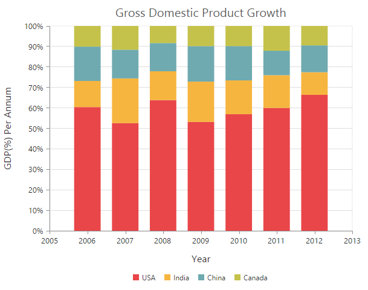

### Group 100% stacked columns

By using the `e-stackinggroup` property, you can group the 100% stacking columns. Columns with same group name are stacked on top of each other. 



<html xmlns="http://www.w3.org/1999/xhtml" lang="en" ng-app="ChartApp">
    <head>
        <title>Essential Studio for AngularJS: Chart</title>
        <!--CSS and Script file References -->
    </head>
    <body ng-controller="ChartCtrl">
        

        <e-series>
            <e-series  e-stackinggroup="GroupOne"></e-series>
             <e-series  e-stackinggroup="GroupOne"></e-series>
        </e-series>
        

        
    </body>
</html>



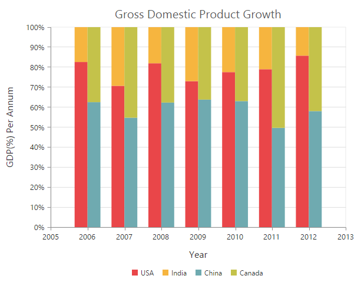

### Change a point color

To change the color of a 100% stacking column, you can use the `fill` property of the point. 



  <html xmlns="http://www.w3.org/1999/xhtml" lang="en" ng-app="ChartApp">
    <head>
        <title>Essential Studio for AngularJS: Chart</title>
        <!--CSS and Script file References -->
    </head>
    <body ng-controller="ChartCtrl">
        

        <e-series>
        <e-series e-points="points"></e-series>
        </e-series>
        

        
    </body>
</html>



## Bar Chart

To render a bar Chart, set the `e-type` as **"bar"** in the chart series. To change the bar color, you can use the `e-fill` property of the series.


<html xmlns="http://www.w3.org/1999/xhtml" lang="en" ng-app="ChartApp">
    <head>
        <title>Essential Studio for AngularJS: Chart</title>
        <!--CSS and Script file References -->
    </head>
    <body ng-controller="ChartCtrl">
        

        <e-series>
            <e-series  e-type="bar" e-fill="#E94649"></e-series>            
        </e-series>
        

        
    </body>
</html>



### Change the color of a bar

By using the `fill` property of the point, you can change the specific point of the series. 


<html xmlns="http://www.w3.org/1999/xhtml" lang="en" ng-app="ChartApp">
    <head>
        <title>Essential Studio for AngularJS: Chart</title>
        <!--CSS and Script file References -->
    </head>
    <body ng-controller="ChartCtrl">
        

        <e-series>
        <e-series e-points="points"></e-series>
        </e-series>
        

        
    </body>
</html>



## Stacked Bar Chart

To render a Stacked Bar Chart, set the `e-type` as **"stackingBar"** in the chart series. To change the StackingBar color, you can use the `e-fill` property of the series.



<html xmlns="http://www.w3.org/1999/xhtml" lang="en" ng-app="ChartApp">
    <head>
        <title>Essential Studio for AngularJS: Chart</title>
        <!--CSS and Script file References -->
    </head>
    <body ng-controller="ChartCtrl">
        

        <e-series>
            <e-series  e-type="stackingBar" e-fill="#E94649"></e-series>            
        </e-series>
        

        
    </body>
</html>
        



### Group stacked bars

You can use the `e-stackinggroup` property to group the stacking bars with the same group name. 


<html xmlns="http://www.w3.org/1999/xhtml" lang="en" ng-app="ChartApp">
    <head>
        <title>Essential Studio for AngularJS: Chart</title>
        <!--CSS and Script file References -->
    </head>
    <body ng-controller="ChartCtrl">
        

        <e-series>
            <e-series  e-stackinggroup="GroupOne"></e-series>
             <e-series  e-stackinggroup="GroupOne"></e-series>
        </e-series>
        

        
    </body>
</html>



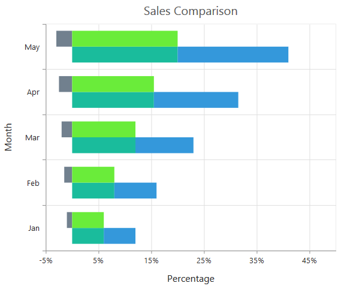

### Change a point color

You can change the color of a stacking bar by using the `fill` property of the point.



 <html xmlns="http://www.w3.org/1999/xhtml" lang="en" ng-app="ChartApp">
    <head>
        <title>Essential Studio for AngularJS: Chart</title>
        <!--CSS and Script file References -->
    </head>
    <body ng-controller="ChartCtrl">
        

        <e-series>
        <e-series e-points="points"></e-series>
        </e-series>
        

        
    </body>
</html>



## 100% Stacked Bar Chart

To render a 100% Stacked Bar Chart, set the `e-type` as **"stackingBar100"** in the chart series. To change the StackingBar100 color, you can use the `e-fill` property of the series.



<html xmlns="http://www.w3.org/1999/xhtml" lang="en" ng-app="ChartApp">
    <head>
        <title>Essential Studio for AngularJS: Chart</title>
        <!--CSS and Script file References -->
    </head>
    <body ng-controller="ChartCtrl">
        

        <e-series>
            <e-series  e-type="stackingBar100" e-fill="#E94649"></e-series>            
        </e-series>
        

        
    </body>
</html>
        



By using the `e-stackingGroup` property, you can group the 100% stacking bars with the same group name. 



<html xmlns="http://www.w3.org/1999/xhtml" lang="en" ng-app="ChartApp">
    <head>
        <title>Essential Studio for AngularJS: Chart</title>
        <!--CSS and Script file References -->
    </head>
    <body ng-controller="ChartCtrl">
        

        <e-series>
            <e-series  e-stackinggroup="GroupOne"></e-series>
             <e-series  e-stackinggroup="GroupOne"></e-series>
        </e-series>
        

        
    </body>
</html>



### Change a point color

To change the color of a 100% stacking bar, you can use the `fill` property of the point. 



 <html xmlns="http://www.w3.org/1999/xhtml" lang="en" ng-app="ChartApp">
    <head>
        <title>Essential Studio for AngularJS: Chart</title>
        <!--CSS and Script file References -->
    </head>
    <body ng-controller="ChartCtrl">
        

        <e-series>
        <e-series e-points="points"></e-series>
        </e-series>
        

        
    </body>
</html>



## Spline Chart

To render a Spline Chart, set the `e-type` as **"spline"** in the chart series. To change the Spline segment color, you can use the `e-fill` property of the series.


<html xmlns="http://www.w3.org/1999/xhtml" lang="en" ng-app="ChartApp">
    <head>
        <title>Essential Studio for AngularJS: Chart</title>
        <!--CSS and Script file References -->
    </head>
    <body ng-controller="ChartCtrl">
        

        <e-series>
            <e-series  e-type="spline" e-fill="#6ADCB0"></e-series>            
        </e-series>
        

        
    </body>
</html>
        



### Change the spline width

To change the spline segment width, you can use the `e-width` property of the series.


<html xmlns="http://www.w3.org/1999/xhtml" lang="en" ng-app="ChartApp">
    <head>
        <title>Essential Studio for AngularJS: Chart</title>
        <!--CSS and Script file References -->
    </head>
    <body ng-controller="ChartCtrl">
        

        <e-series>
            <e-series  e-type="spline" e-fill="#6ADCB0" e-width="3"></e-series>            
        </e-series>
        

        
    </body>
</html>



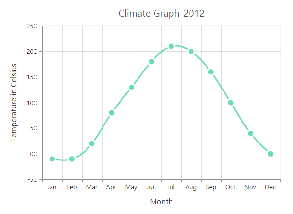

### Dashed lines

To render the spline series with dotted lines, you can use the `e-dasharray` option of the series.



<html xmlns="http://www.w3.org/1999/xhtml" lang="en" ng-app="ChartApp">
    <head>
        <title>Essential Studio for AngularJS: Chart</title>
        <!--CSS and Script file References -->
    </head>
    <body ng-controller="ChartCtrl">
        

        <e-series>
            <e-series  e-type="spline" e-dasharray="5,5"></e-series>            
        </e-series>
        

        
    </body>
</html>



## Pie Chart

You can create a pie chart by setting the series `e-type` as **"pie"** in the chart series.



<html xmlns="http://www.w3.org/1999/xhtml" lang="en" ng-app="ChartApp">
    <head>
        <title>Essential Studio for AngularJS: Chart</title>
        <!--CSS and Script file References -->
    </head>
    <body ng-controller="ChartCtrl">
        

        <e-series>
            <e-series  e-type="pie"></e-series>            
        </e-series>
        

        
    </body>
</html>



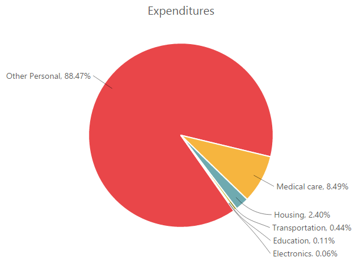

### Change the pie size

You can use the `e-pieCoefficient` property to change the diameter of the Pie chart with respect to the plot area. It ranges from 0 to 1 and the default value is **0.8**.



<html xmlns="http://www.w3.org/1999/xhtml" lang="en" ng-app="ChartApp">
    <head>
        <title>Essential Studio for AngularJS: Chart</title>
        <!--CSS and Script file References -->
    </head>
    <body ng-controller="ChartCtrl">
        

        <e-series>
            <e-series  e-type="pie" e-piecoefficient="0.4"></e-series>            
        </e-series>
        

        
    </body>
</html>



### Explode a pie segment

You can explode a pie segment on the chart load by using the `e-explodeindex` of the series.



<html xmlns="http://www.w3.org/1999/xhtml" lang="en" ng-app="ChartApp">
    <head>
        <title>Essential Studio for AngularJS: Chart</title>
        <!--CSS and Script file References -->
    </head>
    <body ng-controller="ChartCtrl">
        

        <e-series>
            <e-series  e-explodeindex="1"></e-series>            
        </e-series>
        

        
    </body>
</html>



### Explode all the segments

To explode all the segments of the Pie chart, you can enable the `e-explodeall` property.



<html xmlns="http://www.w3.org/1999/xhtml" lang="en" ng-app="ChartApp">
    <head>
        <title>Essential Studio for AngularJS: Chart</title>
        <!--CSS and Script file References -->
    </head>
    <body ng-controller="ChartCtrl">
        

        <e-series>
            <e-series  e-explodeall="true"></e-series>            
        </e-series>
        

        
    </body>
</html>



### Explode a pie segment on mouse over

To explode a pie segment on a mouse over, you can enable the `e-explode` property of the series.


<html xmlns="http://www.w3.org/1999/xhtml" lang="en" ng-app="ChartApp">
    <head>
        <title>Essential Studio for AngularJS: Chart</title>
        <!--CSS and Script file References -->
    </head>
    <body ng-controller="ChartCtrl">
        

        <e-series>
            <e-series  e-explode="true"></e-series>   
        </e-series>
        

        
    </body>
</html>



### Sector of Pie

EjChart allows you to render all the data points/segments in the semi-pie, quarter-pie or in any sector by using the `e-startangle` and `e-endangle` options.



<html xmlns="http://www.w3.org/1999/xhtml" lang="en" ng-app="ChartApp">
    <head>
        <title>Essential Studio for AngularJS: Chart</title>
        <!--CSS and Script file References -->
    </head>
    <body ng-controller="ChartCtrl">
        

        <e-series>
            <e-series  e-type="pie" e-startangle="-90" e-endangle="90"></e-series>
       </e-series>
        

        
    </body>
</html>


## Doughnut Chart

To create a Doughnut chart, you can specify the series `e-type` as **"doughnut"** in the chart series.



<html xmlns="http://www.w3.org/1999/xhtml" lang="en" ng-app="ChartApp">
    <head>
        <title>Essential Studio for AngularJS: Chart</title>
        <!--CSS and Script file References -->
    </head>
    <body ng-controller="ChartCtrl">
        

        <e-series>
            <e-series  e-type="doughnut"></e-series>
         </e-series>
        

        
    </body>
</html>



### Change Doughnut inner radius

You can change the doughnut chart inner radius by using the `e-doughnutcoefficient` with respect to the plot area. It ranges from 0 to 1 and the default value is **0.4**.



<html xmlns="http://www.w3.org/1999/xhtml" lang="en" ng-app="ChartApp">
    <head>
        <title>Essential Studio for AngularJS: Chart</title>
        <!--CSS and Script file References -->
    </head>
    <body ng-controller="ChartCtrl">
        

        <e-series>
            <e-series  e-type="doughnut" e-doughnutcoefficient="0.6"></e-series>
         </e-series>
        

        
    </body>
</html>



### Change the doughnut size

You can use the `e-doughnutsize` property to change the diameter of the Doughnut chart with respect to the plot area. It ranges from 0 to 1 and the default value is **0.8**.


<html xmlns="http://www.w3.org/1999/xhtml" lang="en" ng-app="ChartApp">
    <head>
        <title>Essential Studio for AngularJS: Chart</title>
        <!--CSS and Script file References -->
    </head>
    <body ng-controller="ChartCtrl">
        

        <e-series>
            <e-series  e-type="doughnut" e-doughnutsize="0.4"></e-series>
         </e-series>
        

        
    </body>
</html>



### Explode a doughnut segment

To explode a specific doughnut segment, set the index to be exploded by using the `e-explodeindex` option of the series.


<html xmlns="http://www.w3.org/1999/xhtml" lang="en" ng-app="ChartApp">
    <head>
        <title>Essential Studio for AngularJS: Chart</title>
        <!--CSS and Script file References -->
    </head>
    <body ng-controller="ChartCtrl">
        

        <e-series>
            <e-series  e-type="doughnut" e-explodeindex="1"></e-series>
         </e-series>
        

        
    </body>
</html>



### Explode all the segments

To explode all the segments, you can enable the `e-explodeall` property of the series.


<html xmlns="http://www.w3.org/1999/xhtml" lang="en" ng-app="ChartApp">
    <head>
        <title>Essential Studio for AngularJS: Chart</title>
        <!--CSS and Script file References -->
    </head>
    <body ng-controller="ChartCtrl">
        

        <e-series>
            <e-series  e-type="doughnut" e-explodeall="true"></e-series>
         </e-series>
        

        
    </body>
</html>



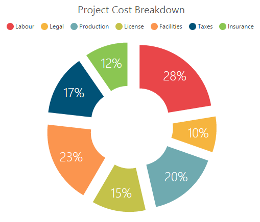

### Explode a doughnut segment on mouse over

To explode a doughnut segment on a mouse over, you can enable the `e-explode` property of the series.


<html xmlns="http://www.w3.org/1999/xhtml" lang="en" ng-app="ChartApp">
    <head>
        <title>Essential Studio for AngularJS: Chart</title>
        <!--CSS and Script file References -->
    </head>
    <body ng-controller="ChartCtrl">
        

        <e-series>
            <e-series  e-type="doughnut" e-explode="true"></e-series>
         </e-series>
        

        
    </body>
</html>



### Sector of Doughnut

EjChart allows you to render all the data points/segments in the semi-doughnut, quarter- doughnut or in any sector by using the `e-startAngle` and `e-endAngle` options.



<html xmlns="http://www.w3.org/1999/xhtml" lang="en" ng-app="ChartApp">
    <head>
        <title>Essential Studio for AngularJS: Chart</title>
        <!--CSS and Script file References -->
    </head>
    <body ng-controller="ChartCtrl">
        

        <e-series>
            <e-series  e-type="doughnut" e-startangle="-90" e-endangle="90"></e-series>
         </e-series>
        

        
    </body>
</html>



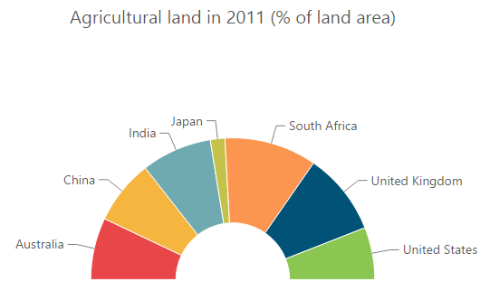

## Multiple Pie Chart

EjChart provides support to render more than one series in pie and in doughnut chart. Radius of each series is calculated based on the radius of the previous series. And in addition legend is displayed according to the list of chart series.



  <html xmlns="http://www.w3.org/1999/xhtml" lang="en" ng-app="ChartApp">
    <head>
        <title>Essential Studio for AngularJS: Chart</title>
        <!--CSS and Script file References -->
    </head>
    <body ng-controller="ChartCtrl">
        

        <e-series>
            <e-series  e-type="pie"></e-series>
             <e-series  e-type="pie"></e-series>
         </e-series>
        

        
    </body>
</html>



**Multiple Pie** 

**Multiple Doughnut** 

### Start and End Angle Support

In the Multiple Pie chart, the start and end angle property is also supported.

**Sector of Multiple Pie**

**Sector of Multiple Doughnut**

## Pyramid Chart

To create a Pyramid chart, you can specify the series `e-type` as **"pyramid"** in the chart series.  


 <html xmlns="http://www.w3.org/1999/xhtml" lang="en" ng-app="ChartApp">
    <head>
        <title>Essential Studio for AngularJS: Chart</title>
        <!--CSS and Script file References -->
    </head>
    <body ng-controller="ChartCtrl">
        

        <e-series>
            <e-series  e-type="pyramid"></e-series>
        </e-series>
        

        
    </body>
</html>



### Pyramid Mode

Pyramid mode has two types, *linear* and *surface* respectively. The default **"pyramidMode"** type is "linear".


<html xmlns="http://www.w3.org/1999/xhtml" lang="en" ng-app="ChartApp">
    <head>
        <title>Essential Studio for AngularJS: Chart</title>
        <!--CSS and Script file References -->
    </head>
    <body ng-controller="ChartCtrl">
        

        <e-series>
            <e-series  e-type="pyramid" e-pyramidmode="surface"></e-series>
        </e-series>
        

        
    </body>
</html>



### Gap between the segments

You can control the gap between the segments by using the `e-gapratio` option of the series. Its ranges from 0 to 1.



<html xmlns="http://www.w3.org/1999/xhtml" lang="en" ng-app="ChartApp">
    <head>
        <title>Essential Studio for AngularJS: Chart</title>
        <!--CSS and Script file References -->
    </head>
    <body ng-controller="ChartCtrl">
        

        <e-series>
            <e-series  e-type="pie" e-gapratio="0.1"></e-series>
        </e-series>
        

        
    </body>
</html>


### Explode a pyramid segment

You can explode a pyramid segment on the chart load by using the `e-explodeindex` of the series.



<html xmlns="http://www.w3.org/1999/xhtml" lang="en" ng-app="ChartApp">
    <head>
        <title>Essential Studio for AngularJS: Chart</title>
        <!--CSS and Script file References -->
    </head>
    <body ng-controller="ChartCtrl">
        

        <e-series>
            <e-series  e-type="pie"  e-explodeindex="4"></e-series>
        </e-series>
        

        
    </body>
</html>



## Funnel Chart

You can create a funnel chart by setting the series `e-type` as **"funnel"** in the chart series.  



<html xmlns="http://www.w3.org/1999/xhtml" lang="en" ng-app="ChartApp">
    <head>
        <title>Essential Studio for AngularJS: Chart</title>
        <!--CSS and Script file References -->
    </head>
    <body ng-controller="ChartCtrl">
        

        <e-series>
            <e-series  e-type="funnel"></e-series>
        </e-series>
        

        
    </body>
</html>



### Change the funnel width and height

Funnel segments height and width is calculated from the chart size, by default. You can change this height and width directly without changing the chart size by using the `e-funnelheight` and `e-funnelWidth` property of the series.


<html xmlns="http://www.w3.org/1999/xhtml" lang="en" ng-app="ChartApp">
    <head>
        <title>Essential Studio for AngularJS: Chart</title>
        <!--CSS and Script file References -->
    </head>
    <body ng-controller="ChartCtrl">
        

        <e-series>
            <e-series  e-type="funnel" e-funnelheight="22%" e-funnelwidth="25%"></e-series>
           
         </e-series>
        

        
    </body>
</html>



### Explode a funnel segment

You can explode a funnel segment on the chart load by using the `e-explodeindex` of the series.



<html xmlns="http://www.w3.org/1999/xhtml" lang="en" ng-app="ChartApp">
    <head>
        <title>Essential Studio for AngularJS: Chart</title>
        <!--CSS and Script file References -->
    </head>
    <body ng-controller="ChartCtrl">
        

        <e-series>
            <e-series  e-type="funnel" e-explodeindex="3"></e-series>
        </e-series>
        

        
    </body>
</html>



## Bubble Chart

To create a Bubble chart, you can set the series `e-type` as **"bubble"** in the chart series. Bubble chart requires 3 fields (*x, y and size*) to plot a point. Here, **size** is used to specify the size of each bubble segment. 


<html xmlns="http://www.w3.org/1999/xhtml" lang="en" ng-app="ChartApp">
    <head>
        <title>Essential Studio for AngularJS: Chart</title>
        <!--CSS and Script file References -->
    </head>
    <body ng-controller="ChartCtrl">
        

        <e-series>
            <e-series  e-type="bubble" e-datasource="datasource" e-xname="month" e-yname="sales" e-size="profit" ></e-series>
         </e-series>
        

        
    </body>
</html>



## Scatter

To create a Scatter chart, you can set the series `e-type` as **"scatter"**’ in the chart series. 



<html xmlns="http://www.w3.org/1999/xhtml" lang="en" ng-app="ChartApp">
    <head>
        <title>Essential Studio for AngularJS: Chart</title>
        <!--CSS and Script file References -->
    </head>
    <body ng-controller="ChartCtrl">
        

        <e-series>
            <e-series  e-type="scatter" ></e-series>
        </e-series>
        

        
    </body>
</html>



### Customize the scatter chart

You can change the scatter size by using the `e-size` property of the series marker. And you can change the scatter color by using the series `e-fill` property. 


<html xmlns="http://www.w3.org/1999/xhtml" lang="en" ng-app="ChartApp">
    <head>
        <title>Essential Studio for AngularJS: Chart</title>
        <!--CSS and Script file References -->
    </head>
    <body ng-controller="ChartCtrl">
        

        <e-series>
            <e-series  e-type="scatter" e-marker="marker" e-fill="#41F282"></e-series>
        </e-series>
        

        
    </body>
</html>



## HiLoOpenClose Chart 

To create a HiLoOpenClose chart, you can set the series `e-type` as **"hiloopenclose"** in the chart series. HiLoOpenClose chart requires 5 fields (`e-x`,`e-high`, `e-low`], `e-open` and `e-close`) to plot a segment.  



<html xmlns="http://www.w3.org/1999/xhtml" lang="en" ng-app="ChartApp">
    <head>
        <title>Essential Studio for AngularJS: Chart</title>
        <!--CSS and Script file References -->
    </head>
    <body ng-controller="ChartCtrl">
        

        <e-series>
            <e-series  e-type="hiloopenclose" e-datasource="datasource" e-xname="month" e-high="high" e-low="low" e-open="open" e-close="close" ></e-series>
         </e-series>
        

        
    </body>
</html>



### DrawMode

You can change the HiLoOpenClose chart `e-drawMode` to `open`, `close` or *both*. The default value of `e-drawMode` is **"both"**. 



<html xmlns="http://www.w3.org/1999/xhtml" lang="en" ng-app="ChartApp">
    <head>
        <title>Essential Studio for AngularJS: Chart</title>
        <!--CSS and Script file References -->
    </head>
    <body ng-controller="ChartCtrl">
        

        <e-series>
            <e-series  e-type="hiloopenclose" e-drawmode="open" ></e-series>
        </e-series>
        

        
    </body>
</html>



### Bull and Bear Color	

HiLoOpenClose chart `e-bullFillColor` is used to specify a fill color for the segments that indicates an increase in stock price in the measured time interval and `e-bearFillColor` is used to specify a fill color for the segments that indicates a decrease in the stock price in the measured time interval. 


<html xmlns="http://www.w3.org/1999/xhtml" lang="en" ng-app="ChartApp">
    <head>
        <title>Essential Studio for AngularJS: Chart</title>
        <!--CSS and Script file References -->
    </head>
    <body ng-controller="ChartCtrl">
        

        <e-series>
            <e-series  e-type="hiloopenclose" e-bullfillcolor="#FF6600" e-bearfillcolor="#336600"></e-series>
        </e-series>
        

        
    </body>
</html>



## Candle

You can create a Candle chart by specifying the series `e-type` as **"candle"** in the chart series. Candle chart requires 5 fields (`e-x`, `e-high`, `e-low`, `e-open` and `e-close`) to plot a segment.



 <html xmlns="http://www.w3.org/1999/xhtml" lang="en" ng-app="ChartApp">
    <head>
        <title>Essential Studio for AngularJS: Chart</title>
        <!--CSS and Script file References -->
    </head>
    <body ng-controller="ChartCtrl">
        

        <e-series>
            <e-series  e-type="candle" e-datasource="datasource" e-xname="month" e-high="high" e-low="low" e-open="open" e-close="close" ></e-series>
         </e-series>
        

        
    </body>
</html>



### Bull and Bear Color

Candle chart `e-bullFillColor` is used to specify a fill color for the segments that indicates an increase in the stock price in the measured time interval and `e-bearFillColor` is used to specify a fill color for the segments that indicates a decrease in the stock price in the measured time interval.


<html xmlns="http://www.w3.org/1999/xhtml" lang="en" ng-app="ChartApp">
    <head>
        <title>Essential Studio for AngularJS: Chart</title>
        <!--CSS and Script file References -->
    </head>
    <body ng-controller="ChartCtrl">
        

        <e-series>
            <e-series  e-type="candle" e-bullfillcolor="#FF6600" e-bearfillcolor="#336600"></e-series>
        </e-series>
        

        
    </body>
</html>



## HiLo

HiLo chart is created by setting the series `e-type` as **"hilo"** in the chart series. HiLo chart requires 3 fields (`e-x`, `e-high` and `e-low`) to plot a segment.  



<html xmlns="http://www.w3.org/1999/xhtml" lang="en" ng-app="ChartApp">
    <head>
        <title>Essential Studio for AngularJS: Chart</title>
        <!--CSS and Script file References -->
    </head>
    <body ng-controller="ChartCtrl">
        

        <e-series>
            <e-series  e-type="high" e-datasource="datasource" e-xname="month" e-high="high" e-low="low" ></e-series>
         </e-series>
        

        
    </body>
</html>



## Polar

Polar chart is created by setting the series `e-type` as **polar** in the chart series. 



<html xmlns="http://www.w3.org/1999/xhtml" lang="en" ng-app="ChartApp">
    <head>
        <title>Essential Studio for AngularJS: Chart</title>
        <!--CSS and Script file References -->
    </head>
    <body ng-controller="ChartCtrl">
        

        <e-series>
            <e-series  e-type="polar"></e-series>
        </e-series>
        

        
    </body>
</html> 



### DrawType

Polar `e-drawType`property is used to change the series plotting type to *line*, *column* or *area*. The default value of `e-drawType` is **"line"**.  


<html xmlns="http://www.w3.org/1999/xhtml" lang="en" ng-app="ChartApp">
    <head>
        <title>Essential Studio for AngularJS: Chart</title>
        <!--CSS and Script file References -->
    </head>
    <body ng-controller="ChartCtrl">
        

        <e-series>
            <e-series  e-type="polar" e-drawtype="column"></e-series>
        </e-series>
        

        
    </body>
</html>



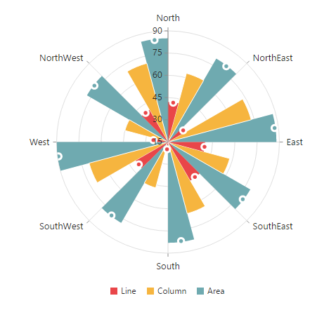

### Stack columns in Polar chart

By using the `e-isStacking` property, you can specify whether the column has to be stacked when the `e-drawType` is column. Its default value is **false**.



<html xmlns="http://www.w3.org/1999/xhtml" lang="en" ng-app="ChartApp">
    <head>
        <title>Essential Studio for AngularJS: Chart</title>
        <!--CSS and Script file References -->
    </head>
    <body ng-controller="ChartCtrl">
        

        <e-series>
            <e-series  e-type="polar" e-isstacking="true"></e-series>
        </e-series>
        

        
    </body>
</html>



## Radar Chart  

To create a Radar chart, you can specify the series `e-type` as **"radar"** in the chart series.



<html xmlns="http://www.w3.org/1999/xhtml" lang="en" ng-app="ChartApp">
    <head>
        <title>Essential Studio for AngularJS: Chart</title>
        <!--CSS and Script file References -->
    </head>
    <body ng-controller="ChartCtrl">
        

        <e-series>
            <e-series  e-type="radar" ></e-series>
        </e-series>
        

        
    </body>
</html>



### DrawType

Radar `e-drawType` property is used to change the series plotting type to *line*, *column* or *area*. The default value of `e-drawType` is **"line"**.



<html xmlns="http://www.w3.org/1999/xhtml" lang="en" ng-app="ChartApp">
    <head>
        <title>Essential Studio for AngularJS: Chart</title>
        <!--CSS and Script file References -->
    </head>
    <body ng-controller="ChartCtrl">
        

        <e-series>
            <e-series  e-type="radar" e-drawtype="column"></e-series>
        </e-series>
        

        
    </body>
</html>



### Stack columns in Radar chart

By using the `e-isStacking` property, you can specify whether the column has to be stacked when the `e-drawType` is set as *column*. Its default value is set to **false**.



<html xmlns="http://www.w3.org/1999/xhtml" lang="en" ng-app="ChartApp">
    <head>
        <title>Essential Studio for AngularJS: Chart</title>
        <!--CSS and Script file References -->
    </head>
    <body ng-controller="ChartCtrl">
        

        <e-series>
            <e-series  e-type="radar" e-isstacking="true"></e-series>
        </e-series>
        

        
    </body>
</html>



## Waterfall Chart 

For rendering a Waterfall chart, set series `e-type` as **"waterfall"** in the chart series. To change the waterfall series segment color use `e-fill` option of series and use [`positiveFill`](../api/ejchart.html#members:series-positiveFill) property to differentiate the positive segments.

N> The inline property of the **series.positiveFill** has the first priority and override the **series.fill**.


<html xmlns="http://www.w3.org/1999/xhtml" lang="en" ng-app="ChartApp">
    <head>
        <title>Essential Studio for AngularJS: Chart</title>
        <!--CSS and Script file References -->
    </head>
    <body ng-controller="ChartCtrl">
        

        <e-series>
            <e-series  e-type="waterfall" e-fill="#C64E4A" e-positivefill="#C64E4A"></e-series>
        </e-series>
        

        
    </body>
</html>



**ShowIntermediateSum**

To display the summary of values since the last intermediate point of the waterfall series, set **showIntermediateSum** property as true in the specific point.



<html xmlns="http://www.w3.org/1999/xhtml" lang="en" ng-app="ChartApp">
    <head>
        <title>Essential Studio for AngularJS: Chart</title>
        <!--CSS and Script file References -->
    </head>
    <body ng-controller="ChartCtrl">
        

        <e-series>
        <e-series e-points="points"></e-series>
        </e-series>
        

        
    </body>
</html>



**ShowTotalSum**

The sum of all previous point in the waterfall series is displayed on enabling the **showTotalSum** property for a specific point.



<html xmlns="http://www.w3.org/1999/xhtml" lang="en" ng-app="ChartApp">
    <head>
        <title>Essential Studio for AngularJS: Chart</title>
        <!--CSS and Script file References -->
    </head>
    <body ng-controller="ChartCtrl">
        

        <e-series>
        <e-series e-points="points"></e-series>
        </e-series>
        

        
    </body>
</html>


### ConnectorLine

To customize the connector line color, width, opacity and dashArray of the waterfall series, you can use `e-connectorLine` option of series.


<html xmlns="http://www.w3.org/1999/xhtml" lang="en" ng-app="ChartApp">
    <head>
        <title>Essential Studio for AngularJS: Chart</title>
        <!--CSS and Script file References -->
    </head>
    <body ng-controller="ChartCtrl">
        

        <e-series>
            <e-series  e-type="waterfall" e-fill="#C64E4A" e-positivefill="#C64E4A"></e-series>
        </e-series>
        

        
    </body>
</html>


