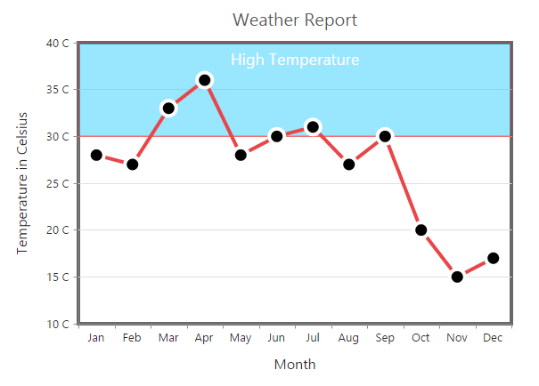
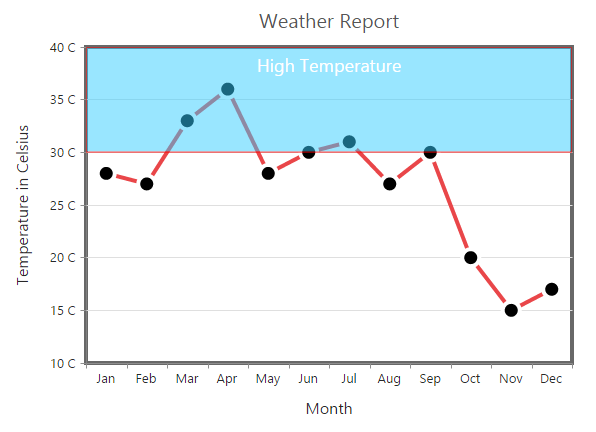

# Striplines

EjChart supports horizontal and vertical striplines. 

## Horizontal Stripline

You can create horizontal stripline by adding the `e-primaryxaxis-stripline` in the **vertical axis** and set `visible` option to **true**. Striplines are rendered in the specified **start** to **end** range and you can add more than one stripline for an axis.



<html xmlns="http://www.w3.org/1999/xhtml" lang="en" ng-app="ChartApp">
    <head>
        <title>Essential Studio for AngularJS: Chart</title>
        <!--CSS and Script file References -->
    </head>
    <body ng-controller="ChartCtrl">
        

        

        
    </body>
</html>
    



## Vertical Stripline

You can create vertical stripline by adding the `e-primaryyaxis-stripline` in the **horizontal axis** and set `visible` option to **true**.  



 <html xmlns="http://www.w3.org/1999/xhtml" lang="en" ng-app="ChartApp">
    <head>
        <title>Essential Studio for AngularJS: Chart</title>
        <!--CSS and Script file References -->
    </head>
    <body ng-controller="ChartCtrl">
        

        

        
    </body>
</html>



## Customize the Text

To customize the stripLine text, use the `text` and `font`options. 



  <html xmlns="http://www.w3.org/1999/xhtml" lang="en" ng-app="ChartApp">
    <head>
        <title>Essential Studio for AngularJS: Chart</title>
        <!--CSS and Script file References -->
    </head>
    <body ng-controller="ChartCtrl">
        

        

        
    </body>
</html>



	

**Text Alignment**

Stripline text can be aligned by using the `textAlignment` property.  



 <html xmlns="http://www.w3.org/1999/xhtml" lang="en" ng-app="ChartApp">
    <head>
        <title>Essential Studio for AngularJS: Chart</title>
        <!--CSS and Script file References -->
    </head>
    <body ng-controller="ChartCtrl">
        

        

        
    </body>
</html>
  



## Customize the Stripline

To customize the stripLine styles, use the `color`, `opacity`, `borderWidth`and `borderColor` properties. 



<html xmlns="http://www.w3.org/1999/xhtml" lang="en" ng-app="ChartApp">
    <head>
        <title>Essential Studio for AngularJS: Chart</title>
        <!--CSS and Script file References -->
    </head>
    <body ng-controller="ChartCtrl">
        

        

        
    </body>
</html>
  



## Change the Z-order of the stripline

Stripline `zIndex`] property is used to display the stripLine either behind or over the series.  



  <html xmlns="http://www.w3.org/1999/xhtml" lang="en" ng-app="ChartApp">
    <head>
        <title>Essential Studio for AngularJS: Chart</title>
        <!--CSS and Script file References -->
    </head>
    <body ng-controller="ChartCtrl">
        

        

        
    </body>
</html>



