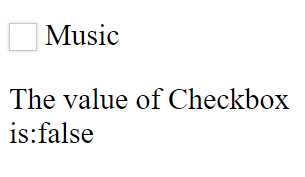
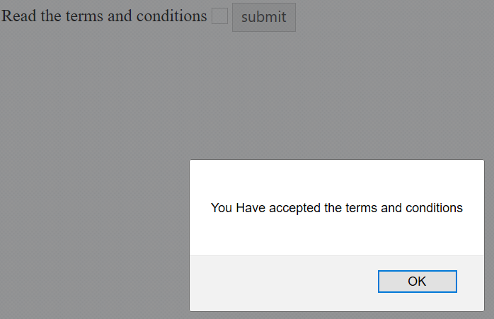

# Data Binding

## Two-way Binding

When data in the model changes, the view reflects the change, and when data in the view changes, the model updated as well. This happens immediately and automatically, which makes sure that the model and the view is updated always.Once we change the state of the **ej-checkBox** control changed then its value will have reflected in the paragraph html element in the webpage.

**HTML View Section**



    <td class="chkrad">
    <input type="checkbox" ej-checkbox id="check1" e-value="Music" e-enabletristate="true" />
    <label for="check1">Music</label>
    
The value of Checkbox is:{{Music}}

    </td>



**Controller Section**



    



The code will render the following output.

 

## Event Binding

In AngularJS, **ej-checkbox** component can be used to bind events. The events that can be binded are beforeChange, change, create, destroy.
beforeChange event of the **ej-checkbox** will be triggered before the checkbox has been checked and unchecked.

**HTML View Section**



    

        Read the terms and conditions <input type="checkbox" id="ch1" ej-checkbox e-beforeChange="change">
            <button id="butn" ej-button e-text="submit"></button>
    



**Controller Section**



    



The above code will render the following output.

 
