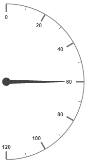

# Gauge Position

**Semi-circular Gauge** can be positioned within the canvas element which provides better appearance for the gauge in the canvas.

**Positioning**

Semi-circular Gauge can be positioned with the help of the attribute called gaugePosition. It is an enumerable value. You can position the gauge away from the corner with the help of the distanceFromCorner attribute. 

The possible enum values for the gaugePosition are as follows:

* Topleft

* Topcenter

* Topright

* Middleleft

* Center

* Middleright

* Bottomleft

* Bottomcenter

* Bottomright



<html xmlns="http://www.w3.org/1999/xhtml" lang="en" ng-app="CircularGaugeApp">
    <head>
        <title>Essential Studio for AngularJS: CircularGauge</title>
        <!--CSS and Script file References -->
    </head>
    <body ng-controller="CircularGaugeCtrl">
        
 
        <ej-circulargauge e-backgroundcolor="transparent" e-width="800" e-height="500" e-radius="120" e-value="60" e-gaugePosition="center"
        e-distanceFromCorner="30" e-frame-frametype="halfcircle" e-frame-halfcircleframestartangle="270" e-frame-halfcircleframeendangle="90">
                <e-scales>
                <e-scale   e-startangle="270" e-sweepangle="180" e-radius="160" e-showscalebar="true" e-size="1" e-maximum="120" e-majorIntervalValue="20"
                e-minorintervalvalue="10" e-border-width="0.5">
                </e-scale>
                <e-scales> 
                </ej-circulargauge>
        

         
    </body>
</html>



Execute the above code to render the following output.

