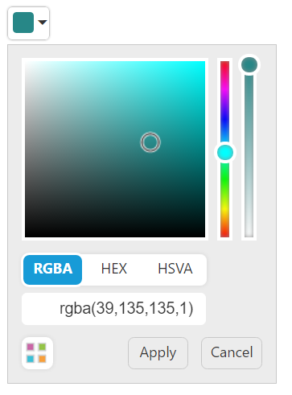
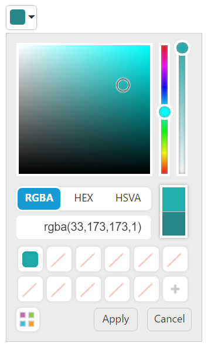
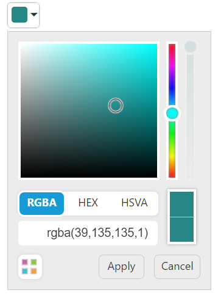
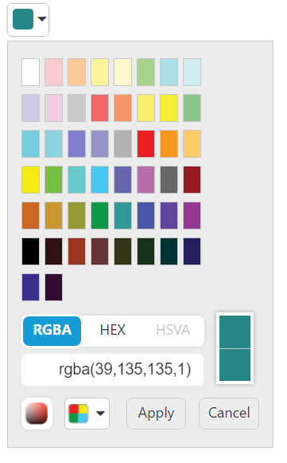

# Behaviour Settings

## Set value

You can use **e-value** property to set default color for the **ColorPicker**. **ColorPicker** value API is two way binding enabled API that can be accessed using **“e-value attribute”**. This API value could be set either as a color object or a formatted string.

**HTML View Section**



     <input id="colorpicker" ej-colorpicker e-value="value"/>



**Controller Section**



        



Run the above code to render the following output.

## showPreview

The **ColorPicker** control provides live preview support for current cursor selection color and selected color. **e-showPreview** property allows you to preview the selected color in the picker or from the palette.

**HTML View Section**



     <input id="colorpicker" ej-colorpicker e-value="value" e-showPreview="false"/>



**Controller Section**



        



Run the above code to render the following output.

# showRecentColors

The **ColorPicker** control allows you to store the color values in custom list by using **e-showRecentColors** property. The **ColorPicker** keeps up to 11 colors in a custom list. By clicking the add button, the selected color from picker or palette gets added in the recent color list.

**HTML View Section**



     <input id="colorpicker" ej-colorpicker e-value="value" e-showRecentColors="true"/>



**Controller Section**



        



Run the above code to render the following output.

## enableOpacity

The **ColorPicker** control allows you to enable or disable the opacity slider. You can achieve this by using the **e-enableOpacity** property.

**HTML View Section**



     <input id="colorpicker" ej-colorpicker e-value="value" e-enableOpacity="false"/>



**Controller Section**



        



Run the above code to render the following output.

## columns

The palette model consists of color values in the rows and columns order. Palette only consists of predefined colors and allows you to select anyone color from it. The **e-columns** property allows you to modify the number of columns in palette model.

**HTML View Section**



     <input id="colorpicker" ej-colorpicker e-value="value" e-columns="columns"/>



**Controller Section**



        



Run the above code to render the following output.

