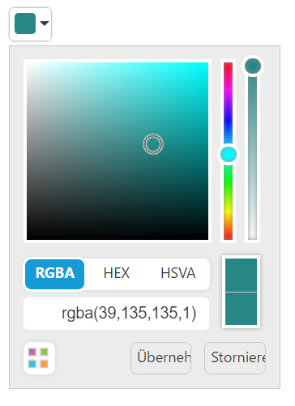

# Globalization

**ColorPicker** has been provided with Built-in **localization** support, so that it will be able to adapt based on culture specific locale defined for it.
**ej.globalize** library is used to **globalize ColorPicker**. Globalize values will be automatically used when **e-locale** property is set with locale string value for example fr-FR.

More than 350 culture specific files are available to localize the colorpicker value. To know more about EJ globalize support, please refer the below link 

To translate our control content from default English to any of the culture, say **For example** - **German** language, then you need to refer the **ej.culture.de-DE.min.js** file in your application,
The **en-US locale** is currently being used as **default culture in ColorPicker**. You can set any other culture to **ColorPicker** by using **e-Locale** property. Below code example shows German cultured ColorPicker.

Refer the below German culture file in head section of HTML page after the reference of **ej.web.all.min.js** file.

**HTML View Section**



     <input id="colorpicker" ej-colorpicker e-value="value" e-locale="locale" />



**Controller Section**



    



Run the above code to render the following output.

