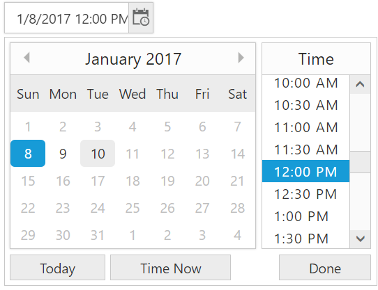
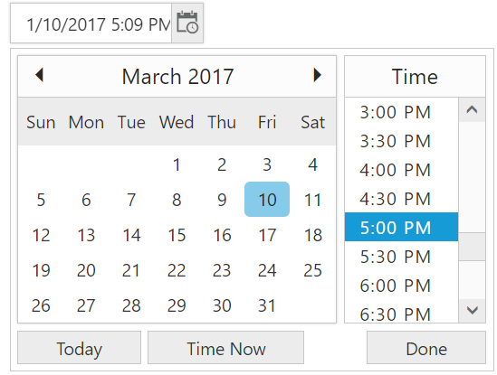
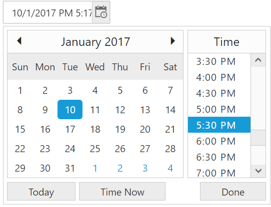
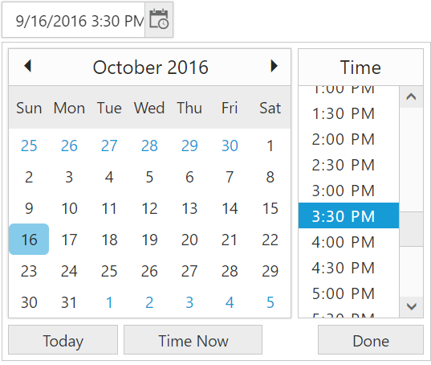

# Behaviour Settings

In AngularJS, **DateTimePicker** Component has some default settings which helps you to perform more operation by built-in.

**HTML View Section**



        

               <input type="text" id="dateTime1" ej-datetimepicker e-value="value"/>
          



 **Controller Section**



    



## MinDateTime and MaxDateTime

**e-minDateTime** and **e-MaxDateTime** API’s of **DateTimePicker** component is used to set the maximum date value and minimum date value. 

In a real-time appointment scenario, the appointment is open only for a limited number of days. You should select a date and time within the given range. This can be achieved by using the properties **e-minDateTime** and **e-maxDateTime** that enables the specified date range in the **DateTimePicker**  control.

**HTML View Section**



      <input type="text" id="dateTime1" ej-datetimepicker e-value="value" e-mindatetime="minDateTime" e-maxdatetime="maxDateTime"/>



 **Controller Section**



        



## ShowOtherMonths

In **DateTimePicker** Component, **e-showOtherMonths** API allow showing days in adjacent months of DatePicker calendar inside the **DateTimePicker** popup which will help us to find the adjacent month dates while viewing current month calendar. If it is set as false, then other month days will be disabled in the calendar.

**HTML View Section**



        <input type="text" id="dateTime1" ej-datetimepicker e-value="value"   e-showothermonths="false"/>



 **Controller Section**



        



## DateTimeFormat

In AngularJS, **DateTimePicker** Component allows you to define the text representation of a date and time value to be displayed in the DateTimePicker control. By default, the date and time format will be set based on the culture but we can also manually configure date and time format by using **e-datetimeformat** property.

**HTML View Section**



      

               <input type="text" id="dateTime1" ej-datetimepicker e-value="value"  e-datetimeformat="dateTimeFormat"/>
            



 **Controller Section**



    



## Enable Persistence

In AngularJS, **e-enablePersistence** property is used to maintain the state of **DateTimePicker** Component in the browser’s local storage. When **e-enablePersistence** is set as true, it will save the model object value of DateTimePicker component in the browser’s local storage. So, the state of the **DateTimePicker** remains same even if refresh the web page.



    <input type="text" id="dateTime1" ej-datetimepicker e-value="value"  e-enablepersistence="true" />





    



