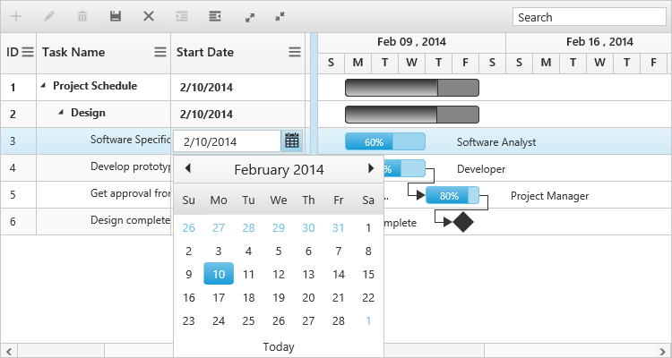
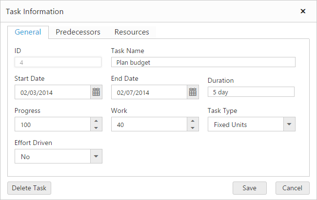

# Editing

The Gantt control provides built-in support to add, insert and update the tasks. The following are the types of editing available in Gantt,

* Cell Editing
* Normal Editing
* Taskbar Editing
* Predecessor Editing

## Cell Editing

Update the task details through grid cell editing by setting editMode as `cellEditing`.

The following code example shows you how to enable `cellEditing` in Gantt control.



<body ng-controller="GanttCtrl">
   <!--Add  Gantt control here-->    
   

   

   
</body>



The output of Gantt with cellEditing is as follows.

## Normal Editing

Update the task details through edit dialog by setting `editMode` as `normal`.

The following code example shows you how to enable normal editing in Gantt control.



<body ng-controller="GanttCtrl">
   <!--Add  Gantt control here-->    
   

   

  
</body>



The following screenshot shows the output of `normal` editing.

## Taskbar Editing

Update the task details by interactions such as resizing and dragging the taskbar. The following code example shows you how to enable taskbar resizing in Gantt control.



<body ng-controller="GanttCtrl">
   <!--Add  Gantt control here-->    
   

   

</body>



You can also enable or disable the progressbar resizing by setting 'e-enableprogressbarresizing'. The following code example shows you to disable this property.



<body ng-controller="GanttCtrl">
   <!--Add  Gantt control here-->    
   

   

</body>



## Predecessor Editing

Update the predecessor details of a task using mouse interactions. The following code example shows how to enable predecessor editing.



<body ng-controller="GanttCtrl">
   <!--Add  Gantt control here-->    
   

   

</body>


The following screen shot shows the predecessor editing in Gantt control.

