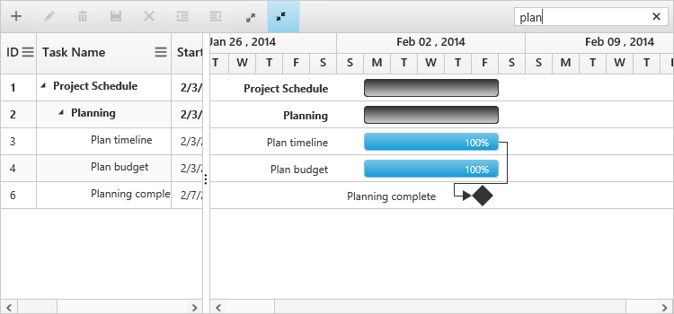

# Searching

The Gantt control for JavaScript has built-in support for searching any content in Gantt.

### Searching for Content Columns

In Gantt we can search the content using the JavaScript method searchItem with search key as parameter. Also, we can integrate the search text box in Gantt toolbar, by adding search toolbar item in toolbarSetting.toolbarItems property.

The following code example shows you how to add search option in Gantt toolbar.



<body ng-controller="GanttCtrl">
   <!--Add  Gantt control here-->    
   

   

  
</body>



The following screenshot shows the output of searching for string in Gantt control.

