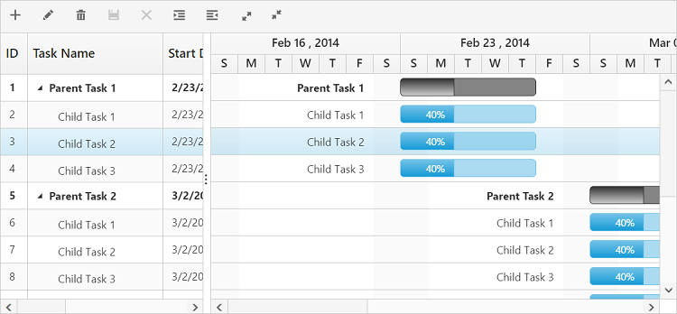

# Toolbar

Gantt control contains toolbar options for editing, searching, expanding and collapsing all records, indent, out dent, delete and add task. You can enable toolbar using the following code example.



<body ng-controller="GanttCtrl">
   <!--Add  Gantt control here-->    
   

   

  
</body>



The following screenshot shows the toolbar option in Gantt control.

