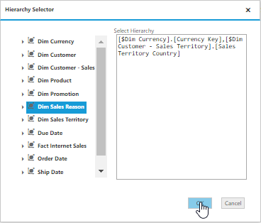
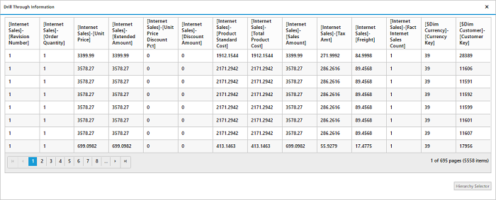

# Drill Through

I> This feature is applicable only for OLAP data source.

Drill-through retrieves the raw items that are used to create a specified cell of PivotGrid. To enable drill-through support, set [`enableDrillThrough`](/api/js/ejpivotgrid#members:enableDrillThrough) property to true. Raw items are obtained through the [`drillThrough`](/api/js/ejpivotclient#events:drillthrough) event, using which user can bind them to an external widget for precise view. 

N> Drill-through is supported in PivotGrid only when we configure and enable drill-through action at the Cube. 

On clicking any value cell, the "Drill Through Information" dialog will be opened. It consists of Grid with data which are associated with the measure values of the clicked value cell. In this example, the measure behind the respective cell is “Sales Amount” and the values of the dimensions which are associated with this measure are alone displayed in the Grid. 

On clicking the "Hierarchy Selector" button which is displayed below the Grid, the "Hierarchy Selector" dialog will be opened. It consists of the dimensions which are associated with the measure of clicked value cell. In this example, the measure behind the respective cell is “Sales Amount” and the dimensions associated with this measure are alone displayed in the dialog.   

By Dragging and dropping the respective hierarchies and finally clicking “OK” button, drill through MDX query will be framed and executed internally and provides back the raw items through "drillThrough" event. In this example, we have bound the raw items obtained to our ejGrid widget. Please refer the code sample and screen-shot below.

## Client Mode



<!--Create a tag which acts as a container for PivotClient-->



## Server Mode



<!--Create a tag which acts as a container for PivotClient-->



When PivotClient is rendered in server mode, below service methods need to be added in WCF/WebAPI for drill through operation.

For WebAPI controller, the below methods need to be added.



[System.Web.Http.ActionName("DrillThroughHierarchies")]
[System.Web.Http.HttpPost]
public string DrillThroughHierarchies(Dictionary<string, object> jsonResult)
{
    OlapDataManager DataManager = new OlapDataManager(connectionString);              
    DataManager.SetCurrentReport(OLAPUTILS.Utils.DeserializeOlapReport(jsonResult["currentReport"].ToString()));
    return pivotClientHelper.DrillthroughHierarchies(DataManager, jsonResult["layout"].ToString(), jsonResult["cellPos"].ToString());
}

[System.Web.Http.ActionName("DrillThroughDataTable")]
[System.Web.Http.HttpPost]
public Dictionary<string, object> DrillThroughDataTable(Dictionary<string, object> jsonResult)
{
    OlapDataManager DataManager = new OlapDataManager(connectionString);
    DataManager.SetCurrentReport(OLAPUTILS.Utils.DeserializeOlapReport(jsonResult["currentReport"].ToString()));
    return pivotClientHelper.DrillthroughDataTable(DataManager, jsonResult["layout"].ToString(), jsonResult["cellPos"].ToString(), jsonResult["selector"].ToString());
}  



For WCF service, the below methods need to be added. 



public string DrillThroughHierarchies(string currentReport, string layout, string cellPos)
{
    OlapDataManager DataManager = new OlapDataManager(connectionString);
    DataManager.SetCurrentReport(OLAPUTILS.Utils.DeserializeOlapReport(currentReport));
    return pivotClientHelper.DrillthroughHierarchies(DataManager, layout, cellPos);
}

public Dictionary<string, object> DrillThroughDataTable(string currentReport, string layout, string cellPos, string selector)
{
    OlapDataManager DataManager = new OlapDataManager(connectionString);
    DataManager.SetCurrentReport(OLAPUTILS.Utils.DeserializeOlapReport(currentReport));
    return pivotClientHelper.DrillthroughDataTable(DataManager, layout, cellPos, selector);
}



