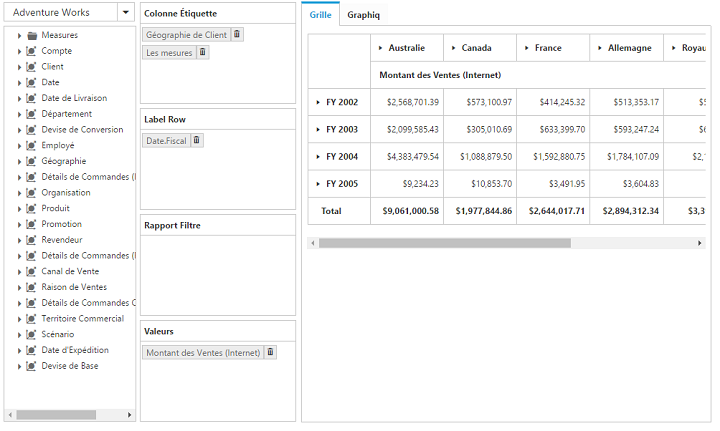
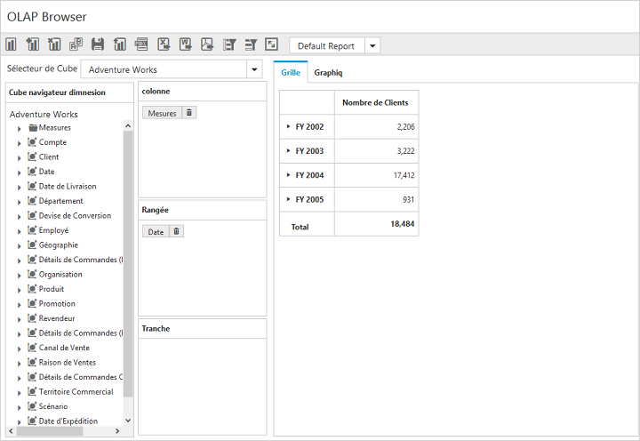
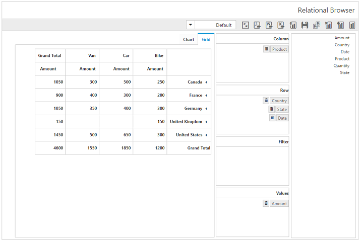

# Localization and Globalization

## Localization in PivotClient control

We can localize the PivotClient control texts with a collection of localized strings using **"ej.PivotClient.Locale"** for different cultures.

N> By default, the PivotClient control is localized in **"en-US".**

Following code example illustrates on how to localize PivotClient based on **French** culture.



    



Following table localizes the in-built keywords to **French** culture for PivotClient.
<table>
<tr>
<th>
Keywords</th><th>
Values</th></tr>
<tr>
<td>
DeferUpdate</td><td>
"Différer Mise à jour"</td></tr>
<tr>
<td>
MDXQuery</td><td>
"de requêtes MDX"</td></tr>
<tr>
<td>
Column</td><td>
"Colonne"</td></tr>
<tr>
<td>
Row</td><td>
"Rangée"</td></tr>
<tr>
<td>
Slicer</td><td>
"Tranche"</td></tr>
<tr>
<td>
CubeSelector</td><td>
"Sélecteur de Cube"</td></tr>
<tr>
<td>
ReportName</td><td>
"Nom du rapport"</td></tr>
<tr>
<td>
NewReport</td><td>
"Nouveau rapport"</td></tr>
<tr>
<td>
CubeDimensionBrowser</td><td>
"Cube navigateur dimnesion"</td></tr>
<tr>
<td>
AddReport</td><td>
"Ajouter un rapport"</td></tr>
<tr>
<td>
RemoveReport</td><td>
"Retirer rapport"</td></tr>
<tr>
<td>
CannotRemoveSingleReport</td><td>
"Vous ne pouvez pas supprimer Rapport unique"</td></tr>
<tr>
<td>
AreYouSureToDeleteTheReport</td><td>
"Etes-vous sûr de vouloir supprimer le rapport"</td></tr>
<tr>
<td>
RenameReport</td><td>
"Renommer rapport"</td></tr>
<tr>
<td>
SaveReport</td><td>
"Enregistrer le rapport"</td></tr>
<tr>
<td>
LoadReport</td><td>
"Rapport de charge"</td></tr>
<tr>
<td>
ToggleAxis</td><td>
"Basculer Axis"</td></tr>
<tr>
<td>
ExportToExcel</td><td>
"Exporter vers Excel"</td></tr>
<tr>
<td>
ExportToWord</td><td>
"Exporter vers Word"</td></tr>
<tr>
<td>
ExportToPdf</td><td>
"Exporter vers PDF"</td></tr>
<tr>
<td>
FullScreen</td><td>
"Plein écran"</td></tr>
<tr>
<td>
Grid</td><td>
"Grille"</td></tr>
<tr>
<td>
Chart</td><td>
"Graphiq"</td></tr>
<tr>
<td>
OK</td><td>
"Bien"</td></tr>
<tr>
<td>
Cancel</td><td>
"Annuler"</td></tr>
<tr>
<td>
MeasureEditor</td><td>
"Mesurer éditeur"</td></tr>
<tr>
<td>
MemberEditor</td><td>
"Sous la direction de membres"</td></tr>
<tr>
<td>
Measures</td><td>
"Mesures"</td></tr>
<tr>
<td>
SortOrFilterColumn</td><td>
"Tri/filtrage (colonne)"</td></tr>
<tr>
<td>
SortOrFilterRow</td><td>
"Tri/filtrage (ligne)"</td></tr>
<tr>
<td>
SortingAndFiltering</td><td>
"Trier et filtrer"</td></tr>
<tr>
<td>
Sorting</td><td>
"Tri"</td></tr>
<tr>
<td>
Measure</td><td>
"Mesurer"</td></tr>
<tr>
<td>
Order</td><td>
"Ordre"</td></tr>
<tr>
<td>
Filtering</td><td>
"Filtrage"</td></tr>
<tr>
<td>
Condition</td><td>
"Condition"</td></tr>
<tr>
<td>
Value</td><td>
"Valeur"</td></tr>
<tr>
<td>
PreserveHierarchy</td><td>
"Préserver hiérarchie"</td></tr>
<tr>
<td>
Ascending</td><td>
"Croissant"</td></tr>
<tr>
<td>
Descending</td><td>
"Descendant"</td></tr>
<tr>
<td>
Enable</td><td>
"Permettre"</td></tr>
<tr>
<td>
Disable</td><td>
"Désactiver"</td></tr>
<tr>
<td>
And</td><td>
"et"</td></tr>
<tr>
<td>
Line</td><td>
"ligne"</td></tr>
<tr>
<td>
Spline</td><td>
"spline"</td></tr>
<tr>
<td>
Column</td><td>
"colonne"</td></tr>
<tr>
<td>
Area</td><td>
"zone"</td></tr>
<tr>
<td>
SplineArea</td><td>
"spline zone"</td></tr>
<tr>
<td>
StepLine</td><td>
"étape ligne"</td></tr>
<tr>
<td>
StepArea</td><td>
"étape zone"</td></tr>
<tr>
<td>
Pie</td><td>
"tarte"</td></tr>
<tr>
<td>
Bar</td><td>
"bar"</td></tr>
<tr>
<td>
StackingArea</td><td>
"Stacking zone"</td></tr>
<tr>
<td>
StackingColumn</td><td>
"Colonne d'empilage"</td></tr>
<tr>
<td>
StackingBar</td><td>
"Stacking bar"</td></tr>
<tr>
<td>
Pyramid</td><td>
"pyramide"</td></tr>
<tr>
<td>
Funnel</td><td>
"entonnoir"</td></tr>
<tr>
<td>
ChartTypes</td><td>
"Types de graphiques"</td></tr>
<tr>
<td>Sort</td>
<td>Trier</td>
</tr>  
<tr>
<td>SelectField</td>
<td>sélectionnez Champ</td>
</tr>
<tr>
<td>LabelFilterLabel</td>
<td>Afficher les éléments pour lesquels l'étiquette</td>
</tr>
<tr>
<td>ValueFilterLabel</td>
<td>Voir les articles pour lesquels</td>
</tr>    
<tr>
<td>LabelFilters</td>
<td>Filtres d'étiquetage</td>
</tr>
<tr>
<td>BeginsWith</td>
<td>Commence par</td>
</tr>
<tr>
<td>NotBeginsWith</td>
<td>Non Commence par</td>
</tr>
<tr>
<td>EndsWith</td>
<td>Se termine par</td>
</tr>     
<tr>
<td>NotEndsWith</td>
<td>Non Se termine par</td>
</tr>   
<tr>
<td>Contains</td>
<td>Contient</td>
</tr>    
<tr>
<td>NotContains</td>
<td>Ne contient pas</td>
</tr>
<tr>
<td>ValueFilters</td>
<td>Filtres de valeur</td>
</tr>
<tr>
<td>ClearFilter</td>
<td>Effacer le filtre</td>
</tr>
<tr>
<td>Equals</td>
<td>Équivaut à</td>
</tr>     
<tr>
<td>Top10</td>
<td>"Top Count"</td>
</tr>    
<tr>
<td>EqualTo</td>
<td>Égal à</td>
</tr>     
<tr>
<td>NotEquals</td>
<td>pas equals</td>
</tr>     
<tr>
<td>GreaterThan</td>
<td>Plus grand que</td>
</tr>     
<tr>
<td>GreaterThanOrEqualTo</td>
<td>Plus grand ou égal à</td>
</tr>

<tr>
<td>LessThan</td>
<td>Moins que</td>
</tr>
     
<tr>
<td>LessThanOrEqualTo</td>
<td>Inférieur ou égal à</td>
</tr>

<tr>
<td>Between</td>
<td>Entre</td>
</tr>
     
<tr>
<td>NotBetween</td>
<td>Entre pas</td>
</tr>

</table>

## Localization and Globalization of Cube Info (Client Mode)

Content displayed within the PivotClient control are obtained from the OLAP cube. Following are the steps to get the localized and globalized cube content.

* To get localized data from OLAP cube, we need to set **"Locale Identifier"** in the connection string to a specific culture in the **"data"** property present inside **"dataSource"**. 
* To bind the globalized content in PivotClient control, we need to set **"locale"** property to a specific culture and the specific culture file is referred in the sample. 
 
N> Culture files are present under **"[installed drive]:\Users\ [user name]\AppData\Local\Syncfusion\EssentialStudio\X.X.X.X\JavaScript\samples\web\scripts\cultures".** 
 


    



 
## Localization and Globalization of Cube (Server Mode)

Content displayed within the PivotClient control are obtained from the OLAP cube. Following are the steps to get the localized and globalized cube content.
 
* To get the localized string based on different cultures, from OLAP cube, you need to set **"Locale Identifier"** in the connection string to a specific culture.
* To bind the globalized content in PivotClient control, you need to set **"Culture"** and `OverrideDefaultFormatStrings` properties in OlapDataManager class to a specific culture. 



    //1036 refers to "fr-FR" culture.
    string connectionString = "Data Source=localhost; Initial Catalog=Adventure Works DW; Locale Identifier=1036;";
    DataManager = new OlapDataManager(connectionString);
    DataManager.Culture = new System.Globalization.CultureInfo(1036);
    DataManager.OverrideDefaultFormatStrings = true;



## Localization and Globalization of Relational Info (Client Mode)

Content displayed within the PivotClient control are obtained from the Relational datasource. Following are the steps to get localized as well as globalized content.
 
* To get the localized content, the Relational datasource must have localized headers in them which will be directly applied to PivotClient.  
* To globalize the values appeared in PivotClient, we need to set the **"format"** and **"locale"** property accordingly.  Also the specific culture file is referred in the sample. 

N> Culture files are present under **"[installed drive]:\Users\ [user name]\AppData\Local\Syncfusion\EssentialStudio\X.X.X.X\JavaScript\samples\web\scripts\cultures".** 
 


    



## Localization and Globalization of Relational Info (Server Mode)
Content displayed within the PivotClient control are obtained from the Relational datasource. Following are the steps to get localized as well as globalized content.
 
* To get the localized content, the Relational datasource must have localized headers in them which will be directly applied to PivotClient.  
* **“Format”** settings in PivotComputationInfo class would globalize the values appeared in PivotClient.



    PivotReport pivotSetting = new PivotReport();
    //...
    pivotSetting.PivotCalculations.Add(new PivotComputationInfo {
        CalculationName = "Amount", Description = "Amount", FieldHeader = "Amount", FieldName = "Amount", Format = "C", SummaryType = Syncfusion.PivotAnalysis.Base.SummaryType.DoubleTotalSum
    });
    //...



## RTL

You can render our PivotClient control from Right to Left by setting `e-enableRTL` property to true.



    



