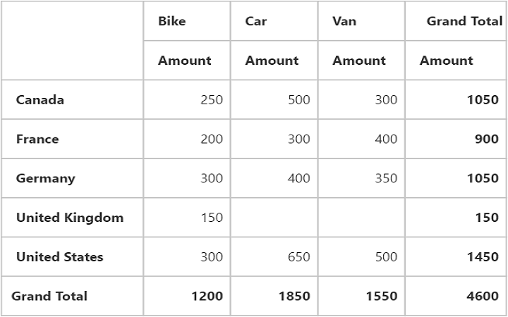
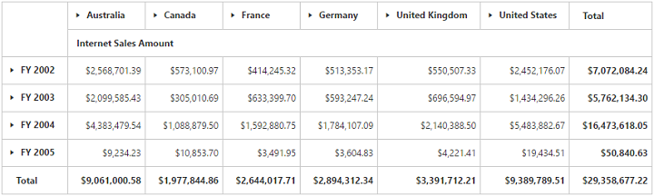

# Getting Started

The AngularJS directives are usually included within the `ej.widget.angular.min.js` file and all these directives are usually packed together in a common module known as `ejangular`. For basic details on how to configure Syncfusion widgets in AngularJS framework, refer [here](https://help.syncfusion.com/js/angularjs).

To get start with the PivotGrid control in AngularJS framework, the following list of external dependencies are mandatory, 

* [jQuery](http://jquery.com) - 1.7.1 and later versions
* [jsRender](https://github.com/borismoore/jsrender) - to render the templates
* [AngularJS](https://angularjs.org/)

The external AngularJS script file `angular.min.js` can also be accessed from the following installed location.

* **(installed location)**\Syncfusion\Essential Studio\{{ site.releaseversion }}\JavaScript\assets\external

An another mandatory script is `ej.widget.angular.min.js`, which can be accessed from the below specified location.

* **(installed location)**\Syncfusion\Essential Studio\{{ site.releaseversion }}\JavaScript\assets\scripts\common

## Script/CSS Reference

Create a new HTML file and include the below initial code.



<!DOCTYPE html>
<html lang="en" xmlns="http://www.w3.org/1999/xhtml">
    <head>
        <meta charset="utf-8" />
        <title> </title>
    </head>
    <body>
    </body>
</html>



Refer the CSS file from the specific theme folder to your HTML file within the head section as shown below. Refer the built-in available themes from [here](https://help.syncfusion.com/js/theming-in-essential-javascript-components).



<head>
    <meta charset="utf-8" />
    <title>Getting Started - PivotGrid</title>
    <link href="http://cdn.syncfusion.com/{{ site.releaseversion }}/js/web/flat-azure/ej.web.all.min.css" rel="stylesheet" />
</head>



Refer the [CDN](https://help.syncfusion.com/js/cdn) script files with other required external dependencies.



<head>
    <meta charset="utf-8" />
    <title>Getting Started - PivotGrid</title>
    <link href="http://cdn.syncfusion.com/{{ site.releaseversion }}/js/web/flat-azure/ej.web.all.min.css" rel="stylesheet" />
    
    
    
    
    
</head>



In the above code, `ej.web.all.min.js`script reference has been added for demonstration purpose. It is not recommended to use this for deployment purpose, as its file size is larger since it contains all the widgets. Instead, you can use[CSG](http://csg.syncfusion.com/# "") utility to generate a custom script file with the required widgets for deployment purpose.

## Relational

This section covers the information that you need to know to populate a simple PivotGrid with Relational data source.

### Control Initialization

Create the PivotGrid control using `ej-pivotgrid` directive and define all its other properties prefixed with `e-` as shown in the below code.



<html xmlns="http://www.w3.org/1999/xhtml" ng-app="PivotGridApp">

<body>
    

        

    

</body>

</html>



### Populate PivotGrid with data

Let us now see how to populate the PivotGrid control using a sample JSON data as shown below.



<html xmlns="http://www.w3.org/1999/xhtml" ng-app="PivotGridApp">
<head> <!-- Dependency file references --> </head>
<body>
    

        

    

</body>

</html>



The above code will generate a simple PivotGrid with “Country” field in Row, “Product” field in Column and “Amount” field in Value section.

## OLAP

This section covers the information that you need to know to populate a simple PivotGrid with OLAP data source.

### Control Initialization

Create the PivotGrid control using `ej-pivotgrid` directive and define all its other properties prefixed with `e-` as shown in the below code.



<html xmlns="http://www.w3.org/1999/xhtml" ng-app="PivotGridApp">

<body>
    

        

    

</body>

</html>



### Populate PivotGrid with data

Initializes the OLAP datasource for PivotGrid control as shown below.



<html xmlns="http://www.w3.org/1999/xhtml" ng-app="PivotGridApp">
<head> <!-- Dependency file references --> </head>
<body>
    

        

    

</body>

</html>



The above code will generate a simple PivotGrid with “Fiscal” field in Row, “Customer Geography” field in Column and “Internet Sales Amount” field in Value section.

