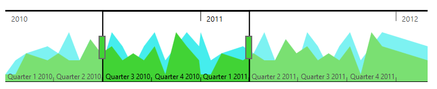

### Behavior Customization

**RangeNavigator** allows you to customize the control using events. You can change the range for selected data of the **RangeNavigator** using events.

#### Deferred update

If you set **enableDeferredUpdate**to true, the **rangeChanged** event gets fired after dragging and dropping the slider. By default the **enableDeferredUpdate**is true. If **enableDeferredUpdate**is false then the **rangeChanged** event gets fired while dragging the slider.



<html xmlns="http://www.w3.org/1999/xhtml" lang="en" ng-app="RangeApp">
    <head>
        <title>Essential Studio for AngularJS: RangeNavigator</title>
        <!--CSS and Script file References -->
    </head>
    <body ng-controller="RangeCtrl">
       

       <ej-rangenavigator e-enabledeferredupdate="true"></ej-rangenavigator>
         

    
   </body>
</html>



 

#### Handle Events

**loaded:** function

This event is handled when the **RangeNavigator** gets loaded. A parameter **sender** is passed to the handler. Using **sender.model**, you can access the RangeNavigator properties. 



<html xmlns="http://www.w3.org/1999/xhtml" lang="en" ng-app="RangeApp">
    <head>
        <title>Essential Studio for AngularJS: RangeNavigator</title>
        <!--CSS and Script file References -->
    </head>
    <body ng-controller="RangeCtrl">
       

       <ej-rangenavigator e-loaded=loaded></ej-rangenavigator>
         

    
   </body>
</html>



**rangeChanged**: function

This event gets fired whenever the selected range changes in **RangeNavigator**. A parameter **sender** is passed to the handler. Using sender.selectedRangeSettings, you can access the start and end value of range for the selected region. 



<html xmlns="http://www.w3.org/1999/xhtml" lang="en" ng-app="RangeApp">
    <head>
        <title>Essential Studio for AngularJS: RangeNavigator</title>
        <!--CSS and Script file References -->
    </head>
    <body ng-controller="RangeCtrl">
       

       <ej-rangenavigator e-rangechanged=rangechanged></ej-rangenavigator>
         

    
   </body>
</html>



#### Use of ZoomCoordinates

**RangeNavigator** is used along with the controls like chart and grid to view the selected data. To update chart/grid, whenever the selected range changes in **RangeNavigator**, you can use **rangeChanged** event of **RangeNavigator** and then update the chart/grid with the selected data in this event. 

You can easily update the data for chart by assigning the **zoomFactor** and **zoomPosition** of the **RangeNavigator** to the chart axis.



<html xmlns="http://www.w3.org/1999/xhtml" lang="en" ng-app="RangeApp">
    <head>
        <title>Essential Studio for AngularJS: RangeNavigator</title>
        <!--CSS and Script file References -->
    </head>
    <body ng-controller="RangeCtrl">
       

       <ej-rangenavigator e-rangechanged="onchartloaded"></ej-rangenavigator>
         

    
   </body>
</html>
   



 

#### Thumb Template

You can customize Thumb template by using **leftThumbTemplate** and **rightThumbTemplate** property. You can add the required template as a "div" element with an "id" to the web page and assign the id or assign the HTML string to this property under **navigatorStyleSettings**.



 
 <html xmlns="http://www.w3.org/1999/xhtml" lang="en" ng-app="RangeApp">
    <head>
        <title>Essential Studio for AngularJS: RangeNavigator</title>
        <!--CSS and Script file References -->
    </head>
    <body ng-controller="RangeCtrl">
     

       <ej-rangenavigator e-navigatorstylesettings-leftthumbtemplate="left" e-navigatorstylesettings-rightthumbtemplate="right"></ej-rangenavigator>
         

         
         
     
   </body>
</html>      



The following screenshot displays the **RangeNavigator** using thumb template.

 
