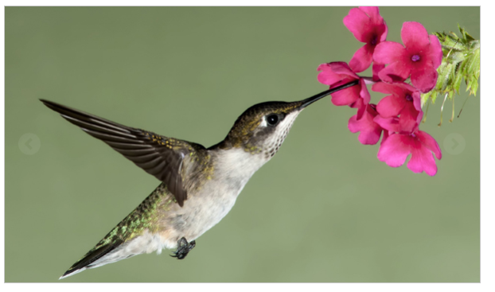

## Behavior settings

### Enabling rotator

The e-enabled property enables or disables the Rotator control. The default value is ‘true’. The value set to this property is Boolean type. You can refer the following code example to set this property.



<ul id="sliderContent" ej-rotator e-datasource="dataList" e-enabled="true" e-slidewidth="600px" e-slideheight="350px"/>



### Device Responsiveness 

The e-isresponsive property resizes the Rotator when the browser window is resized. The default value is ‘false’. The value set to this property is Boolean.



<ul id="sliderContent" ej-rotator e-datasource="dataList" e-isresponsive="true" e-slidewidth="600px" e-slideheight="350px"/>



### Auto Play option

By using the e- enableautoplay, we can able to play the rotator slides automatically without our interference when it is set as true. The default value is ‘false’. The value set to this property is Boolean.



<ul id="sliderContent" ej-rotator e-datasource="dataList" e-enableautoplay="true" e-slidewidth="600px" e-slideheight="350px"/>



### Stop sliding on hover

The e-stoponhover property pauses the auto play while mouse over the Rotator content. The default value is ‘false’. The value set to this property is Boolean.



 <ul id="sliderContent" ej-rotator e-datasource="dataList" e- enableautoplay="true" e-stoponhover="true" e-slidewidth="600px" e-slideheight="350px"/>



### Pager settings

#### Show pager

The “e-showpager” property turns on or off the pager support in the Rotator control. The Pager is used to navigate the Rotator Items. The default value is ‘true’. The value set to this property is Boolean.


                            <ul id="sliderContent" ej-rotator e-datasource="dataList" e-showpager="false" e-slidewidth="600px" e-slideheight="350px" />


#### Pager position

This property specifies the position of the Pager in the Rotator Item. The default value is ‘outside’. The value set to this property is string or enum.

ej.Rotator.PagerPosition.BottomLeft

ej.Rotator.PagerPosition.BottomRight

ej.Rotator.PagerPosition.Outside

ej.Rotator.PagerPosition.TopCenter

ej.Rotator.PagerPosition.TopLeft

ej.Rotator.PagerPosition.TopRight


        <ul id="sliderContent" ej-rotator e-datasource="dataList" e-pagerposition="position" e-slidewidth="600px" e-slideheight="350px"/>




   



