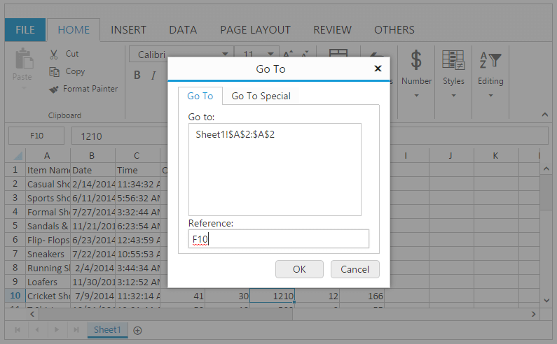

---
layout: post
title: Searching with Spreadsheet widget for Syncfusion Essential JS
description: How to enable Searching and its functionalities
platform: Angular-1
control: Spreadsheet
documentation: ug
--- 

# Searching

This feature is used to search the contents in the Spreadsheet. You can use [`e-allowsearching`](https://help.syncfusion.com/api/js/ejspreadsheet#members:allowsearching "allowSearching") property to enable or disable this feature.

You have following options in Searching.

* Find
* Replace
* GoTo
* GoTo Special

The following code example describes the above behavior.


 




var syncApp = angular.module("defaultApp", ["ngRoute", "ejangular"]);
// the datasource "window.defaultData" is referred from 'http://js.syncfusion.com/demos/web/scripts/xljsondata.min.js'
     syncApp.controller('SpreadsheetCtrl', function ($scope,$rootScope) {
         $scope.sheetData = [{
                rangeSettings: [{ dataSource: window.defaultData}],
            }];
     });


The following output is displayed as a result of the above code example which shows the find and Select button.

## Find

This is used to search the contents of a cell. You can do this by one of the following ways,

* Using "Find" option in Find and Select button of OTHERS tab in ribbon to open the Find and Replace dialog.
* Using `findNext` and `findPrevious` methods to search the given value in workbook.
* Using Ctrl + F key to open the Find and Replace dialog with Find tab enabled.

The following output is displayed as a result of Find and Replace dialog with Find tab enabled.

You can customize the following settings in find option.

* Match Case - Search content should have same casing compared with the cell content.
* Match Entire Cell Content - Search content should match with entire cell content.
* Look in - You can search the contents by values, formulas and comments.
* Within - You can search the content within the sheet or workbook.
* Search - You can search the contents by rows or columns.
* Replace Direction - You can replace the contents by up or down direction.

{:caption}

Find and Replace dialog with Settings tab enabled.

## Replace

This is used to replace the contents of a cell. You can do this by one of the following ways.

* Using "Replace" option in Find and Select button of OTHERS tab in ribbon to open the Find and Replace dialog.
* Using [`replaceAllByBook`](https://help.syncfusion.com/api/js/ejspreadsheet#methods:xlsearch-replaceallbybook "replaceAllByBook") or [`replaceAllBySheet`](https://help.syncfusion.com/api/js/ejspreadsheet#methods:xlsearch-replaceallbysheet "replaceAllBySheet") method to replace the contents.
* Using Ctrl + R key to open the Find and Replace dialog with Replace tab enabled.

{:caption}

Find and Replace dialog with Replace tab enabled

The following code example describes the above behavior.


 



var syncApp = angular.module("defaultApp", ["ngRoute", "ejangular"]);
// the datasource "window.defaultData" is referred from 'http://js.syncfusion.com/demos/web/scripts/xljsondata.min.js'
    syncApp.controller('SpreadsheetCtrl', function ($scope,$rootScope) {
         $scope.sheetData = [{
                rangeSettings: [{ dataSource: window.defaultData}],
            }];
            $scope.loadComplete = loadComplete;
     });
function loadComplete() {
    var xlSearch = this.XLSearch;
    if (!this.isImport) {
        xlSearch.replaceAllBySheet("Shoes", "Slippers", true, false); 
        //xlSearch.replaceAllByBook("Shoes", "Slippers", true, false);
    }
}


The following output is displayed as a result of the above code example.

## Go To

This feature is used to navigate to the particular cell in the worksheet or workbook.

You can do this by one of the following ways,

* Using "Go To" option in Find and Select button of OTHERS tab in ribbon to open the Go To dialog.
* Using Ctrl + G key to open the Go To dialog.

The following output is displayed the Go To dialog.

The following output is displayed as a result of goto to cell "F10".

## GoTo Special

This feature is used to quickly select cells of a specified type within the worksheet. You can do this by following ways,

* Using "Go to Special" option in Find and Select button of OTHERS tab in ribbon to open the Go To dialog.

* Using "Go to Formulas" option in Find and Select button of OTHERS tab in ribbon to highlight the cells, which contains formulas.

* Using "Go to Comments" option in Find and Select button of OTHERS tab in ribbon to highlight the cells, which contains comments.

* Using "Go to Conditional Formats" option in Find and Select button of OTHERS tab in ribbon to highlight conditional format applied cells.

* Using "Go to Data Validation" option in Find and Select button of OTHERS tab in ribbon to highlight the data validation applied cells.

* Using "Go to Constants" option in Find and Select button of OTHERS tab in ribbon to highlight the cells, which contains constant values.

The following output is displayed as a result of goto constants which selects the cells containing constant values.

