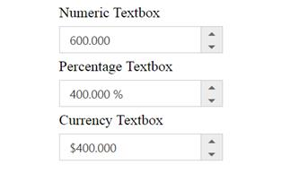
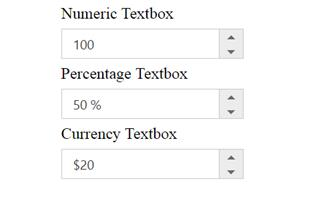
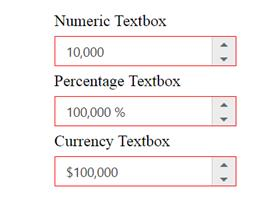
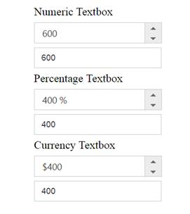

# Getting Started

This section explains briefly about how to create a **EJ** **TextBox** control in your application with **JavaScript**. From the following steps you can learn how to create and use **EJ** **TextBox** in your application. Here we have showcased the Textbox controls.

## Create Textboxes Widgets

Essential JavaScript includes angular directives for all controls with the ej.widget.angular.min.js script file. All the Essential JS directives have been encapsulated into a single module called **ejangular**. To render our ej controls in angular, you need to refer the “angular.min.js” and “ej.widget.angular.min.js” in your application.

Create an **HTML** file and add the following template to the HTML file for Textbox widget creation.

<table>
<tr>
<td>
<!doctype html>  <html lang="en" ng-app="EditCtrl">  <head>  <title>Essential Studio for JavaScript : Angular JS Support for Textboxes </title>  <!-- Style sheet for default theme (flat azure) -->  <link href="http://cdn.syncfusion.com/14.3.0.49/js/web/flat-azure/ej.web.all.min.css" rel="stylesheet" />  <!--Scripts-->            <!--Add custom scripts here -->  </head>  <body>  <!--Add the Textbox elements here-->  </body>  </html>  </td></tr>
</table>
The ng-app directive explains the root element (<html> or <body> tags) of the application. You will assign a name to the ng-app directive, then you must create a module with that name. In this module, you will have to define your directives, services, filters and configurations.

Properties can be bind to ejTextboxes control using the prefix e- and particular property name as shown as below

Add the input elements

<table>
<tr>
<td>
<table class="sample" style="margin: auto">  <tbody>  <tr>  <td>  Numeric Textbox  </td>  </tr>  <tr>  <td>  <input id="numeric" type="text" ej-numerictextbox e-value="nvalue" />  </td>  </tr>  <tr>  <td>  Percentage Textbox  </td>  </tr>  <tr>  <td>  <input id="percent" type="text" ej-percentagetextbox e-value="pvalue" />  </td>  </tr>  <tr>  <td>  Currency Textbox  </td>  </tr>  <tr>  <td>  <input id="currency" type="text" ej-currencytextbox e-value="cvalue" />  </td>  </tr>  </tbody>  </table>  </td></tr>
</table>
Set the value in the controller

<table>
<tr>
<td>
angular.module('EditCtrl', ['ejangular'])  .controller('EditorsCtrl', function ($scope) {  $scope.nvalue = 600;  $scope.pvalue = 400;  $scope.cvalue = 400;   });  </td></tr>
</table>
Execute the above code to render the following output

## Set the MinValue, MaxValue and Value in Textoxes

You can set the **“****minValue****”,** **“****maxValue****”** and **“****value****”** in Numeric, Percentage and Currency text boxes for maintaining the range in Textboxes widgets. In this scenario, you have to enter the values between the given ranges. The following code example illustrates how to achieve this.

<table>
<tr>
<td>
table class="sample" style="margin: auto">  <tbody>  <tr>  <td>  Numeric Textbox  </td>  </tr>  <tr>  <td>  <input id="numeric" type="text" ej-numerictextbox e-value="100" e-maxvalue="1000" />  </td>  </tr>  <tr>  <td>  Percentage Textbox  </td>  </tr>  <tr>  <td>  <input id="percent" type="text" ej-percentagetextbox e-value="50" e-maxvalue="1000" />  </td>  </tr>  <tr>  <td>  Currency Textbox  </td>  </tr>  <tr>  <td>  <input id="currency" type="text" ej-currencytextbox e-value="20" e-maxvalue="1000" />  </td>  </tr>  </tbody>  </table>  </td></tr>
</table>
The following screenshot shows the output for the above code

## Set the Strict Mode option

You can set the “**StrictMode****”** **option** to restrict entering values defined outside the range. The following code example illustrates how to set strict mode option.

<table>
<tr>
<td>
table class="sample" style="margin: auto">  <tbody>  <tr>  <td>  Numeric Textbox  </td>  </tr>  <tr>  <td>  <input id="numeric" type="text" ej-numerictextbox e-value="100" e-maxvalue="1000" e-enablestrictmode="true" />  </td>  </tr>  <tr>  <td>  Percentage Textbox  </td>  </tr>  <tr>  <td>  <input id="percent" type="text" ej-percentagetextbox e-value="50" e-maxvalue="1000" e-enablestrictmode="true" />  </td>  </tr>  <tr>  <td>  Currency Textbox  </td>  </tr>  <tr>  <td>  <input id="currency" type="text" ej-currencytextbox e-value="20" e-maxvalue="1000" e-enablestrictmode="true" />  </td>  </tr>  </tbody>  </td></tr>
</table>
<table>
<tr>
<td>
angular.module('EditCtrl', ['ejangular'])  .controller('EditorsCtrl', function ($scope) {  });  </td></tr>
</table>
The following screenshot show the output the for the above code

## Data Binding

The EJ Textbox supports the data binding. When a widget’s model attribute is bound to a scope variable, it has been bound in one way.

We have listed the properties of **Textbox** widget that supports two way binding:

<table>
<tr>
<td>
**control******  </td><td>
**Supported** **properties**  </td></tr>
<tr>
<td>
ejNumericTextbox  ejCurrencyTextbox  ejPercentageTextbox  </td><td>
Value    </td></tr>
</table>
Please use the below code to bind the Textbox in two-way support.

<table>
<tr>
<td>
<table class="sample" style="margin: auto">  <tbody>  <tr>  <td>  Numeric Textbox  </td>  </tr>  <tr>  <td>  <input id="numeric" type="text" ej-numerictextbox e-value="nvalue" />  </td>  </tr>  <tr>   <td>  <input type="text" class="input ejinputtext" ng-model="nvalue" />   </td>    </tr>  <tr>  <td>  Percentage Textbox  </td>  </tr>  <tr>  <td>  <input id="percent" type="text" ej-percentagetextbox e-value="pvalue" />  </td>  </tr>  <tr>  <td>  <input type="text" class="input ejinputtext" ng-model="pvalue" />   </td>  </tr>  <tr>  <td>  Currency Textbox  </td>  </tr>  <tr>  <td>  <input id="currency" type="text" ej-currencytextbox e-value="cvalue" />  </td>  </tr>  <tr>  <td>  <input type="text" class="input ejinputtext" ng-model="cvalue" />   </td>  </tr>   </tbody>  </table>  </td></tr>
</table>
<table>
<tr>
<td>
angular.module('EditCtrl', ['ejangular'])  .controller('EditorsCtrl', function ($scope) {  $scope.nvalue = 600;  $scope.pvalue = 400;  $scope.cvalue = 400;   });  </td></tr>
</table>
In the above sample, Textbox value was bind in two way method. Changes made in the textbox will reflect to another textbox.

Run the above code to render the following output.

