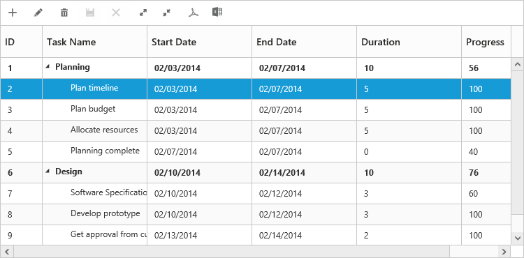

# Toolbar

TreeGrid control contains toolbar options for adding, deleting and editing the records. You can customize the TreeGrid toolbar by using [`e-toolbarsettings`](/api/js/ejtreegrid#toolbarsettingsspan-classtype-signature-type-objectobjectspan "toolbarSettings") property. 

In TreeGrid by using [`rowPosition`](/api/js/ejtreegrid#editsettingsrowpositionspan-classtype-signature-type-stringstringspan "editSettings.rowPosition") property, the index position for the newly added row can be provided. Default value of the `rowPosition` property is `top`. The enumeration values for `rowPosition` properties are,

* top
* bottom
* aboveSelectedRow
* belowSelectedRow

You can enable toolbar for TreeGrid, using the following code example.



<body ng-controller="TreeGridCtrl">
    <!--Add  treegrid control here-->
    

    

    
</body>



The following screenshot displays the toolbar option in TreeGrid control.

