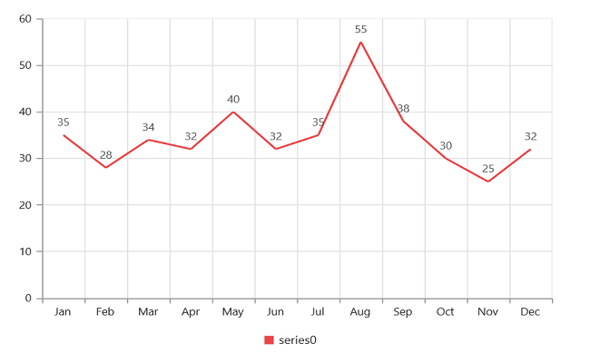
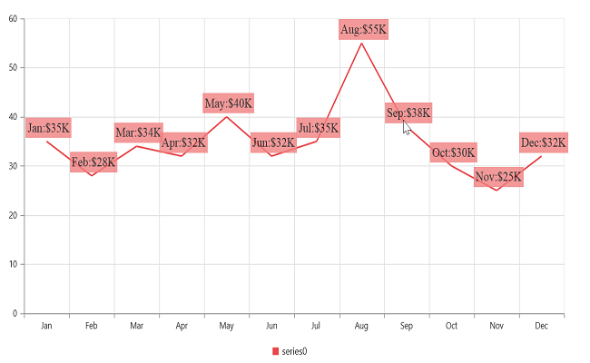

---

 title: Getting started for Chart

 description: How to create a chart, add series, enable tooltip and other functionalities

 platform: AngularJS

 control: chart

 documentation: ug

 keywords: ejchart, chart, chart widget, js chart, angular chart, angularjs chart, angular 1.0 chart, angular 1 chart

---

# Getting Started

Before we start with the Chart, please refer [this page](http://help.syncfusion.com/js/angularjs)  for general information regarding integrating Syncfusion widget’s.

## Adding script reference

To render the Chart control, the following list of external dependencies are needed, 

* [jQuery](http://jquery.com) - 1.7.1 and later versions
* [Angular](https://angularjs.org/) - angular latest versions

The required angular script as `angular.min.js` and `ej.widget.angular.min.js` which can be available in below [CDN](/js/cdn) links:

* `angular.min.js` - [http://cdn.syncfusion.com/js/assets/external/angular.min.js](http://cdn.syncfusion.com/js/assets/external/angular.min.js)
* `ej.widget.angular.min.js` - [http://cdn.syncfusion.com/{{ site.releaseversion }}/js/common/ej.widget.angular.min.js](http://cdn.syncfusion.com/14.3.0.49/js/common/ej.widget.angular.min.js)

The other required internal dependencies are tabulated below,

<table>
   <tr>
      <th>
         <b>Files</b>
      </th>
      <th>
         <b>Description/Usage </b>
      </th>
   </tr>
   <tr>
      <td>
         ej.core.min.js
      </td>
      <td>
        It is referred always before using all the JS controls.
      </td>
   </tr>
   <tr>
      <td>
         ej.data.min.js
      </td>
      <td>
         Used to handle data operation and is used while binding data to the JS controls.
      </td>
   </tr>
   <tr>
      <td>
        ej.globalize.min.js
      </td>
      <td>
       It is referred when using localization in Chart.
      </td>
   </tr>
   <tr>
      <td>
        ej.chart.min.js
      </td>
      <td>
        Chart core script file which includes chart related scripts files.
      </td>
   </tr>
   <tr>
      <td>
         ej.scroller.min.js
      </td>
      <td>
         It is referred when scrolling is used in the Chart. 
      </td>
   </tr>
</table>

N> Refer the `ej.web.all.min.js` (which encapsulates all the `ej` controls and frameworks in a single file) in the application instead of referring all the above specified internal dependencies. 

To get the real appearance of the Chart, the dependent CSS file `ej.web.all.min.css` (which includes styles of all the widgets) should also needs to be referred.

So the complete boilerplate code is



 <!DOCTYPE html>
    <html xmlns="http://www.w3.org/1999/xhtml" lang="en" ng-app="syncApp">
    <head>
    <title>Essential Studio for AngularJS: Chart</title>
    <!-- Essential Studio for JavaScript  theme reference -->
    <link href="http://cdn.syncfusion.com/{{ site.releaseversion }}/js/web/flat-azure/ej.web.all.min.css" rel="stylesheet" />
    <!-- Essential Studio for JavaScript  script references -->
    
    
        
    
    
    <!-- Add your custom scripts here -->
    </head>
    <body>
    </body>
    </html>



N> 1. In production, we highly recommend you to use our [`custom script generator`](http://help.syncfusion.com/js/custom-script-generator) to create custom script file with required controls and its dependencies only. Also to reduce the file size further please use [`GZip compression`](https://developers.google.com/web/fundamentals/performance/optimizing-content-efficiency/optimize-encoding-and-transfer?hl=en) in your server.
N> 2. For themes, you can use the `ej.web.all.min.css` CDN link from the code snippet given. To add the themes in your application, please refer to [`this link`](http://help.syncfusion.com/js/theming-in-essential-javascript-components).
N> 3. If you are using the Essential Studio below 13.4.0.53 version, then you need to refer **jQuery.globalize.js** script file along with the above references to render the Chart control.

## Create Chart

All the Essential JavaScript directives have been encapsulated into a single module called `ejangular` so the first step would be to declare dependency for this module within your AngularJS application.

The chart can be created using `ej-chart` AngularJS directive and its properties can be defined using `e-` prefix followed by the property name.(For example, e-size)

The code example for defining controls in AngularJS is as follows,



<html xmlns="http://www.w3.org/1999/xhtml" lang="en" ng-app="ChartApp">
    <head>
        <title>Essential Studio for AngularJS: Chart</title>
        <!--CSS and Script file References -->
    </head>
    <body ng-controller="ChartCtrl">
        

        

        
    </body>
</html>



## Data Binding

Typically, you will assign data directly to chart using `dataSource` property of the series. In AngularJS, you need to bind the variable, which contains data in the AngularJS scope object, to the dataSource property as illustrated in the following code example,

I> Essential JS includes AngularJS directives for all controls in the **ej.widget.angular.min.js** script file. 

N> All the properties in EjChart supports one way AngularJS binding except inner array properties like **series.points[]**, **series.trendlines[]**. [Click](http://help.syncfusion.com/js/angularjs) here to know more about Essential AngularJS and the properties which support two way AngularJS binding in chart.  



<html xmlns="http://www.w3.org/1999/xhtml" lang="en" ng-app="ChartApp">
    <head>
        <title>Essential Studio for AngularJS: Chart</title>
        <!--CSS and Script file References -->
    </head>
    <body ng-controller="ChartCtrl">
        

         <e-series>
            <e-series e-datasource=dataSource e-xname="month" e-yname="sales">
            </e-series>
        </e-series>
    
          
    </body>
</html>







Need to edit the jsplayground sample
[Click](http://js.syncfusion.com/demos/web/#!/azure/angularsupport/chart) here to view the AngularJS data binding online demo sample.	

## Add Data Labels

You can add data labels to improve the readability of the chart. This can be achieved by enabling the `e-visible` option in the `e-marker-dataLabel` option. Now, the data labels are rendered at the top of all the data points.

The following code example illustrates this,


     

        <e-series>
            <e-series  e-marker-visible="true"
            e-marker-datalabel-visible="true">
            </e-series>
        </e-series>
    

    



There are situations where the default label content is not sufficient to the user. In this case, you can use the `template` option to format the label content with some additional information.



<!DOCTYPE html>
<html>
<body>
  

  
#point.x#:$#point.y#K

   

</body>
</html>



The above HTML template is used as a template for each data label. Here, "point.x" and "point.y" are the placeholder text used to display the corresponding data point’s x & y value.

The following code example shows how to set the id of the above template to `template` option,



     angular.module('ChartApp', ['ejangular'])
     .controller('ChartCtrl', function ($scope) {
                $scope.dataSource = chartData;
                $scope.markeroptions = {
                    dataLabel: {
                        visible: true,
                        template: "dataLabelTemplate"
                    }
                };
            });



## Enable Legend

You can enable or disable the legend by using the `visible` option in the `legend`. It is enabled in the chart, by default.



   

   



## Enable Tooltip

The Tooltip is useful when you cannot display information by using the `Data Labels` due to the space constraints. You can enable tooltip by using the `visible`option of the `tooltip` in the specific series.

The following code example illustrates this,


    

    
#point.x#:$#point.y#K

    

    

        <e-series>
            <e-series e-tooltip-visible="true" e-tooltip-template="Template" >
            </e-series>
        </e-series>
    

    



