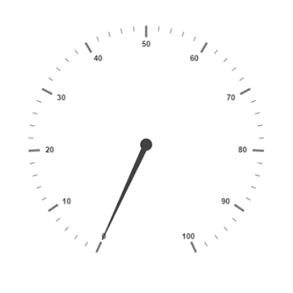
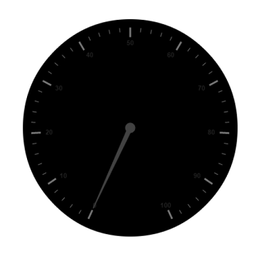
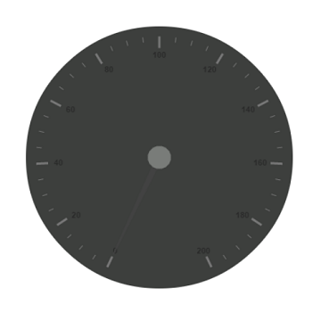
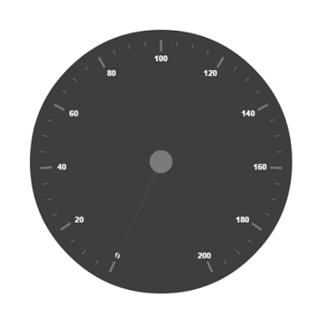
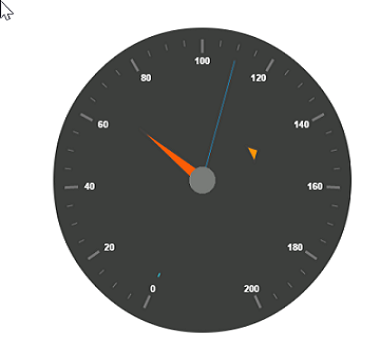
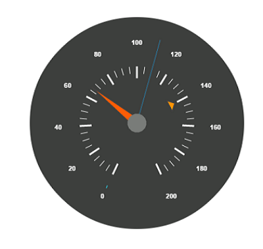
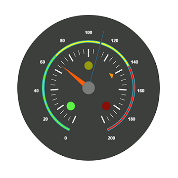

# Getting Started

Before we start with the circular gauge, please refer [this page](http://help.syncfusion.com/js/angularjs) page for general information regarding integrating Syncfusion widget’s.

## Adding JavaScript and CSS references

To render the circular gauge control, the following list of external dependencies are needed, 

* [jQuery](http://jquery.com) - 1.7.1 and later versions
* [Angular](https://angularjs.org/) - angular latest versions

The required angular script as `angular.min.js` and `ej.widget.angular.min.js` which can be available in below [CDN](/js/cdn) links:

* `angular.min.js` - [http://cdn.syncfusion.com/js/assets/external/angular.min.js](http://cdn.syncfusion.com/js/assets/external/angular.min.js)
* `ej.widget.angular.min.js` - [http://cdn.syncfusion.com/{{ site.releaseversion }}/js/common/ej.widget.angular.min.js](http://cdn.syncfusion.com/14.3.0.49/js/common/ej.widget.angular.min.js)

The other required internal dependencies are tabulated below,

<table>
   <tr>
      <th>
         <b>Files</b>
      </th>
      <th>
         <b>Description/Usage </b>
      </th>
   </tr>
   <tr>
      <td>
         ej.core.min.js
      </td>
      <td>
        It is referred always before using all the JS controls.
      </td>
   </tr>
   <tr>
      <td>
         ej.data.min.js
      </td>
      <td>
         Used to handle data operation and is used while binding data to the JS controls.
      </td>
   </tr>
   <tr>
      <td>
        ej.circulargauge.min.js 
      </td>
      <td>
         CircularGauge core script file which includes circular gauge related scripts files.
      </td>
   </tr>
    <tr>
      <td>
        ej.excanvas.min.js 
      </td>
      <td>
          
      </td>
   </tr>
</table>

N> Refer the `ej.web.all.min.js` (which encapsulates all the `ej` controls and frameworks in a single file) in the application instead of referring all the above specified internal dependencies. 

To get the real appearance of the CircularGauge, the dependent CSS file `ej.web.all.min.css` (which includes styles of all the widgets) should also needs to be referred.

So the complete boilerplate code is



    <!DOCTYPE html>
    <html xmlns="http://www.w3.org/1999/xhtml" lang="en" ng-app="CircularGaugeApp">
    <head>
    <title>Essential Studio for AngularJS: CircularGauge</title>
    <!-- Essential Studio for JavaScript  theme reference -->
    <link href="http://cdn.syncfusion.com/{{ site.releaseversion }}/js/web/flat-azure/ej.web.all.min.css" rel="stylesheet" />
    <!-- Essential Studio for JavaScript  script references -->
    
        
    
    
    <!-- Add your custom scripts here -->
    </head>
    <body>
    </body>
    </html>



N> 1. In production, we highly recommend you to use our [`custom script generator`](http://help.syncfusion.com/js/custom-script-generator) to create custom script file with required controls and its dependencies only. Also to reduce the file size further please use [`GZip compression`](https://developers.google.com/web/fundamentals/performance/optimizing-content-efficiency/optimize-encoding-and-transfer?hl=en) in your server.
N> 2. For themes, you can use the `ej.web.all.min.css` CDN link from the code snippet given. To add the themes in your application, please refer to [`this link`](http://help.syncfusion.com/js/theming-in-essential-javascript-components).

## Create a circular gauge

All the Essential JavaScript directives have been encapsulated into a single module called `ejangular` so the first step would be to declare dependency for this module within your AngularJS application.

The chart can be created using `ej-chart` AngularJS directive and its properties can be defined using `e-` prefix followed by the property name.(For example, e-size)

The code example for defining controls in AngularJS is as follows,



<html xmlns="http://www.w3.org/1999/xhtml" lang="en" ng-app="CircularGaugeApp">
    <head>
        <title>Essential Studio for AngularJS: CircularGauge</title>
        <!--CSS and Script file References -->
    </head>
    <body ng-controller="CircularGaugeCtrl">
        

         <ej-circulargauge>
         </ej-circulargauge>
        

    </body>
</html>



On executing the above code, sample renders a default **Circular Gauge** with default values as follows.

## Set Height and Width values

Pointers have different height and range. You can set the height and width of the gauge.



 <ej-circulargauge e-height="500" e-width="500">
 </ej-circulargauge>



The following screenshot displays a **Gauge** in which height and width are set.

## Set Background Color

You can draw the speedometer with dark background and to vary the speed of the pointer, set the **readOnly** option as **false** for user interaction. 



 <ej-CircularGauge e-height="500" e-width="500" e-backgroundcolor="##3D3F3D" e-readonly="false">
 </ej-CircularGauge>



The above code example renders a **Gauge** as shown in the following screen shot.

## Provide scale values

* You can customize the pointer cap using the following options- Cap radius, Cap border color, cap background color, pointer cap border width. 

* Set the maximum speed limit in the **Gauge** as 200KmpH.

* Major Ticks and Minor Ticks have the interval values 20 and 5 respectively. Show ranges and show indicators are used to display the ranges and indicators in their respective positions.



 <ej-CircularGauge e-height="500" e-width="500" e-backgroundcolor="#3D3F3D" e-readonly="false">
     <e-scales>
          <e-scale e-showranges="true" e-showindicators="true" e-maximum="200" e-majorintervalvalue="20" e-minorintervalvalue="5"
                   e-pointercap-radius="15" e-pointercap-borderWidth="0" e-pointercap-backgroundColor="#797C79" 
                   e-pointercap-borderColor="#797C79">
          //Add the labels customization code here
          //Add the pointers customization code here
          //Add the ticks customization code here
          //Add the ranges customization code here
          //Add the indicators customization code here
          //Add the Custom labels customization code here
          </e-scale>
       </e-scales>
  </ej-CircularGauge>



On executing the above code, sample renders a **Circular Gauge** with customized labels as follows.

## Add Label Customization

To display the values in the **Gauge,** scale labels are used. You can customize the label color.  



<ej-CircularGauge e-height="500" e-width="500" e-backgroundcolor="#3D3F3D" e-readonly="false">
    <e-scales>
     <e-scale e-showranges="true" e-showindicators="true" e-maximum="200" e-majorintervalvalue="20" 
     e-minorintervalvalue="5" e-pointercap-radius="15" e-pointercap-borderWidth="0" 
     e-pointercap-backgroundColor="#797C79" e-pointercap-borderColor="#797C79">
     <e-labels>
     <e-label e-color="#ffffff"></e-label>
     </e-labels>
       //Add the pointers customization code here
       //Add the ticks customization code here
       //Add the ranges customization code here
       //Add the indicators customization code here
       //Add the Custom labels customization code here
       </e-scale>
     </e-scales>
</ej-CircularGauge>



On executing the above code, sample renders a default **Circular Gauge** with customized labels as follows.

## Add pointer data

You can use three pointers that denote kilometer value, rotation per minute value and torque value.The torque value pointer should not be similar to other two pointers. Set the torque pointer as marker pointer. You can set other attributes for pointer such as background color, border color, Length, width and distance from scale.



<ej-CircularGauge e-height="500" e-width="500" e-backgroundcolor="#3D3F3D" e-readonly="false">
    <e-scales>
        <e-scale e-showranges="true" e-showindicators="true" e-maximum="200" e-majorintervalvalue="20"
         e-minorintervalvalue="5" e-pointercap-radius="15" e-pointercap-borderWidth="0" 
         e-pointercap-backGroundColor="#797C79" e-pointercap-borderColor="#797C79">
         <e-labels>
               <e-label e-color="#ffffff"></e-label>
         </e-labels>
         <e-pointers>
                <e-pointer e-value="140" e-distancefromscale="60" e-showbackneedle="false" 
                e-length="20" e-type="marker"e-markertype="triangle" e-width="10" 
                e-radius="10" e-backgroundcolor="#FF940A">
                <e-border e-color="#FF940A"></e-border>
                </e-pointer>
                <e-pointer e-value="110" e-showbackneedle="false" e-length="150" e-width="2" 
                e-radius="10" e-needletype="rectangle" e-backgroundcolor="#05AFFF">
                <e-border e-color="#05AFFF"></e-border>
                </e-pointer>
                <e-pointer e-value="67" e-showbackneedle="false" e-length="100" e-width="15" 
                e-radius="10" e-backgroundcolor="#FC5D07">
                <e-border e-color="#FC5D07"></e-border>
                </e-pointer>
         </e-pointers>
       //Add the ticks customization code here
       //Add the ranges customization code here
       //Add the indicators customization code here
       //Add the Custom labels customization code here
        </e-scale>
     </e-scales>
</ej-CircularGauge>



On executing the above code, sample renders a customized **Circular Gauge** as follows.

## Add Tick Details

You can display the tick value with customization as given in the following code example. You can set width and height of the Major ticks greater than the Minor ticks. You can set dark background for tick Color to have a better visibility.



<ej-CircularGauge e-height="500" e-width="500" e-backgroundcolor="#3D3F3D" e-readonly="false">
    <e-scales>
        <e-scale e-showranges="true" e-showindicators="true" e-maximum="200" e-majorintervalvalue="20" 
        e-minorintervalvalue="5" e-pointercap-radius="15" e-pointercap-borderWidth="0" 
        e-pointercap-backgroundColor="#797C79" e-pointercap-borderColor="#797C79">
        <e-labels>
               <e-label e-color="#ffffff"></e-label>
        </e-labels>
        <e-pointers>
            <e-pointer e-value="140" e-distancefromscale="60" e-showbackneedle="false" e-length="20"
            e-type="marker"e-markertype="triangle" e-width="10" e-radius="10" e-backgroundcolor="#FF940A">
            <e-border e-color="#FF940A"></e-border>
            </e-pointer>
            <e-pointer e-value="110" e-showbackneedle="false" e-length="150" e-width="2" e-radius="10"
            e-needletype="rectangle" e-backgroundcolor="#05AFFF">
            <e-border e-color="#05AFFF"></e-border>
            </e-pointer>
            <e-pointer e-value="67" e-showbackneedle="false" e-length="100" e-width="15" e-radius="10"
            e-backgroundcolor="#FC5D07">
            <e-border e-color="#FC5D07"></e-border>
            </e-pointer>
        </e-pointers>
        <e-ticks>
            <e-tick e-type="major" e-distanceFromScale="70" e-height="20" e-width="3" e-color="#ffffff">
            </e-tick>
            <e-tick e-type="minor" e-distanceFromScale="70" e-height="12" e-width="1" e-color="#ffffff">
            </e-tick>
        </e-ticks>
       //Add the indicators customization code here
       //Add the Custom labels customization code here
        </e-scale>
    </e-scales>
</ej-CircularGauge>



On executing the above code, sample renders a **Circular Gauge** with customized labels as follows.

## Add Range Values

Ranges denote the property of scale value in the speedometer. The color values of the ranges specify the speed variation. Set **showRanges** property to **“True”** to show the ranges in the **Circular Gauge**. Select safe zone for low speed, caution zone for moderate speed and high zone for high speed.You can customize the range with the properties such as start value, end value, start width, end width,  background color , border color, etc.,



 <ej-CircularGauge e-height="500" e-width="500" e-backgroundcolor="#3D3F3D" e-readonly="false">
    <e-scales>
        <e-scale e-showranges="true" e-showindicators="true" e-maximum="200" e-majorintervalvalue="20"
        e-minorintervalvalue="5" e-pointercap-radius="15" e-pointercap-borderWidth="0" 
        e-pointercap-backgroundColor="#797C79" e-pointercap-borderColor="#797C79">
        <e-labels>
               <e-label e-color="#ffffff"></e-label>
        </e-labels>
        <e-pointers>
           <e-pointer e-value="140" e-distancefromscale="60" e-showbackneedle="false" e-length="20"
           e-type="marker"e-markertype="triangle" e-width="10" e-radius="10" e-backgroundcolor="#FF940A">
           <e-border e-color="#FF940A"></e-border>
           </e-pointer>
           <e-pointer e-value="110" e-showbackneedle="false" e-length="150" e-width="2" e-radius="10"
           e-needletype="rectangle" e-backgroundcolor="#05AFFF">
           <e-border e-color="#05AFFF"></e-border>
           </e-pointer>
           <e-pointer e-value="67" e-showbackneedle="false" e-length="100" e-width="15" e-radius="10"
            e-backgroundcolor="#FC5D07">
           <e-border e-color="#FC5D07"></e-border>
           </e-pointer>
        </e-pointers>
        <e-ticks>
         <e-tick e-type="major" e-distanceFromScale="70" e-height="20" e-width="3" e-color="#ffffff">         
         </e-tick>
         <e-tick e-type="minor" e-distanceFromScale="70" e-height="12" e-width="1" e-color="#ffffff">
         </e-tick>
        </e-ticks>
       //Add the indicators customization code here
       //Add the Custom labels customization code here
        </e-scale>
     </e-scales>
</ej-CircularGauge>



On executing the above code, sample renders a **Circular Gauge** with customized range as follows.

## Add Indicator Details

Indicators denote whether the pointer values are placed in their respective zones. You can position the indicator on the respective range value for the required changes. You can set the location of the indicator using **position** property. The **stateRanges** property defines how the indicator should behave when the pointer is in certain values. 



<ej-CircularGauge e-height="500" e-width="500" e-backgroundcolor="#3D3F3D" e-readonly="false">
    <e-scales>
        <e-scale e-showranges="true" e-showindicators="true" e-maximum="200" e-majorintervalvalue="20"
        e-minorintervalvalue="5" e-pointercap-radius="15" e-pointercap-borderWidth="0" 
        e-pointercap-backgroundColor="#797C79" e-pointercap-borderColor="#797C79">
        <e-labels>
               <e-label e-color="#ffffff"></e-label>
        </e-labels>
        <e-pointers>
               <e-pointer e-value="140" e-distancefromscale="60" e-showbackneedle="false" e-length="20" 
               e-type="marker"e-markertype="triangle" e-width="10" e-radius="10" e-backgroundcolor="#FF940A">
               <e-border e-color="#FF940A"></e-border>
               </e-pointer>
               <e-pointer e-value="110" e-showbackneedle="false" e-length="150" e-width="2" e-radius="10"
               e-needletype="rectangle" e-backgroundcolor="#05AFFF">
               <e-border e-color="#05AFFF"></e-border>
               </e-pointer>
               <e-pointer e-value="67" e-showbackneedle="false" e-length="100" e-width="15" e-radius="10" 
               e-backgroundcolor="#FC5D07">
               <e-border e-color="#FC5D07"></e-border>
               </e-pointer>
        </e-pointers>
        <e-ticks>
               <e-tick e-type="major" e-distanceFromScale="70" e-height="20" e-width="3" e-color="#ffffff">
               </e-tick>
               <e-tick e-type="minor" e-distanceFromScale="70" e-height="12" e-width="1" e-color="#ffffff">
               </e-tick>
        </e-ticks>
        <e-ranges>
               <e-range e-distancefromscale="30" e-startvalue="0" e-endvalue="70"
               e-backgroundcolor="#5DF243">
               <e-border e-color="#FFFFFF"></e-border>
               </e-range>
               <e-range e-distancefromscale="30" e-startvalue="70" e-endvalue="140"
               e-backgroundcolor="#F6FF0A">
               <e-border e-color="#FFFFFF"></e-border>
               </e-range>
               <e-range e-distancefromscale="30" e-startvalue="140" e-endvalue="200"
               e-backgroundcolor="#FF1807">
               <e-border e-color="#FFFFFF"></e-border>
               </e-range>
        </e-ranges>
        <e-indicators>
               <e-indicator e-height="10" e-width="10" e-type="circle" e-position-x="210" 
                e-position-y="300">
               <e-stateranges>
               <e-staterange e-endValue="70" e-startvalue="0" e-backgroundcolor="#5DF243" 
               e-bordercolor="#5DF243" e-text="" e-textColor="#870505">
               </e-staterange>
               <e-staterange e-endValue="200" e-startvalue="70" e-backgroundcolor="#145608" 
               e-bordercolor="#145608" e-text="" e-textColor="#870505">
               </e-staterange>
               </e-stateranges>
               </e-indicator>
               <e-indicator e-height="10" e-width="10" e-type="circle" e-position-x="255" 
               e-position-y="200">
               <e-stateranges>
               <e-staterange e-endValue="140" e-startvalue="70" e-backgroundcolor="#F6FF0A" 
               e-bordercolor="#F6FF0A" e-text="">
               </e-staterange>
               <e-staterange e-endValue="70" e-startvalue="0" e-backgroundcolor="#969B0C" 
               e-bordercolor="#969B0C" e-text="">
               </e-staterange>
               <e-staterange e-endValue="200" e-startvalue="140" e-backgroundcolor="#969B0C" 
               e-bordercolor="#969B0C" e-text="">
               </e-staterange>
               </e-stateranges>
               </e-indicator>
               <e-indicator e-height="10" e-width="10" e-type="circle" e-position-x="300" 
               e-position-y="300">
               <e-stateranges>
               <e-staterange e-endValue="140" e-startvalue="0" e-backgroundcolor="#890F06" 
               e-bordercolor="#890F06" e-text="">
               </e-staterange>
               <e-staterange e-endValue="200" e-startvalue="140" e-backgroundcolor="#FF1807" 
               e-bordercolor="#FF1807" e-text="">
               </e-staterange>
               </e-stateranges>
               </e-indicator>
        </e-indicators>
       </e-scale>
     </e-scales>
</ej-CircularGauge>



On executing the above code, sample renders a **Circular Gauge** with customized indicators as follows.

## Add Custom Label Details

You can specify the text in the **Gauge** using **Custom labels** and you can customize it through various properties. You can use custom texts to display the three range description.



<ej-CircularGauge e-height="500" e-width="500" e-backgroundcolor="#3D3F3D" e-readonly="false">
    <e-scales>
        <e-scale e-showranges="true" e-showindicators="true" e-maximum="200" e-majorintervalvalue="20"
         e-minorintervalvalue="5" e-pointercap-radius="15" e-pointercap-borderWidth="0" 
         e-pointercap-backgroundColor="#797C79" e-pointercap-borderColor="#797C79">
        <e-labels>
               <e-label e-color="#ffffff"></e-label>
        </e-labels>
        <e-pointers>
               <e-pointer e-value="140" e-distancefromscale="60" e-showbackneedle="false" 
               e-length="20" e-type="marker"e-markertype="triangle" e-width="10" 
               e-radius="10" e-backgroundcolor="#FF940A">
               <e-border e-color="#FF940A"></e-border>
               </e-pointer>
               <e-pointer e-value="110" e-showbackneedle="false" e-length="150" e-width="2" 
               e-radius="10" e-needletype="rectangle" e-backgroundcolor="#05AFFF">
               <e-border e-color="#05AFFF"></e-border>
               </e-pointer>
               <e-pointer e-value="67" e-showbackneedle="false" e-length="100" e-width="15" 
               e-radius="10" e-backgroundcolor="#FC5D07">
               <e-border e-color="#FC5D07"></e-border>
               </e-pointer>
        </e-pointers>
        <e-ticks>
               <e-tick e-type="major" e-distanceFromScale="70" e-height="20" e-width="3" 
               e-color="#ffffff"></e-tick>
               <e-tick e-type="minor" e-distanceFromScale="70" e-height="12" e-width="1" 
               e-color="#ffffff"></e-tick>
        </e-ticks>
        <e-ranges>
               <e-range e-distancefromscale="30" e-startvalue="0" e-endvalue="70" 
               e-backgroundcolor="#5DF243">
               <e-border e-color="#FFFFFF"></e-border>
               </e-range>
               <e-range e-distancefromscale="30" e-startvalue="70" e-endvalue="140" 
               e-backgroundcolor="#F6FF0A">
               <e-border e-color="#FFFFFF"></e-border>
               </e-range>
               <e-range e-distancefromscale="30" e-startvalue="140" e-endvalue="200"
               e-backgroundcolor="#FF1807">
               <e-border e-color="#FFFFFF"></e-border>
               </e-range>
        </e-ranges>
        <e-indicators>
               <e-indicator e-height="10" e-width="10" e-type="circle" e-position-x="210" 
               e-position-y="300">
               <e-stateranges>
               <e-staterange e-endValue="70" e-startvalue="0" e-backgroundcolor="#5DF243" 
               e-bordercolor="#5DF243" e-text="" e-textColor="#870505">
               </e-staterange>
               <e-staterange e-endValue="200" e-startvalue="70" e-backgroundcolor="#145608"
                e-bordercolor="#145608" e-text="" e-textColor="#870505">
               </e-staterange>
               </e-stateranges>
               </e-indicator>
               <e-indicator e-height="10" e-width="10" e-type="circle" e-position-x="255" 
               e-position-y="200">
               <e-stateranges>
               <e-staterange e-endValue="140" e-startvalue="70" e-backgroundcolor="#F6FF0A" 
               e-bordercolor="#F6FF0A" e-text="">
               </e-staterange>
               <e-staterange e-endValue="70" e-startvalue="0" e-backgroundcolor="#969B0C" 
               e-bordercolor="#969B0C" e-text="">
               </e-staterange>
               <e-staterange e-endValue="200" e-startvalue="140" e-backgroundcolor="#969B0C"
                e-bordercolor="#969B0C" e-text="">
               </e-staterange>
               </e-stateranges>
               </e-indicator>
               <e-indicator e-height="10" e-width="10" e-type="circle" e-position-x="300" 
               e-position-y="300">
               <e-stateranges>
               <e-staterange e-endValue="140" e-startvalue="0" e-backgroundcolor="#890F06" 
               e-bordercolor="#890F06" e-text="">
               </e-staterange>
               <e-staterange e-endValue="200" e-startvalue="140" e-backgroundcolor="#FF1807" 
               e-bordercolor="#FF1807" e-text="">
               </e-staterange>
               </e-stateranges>
               </e-indicator>
        </e-indicators>
        <e-customlabels>
               <e-customlabel e-value="Safe" e-position-x="200" e-position-y="280" e-color="#5DF243">
               <e-font e-size="12px" e-fontfamily="Arial" e-fontstyle="Bold"></e-font>
               </e-customlabel>
               <e-customlabel e-value="Caution" e-position-x="253" e-position-y="212" 
               e-color="#F6FF0A">
               <e-font e-size="12px" e-fontfamily="Arial" e-fontstyle="Bold"></e-font>
               </e-customlabel>
               <e-customlabel e-value="Danger" e-position-x="290" e-position-y="280" 
               e-color="#FF1807">
               <e-font e-size="12px" e-fontfamily="Arial" e-fontstyle="Bold"></e-font>
               </e-customlabel>
        </e-customlabels>
       </e-scale>
     </e-scales>
</ej-CircularGauge>



The following screenshot displays a **Circular Gauge** control with all customization properties.

