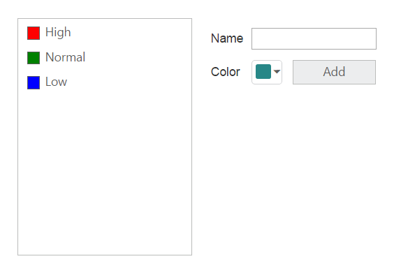
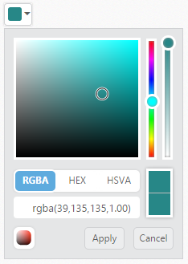
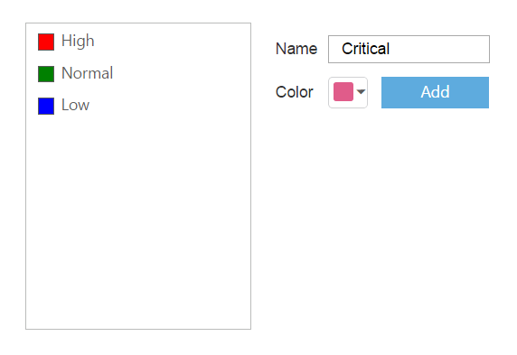
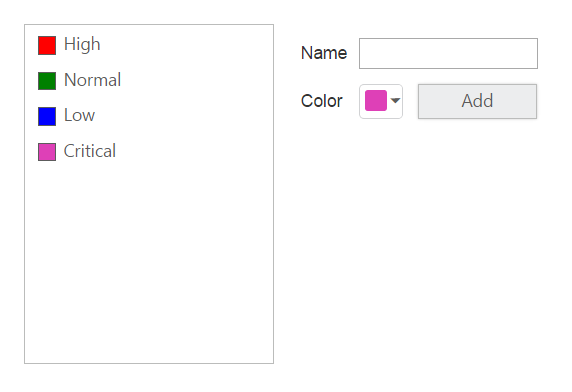

# Getting Started

This section explains briefly about how to create a **ColorPicker** in your application with **JavaScript**. The **Essential JavaScript ColorPicker** control provides you support for selecting the colors in different sources such as palettes, picker or custom palettes. You can also render the color value from control in three formats such as RGB, HSV and HEXCODE. 

In this example, you can learn how to customize **ColorPicker** control in a category Application. 

 

## Create ColorPicker Control

Use the following steps to create the **ColorPicker** control.

1. Create an HTML file and add required scripts and CSS files to render the Essential JavaScript component as given in the [Getting Started](https://help.syncfusion.com/js/control-initialization).

2. Essential JavaScript includes angular directives for all controls with the ej.widget.angular.min.js script file. All the Essential JS directives have been encapsulated into a single module called **ejangular**. To render our ej controls in angular, you need to refer the “angular.min.js” and “ej.widget.angular.min.js” in your application.



<!DOCTYPE html>
    <html xmlns="http://www.w3.org/1999/xhtml" ng-app="ColorPickCtrl">
    <head>
        <meta name="viewport" content="width=device-width, initial-scale=1.0" charset="utf-8" />
        <title>Getting Started Essential JS</title>
        <!-- Style sheet for default theme (flat azure) -->
        <link href="http://cdn.syncfusion.com/{{ site.releaseversion }}/js/web/flat-azure/ej.web.all.min.css" rel="stylesheet" />
        <!--Scripts-->
        
        
        <!--Add custom scripts here -->
    </head>
    <body ng-controller="ColorPickCtrller">
        <input id="CategoryColor" ej-colorpicker e-value="#278787" />
        <!--add the ColorPicker element here -->
    </body>
    </html>



N> jQuery.easing external dependency has been removed from version 14.3.0.49 onwards. Kindly include this jQuery.easing dependency for versions lesser than 14.3.0.49 in order to support animation effects.

Run the above code to render the following output.

 

## Initialize the other widgets

To add the priority value to the **ListBox**, the text value is received from the input element and color for each priority is received by the **ColorPicker** control. To add each new priority value to the **ListBox** control click the **Add** button.

You can refer the following link for more information on creation of **ListBox**.
<http://help.syncfusion.com/js/listbox/overview>

The following code example is used to create the Priority form using **ListBox** control and **ColorPicker** control.



   

   

            

                

                    

                        <ul ej-listbox id="selectcheck">
                            <li>High</li>
                            <li>Normal</li>
                            <li>Low</li>
                        </ul>
                    

                

                

                    <table class="prop-grid">
                        <tr class="row">
                            <td class="column">Name
                            </td>
                            <td class="column">
                                <input type="text" id="categoryName" ng-model="textval"/>
                            </td>
                        </tr>
                        <tr class="row">
                            <td class="column">Color
                            </td>
                            <td class="column">
                                <!--Colorpicker element-->
                                <input id="CategoryColor" ej-colorpicker e-value="#278787" />
                            </td>
                            <td class="column">
                                <!--Add button for add the new category-->
                                <button class="e-btn e-select" id="AddCategory" ej-button e-text="Add" e-height="21px" e-width="82px"></button>
                                <input type="button" class="e-btn e-select" id="AddCategory" />
                            </td>
                        </tr>
                        <tr class="row"></tr>
                    </table>
                

            

   

   



Add the following in the script section.



        angular.module('ColorPickCtrl', ['ejangular'])
           .controller('ColorPickCtrller', function ($scope) {
                    $scope.textval = "";
              }
           });



Add the following style section to align form fields. 





Run the above code to render the following output.

 

## Add value with Selected Color 

You can add the value to **ListBox** with selected color by performing the button click event. The following script section defines the click event for the button element.

Initialize the click event for the button element in **&lt;script&gt;** tag.



<ul ej-listbox id="selectcheck" e-create="onCreate">
    <li>High</li>
    <li>Normal</li>
    <li>Low</li>
</ul>
<input type="text" id="categoryName" ng-model="textval"/>
<button class="e-btn e-select" id="AddCategory" ej-button e-text="Add" e-height="21px" e-width="82px" e-click="addCategoryValue" ></button>





        angular.module('ColorPickCtrl', ['ejangular'])
           .controller('ColorPickCtrller', function ($scope) {
                $scope.textval = "";
                $scope.onCreate = function(e) {
                    listBoxObj = $("#" + this._id).ejListBox('instance')
                }
                $scope.addCategoryValue = function(e) {
                    $scope.textval = "";
                    listBoxObj.addItem("" + $("#categoryName").val());
                }
              }
           });





    jQuery(function ($) {
        //reuse the previous section script block
        //initliaze the button with click event
        $("#AddCategory").ejButton({ text: "Add", click: "addCategoryValue", width: "82px", height: "21px" });
    });

    //The following function used to add the new value to the listbox control
    function addCategoryValue() {
        if ($("#categoryName").val() !== "") {
            //To get the selected color from the colorpicker by using getValue()
            listBoxObj.addItem("" + $("#categoryName").val());
            $("#categoryName").val("");
        }
    }



The following screenshot illustrates the resultant output after you click **Add** button.

  

