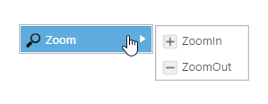

# Context Menu in AngularJS Diagram

In graphical user interface (GUI), a context menu is a type of menu that appears when you perform right-click operation. Nested level of context menu items can be created.
Diagram provides some in-built context menu items and allows to define custom menu items.

## Default Context Menu

The `enableContextMenu` property helps you to enable/disable the context menu. Diagram provides some default context menu items to ease the execution of some frequently used commands.
The following code illustrates how to enable the default context menu items.



    

        <ej-diagram id="diagram" e-height="600px" e-width="100%" e-enableContextMenu true="enableContextMenu">
        </ej-diagram>
    





    syncApp.controller('diagramCtrl', function ($scope) {    
    $scope.enableContextMenu = true;
    });



## Customize Context Menu

Apart from the default context menu items, you can define some additional context menu items. Those additional items have to be defined and added to `contextMenu.items`. Sub menu items for context menu can set using `contextMenu.items.subItems`
The following code example illustrate how to add custom context menu items.



    

        <ej-diagram id="diagram" e-height="600px" e-width="100%" e-enableContextMenu="enableContextMenu"
		 e-contextMenu="contextMenu" e-contextMenu-items="contextMenu.items">
        </ej-diagram>
    





syncApp.controller('diagramCtrl', function($scope) {
    $scope.enableContextMenu = true;
    $scope.contextMenu = {
        // Defines the custom context menu items
        items: [{
            name: "zoom",
            // Text to be displayed
            text: "Zoom",
            // Defines the sub items
            subItems: [{
                name: "zoomIn",
                text: "ZoomIn"
            }, {
                name: "zoomOut",
                text: "ZoomOut"
            }]
        }],
        // Hides the default context menu items
        showCustomMenuItemsOnly: true
    }
});



When you want to display only your custom context menu items, you can set true to the `showCustomMenuItemsOnly` property.

Icons of context menu items can be customized by overriding the default context menu item style.
The following code example illustrates how to customize the icon of context menu items.





## Context Menu Events

You would be notified with events when you try to open the context menu items(`contextMenuBeforeOpen`) and when you click the menu items(`contextMenuClick`). The following code example illustrates how to define those events.



syncApp.controller('diagramCtrl', function($scope) {
    $scope.enableContextMenu = true;
    $scope.contextMenu = {
        items: [{
            name: "zoom",
            text: "zoom"
        }],

        contextMenuBeforeOpen: function(args) {
            //do your custom action here.
        },

        contextMenuClick: function(args) {
            switch (args.text) {
                case "zoom":
                    //do your custom action here.
                    break;
            }
        }
    }
});

