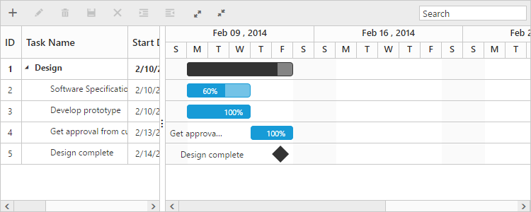
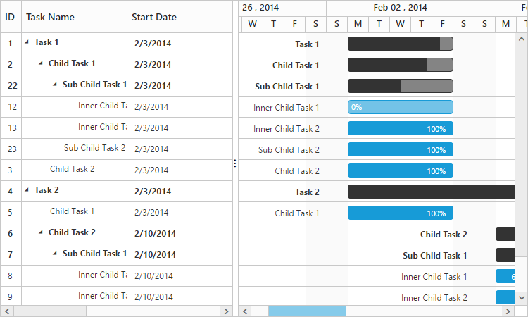

# Data Binding

Data binding is the process that establishes a connection between the application and different kinds of data sources such as business objects. And it is possible to bind local data and remote data in Gantt.

## Local Data Binding

In Local Data Binding, datasource for rendering the Gantt control is retrieved from the same application locally.

Two types of Data Binding are possible with Gantt control, 

* Hierarchical datasource binding
* Self-referential data binding (Flat data)

### Hierarchical data-source binding

The following code example explains how to bind the hierarchical data in Gantt.





### Self-referential data binding (Flat data)

Gantt can be rendered from self-referential data structures, by mapping the task ID and parent task ID fields.

* Task ID field- This field must contain unique values to identify the nodes. It should be mapped to the `e-taskidmapping` property.
* Parent task ID field- This field must contain values to identify the parent nodes. It should be mapped to the `e-parenttaskidmapping` property.



<body ng-controller="GanttCtrl">
   <!--Add  Gantt control here-->    
   

   



The following screenshot shows the output of the above steps.

## Remote data

It is possible to load remote data in Gantt by using ej.DataManager. You can assign the web service data as an ej.DataManager instance to the datasource property. The following example explains how to load the remote data in Gantt.



<body ng-controller="GanttCtrl">
   <!--Add  Gantt control here-->    
   

   

</body>


