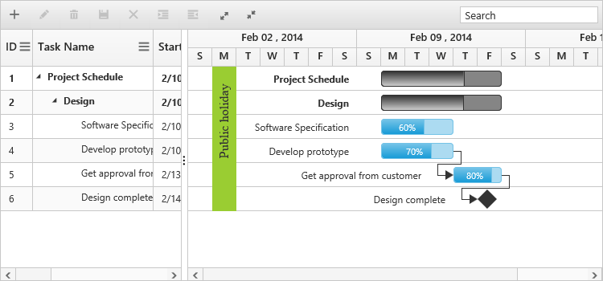

# Holidays

Holidays in Gantt control is used to highlight the non-working days in Gantt control and it can be initialized with Gantt control by using the following code example.



<body ng-controller="GanttCtrl">
   <!--Add  Gantt control here-->    
   

   

   
</body>
   


The following screenshot shows the output of Holidays in Gantt control.

