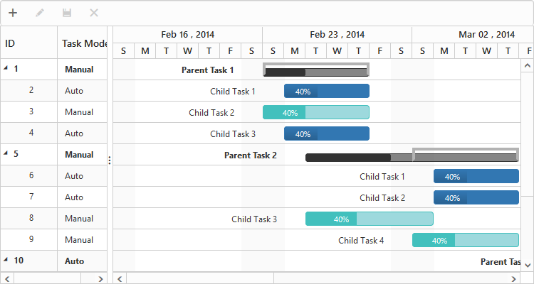

# Task Scheduling Modes

Gantt provides support for automatic and manual task scheduling modes. Using the property **e-taskschedulingmode** we can able to change the scheduling mode of a task. The following are the enumeration values that can be set to the property **e-taskschedulingmode**

* auto
* manual
* custom

## **Automatically** **Scheduled** **tasks**

In this scheduling mode, all the tasks in the project will be rendered as automatically scheduled tasks. The tasks will be automatically scheduled based on the factors such as dependencies between the tasks, non-working days like holidays and weekends. Tasks automatically recalculate the scheduling date when its predecessor task has been affected. But still we can schedule these tasks manually. Summary tasks will also be automatically scheduled, but its start date, end date and duration values cannot be edited manually. 



<body ng-controller="GanttCtrl">
   <!--Add  Gantt control here-->    
   

   

</body>



N> Automatic scheduling mode is the default task scheduling mode in Gantt.

## **Manually** **Scheduled** **tasks**

In this mode, all the tasks in the project will be rendered as manually scheduled tasks. The tasks will not get rescheduled and dates will not be recalculated automatically based on the factors such as task dependencies and non-working days. Manual scheduled tasks will lie on weekends and holidays, but we can restrict this mode in predecessor calculation using the property **e-validatemanualtasksonlinking****.** By enabling this property, the dates of the manual tasks will recalculate automatically, while its predecessor tasks have been affected.



<body ng-controller="GanttCtrl">
   <!--Add  Gantt control here-->    
   

   

</body>



## **Custom**

Tasks can be either automatically scheduled or manually scheduled and we can map the scheduling mode from the datasource field using the mapping property **e-taskschedulingmodemapping**.



<body ng-controller="GanttCtrl">
   <!--Add  Gantt control here-->    
   

   

</body>



The following screen shot depicts a project with both automatically and manually scheduled tasks.

