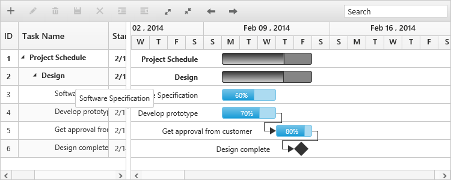

# Tooltip

Gantt has support to display tooltip for both taskbars and for column cells.

## Taskbar Tooltip

In Gantt, you can enable or disable taskbar mouse hover tooltip by using the [e-enabletaskbartooltip](https://help.syncfusion.com/api/js/ejgantt#members:enabletaskbartooltip) property. By default, this property is set to true. The following code example shows, how to enable the taskbar tooltip in Gantt.



<body ng-controller="GanttCtrl">
   <!--Add  Gantt control here-->    
   

   

</body>



This tooltip can be customized further by using [e-taskbartooltiptemplate](https://help.syncfusion.com/api/js/ejgantt#members:taskbartooltiptemplate) this property, which is described briefly in the [customization](https://help.syncfusion.com/js/gantt/customizations) section.

## Taskbar drag tooltip

It is possible to enable or disable the tooltip while performing editing actions on taskbar (left resizing, right resizing, dragging and progress resizing) by using the [e-enabletaskbardragtooltip](https://help.syncfusion.com/api/js/ejgantt#members:enabletaskbardragtooltip)  this property. By default, this property is set to true. The following code example explains this behavior.



<body ng-controller="GanttCtrl">
   <!--Add  Gantt control here-->    
   

   

</body>



## Cell tooltip

It is possible to enable or disable the TreeGrid cell tooltip in mouse hover by using [e-showgridcelltooltip](https://help.syncfusion.com/api/js/ejgantt#members:showgridcelltooltip) property. By default, this property is set to true. The following code example explains, how to enable disable this property,



<body ng-controller="GanttCtrl">
   <!--Add  Gantt control here-->    
   

   

</body>


This tooltip can be customizable using the [e-celltooltiptemplate](https://help.syncfusion.com/api/js/ejgantt#members:celltooltiptemplate) property, which is described briefly in the [customization](https://help.syncfusion.com/js/gantt/customizations) section.

## Tree column (Expander column) tooltip 

It is also possible to display tooltip only for expander column by setting [e-showexpandgridcelltooltip](https://help.syncfusion.com/api/js/ejgantt#members:showgridexpandcelltooltip) property. The following code example shows you to enable expander column tooltip in Gantt.



<body ng-controller="GanttCtrl">
   <!--Add  Gantt control here-->    
   

   

</body>



