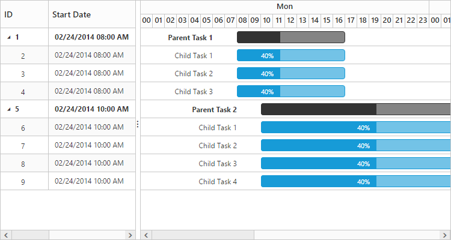

# Working time range

In Gantt control, working hours in a day for the project can be defined by using the **e-dayworkingtime** property. Based on the working hours, automatic date scheduling and duration validations for the task can be performed.

The following code snippet explains how to define the working time range for project in the Gantt control:



<body ng-controller="GanttCtrl">
   <!--Add  Gantt control here-->    
   

   

  
</body>



N> Individual tasks can lie between any time within the defined working time range of the project.

N> The **e-dayworkingtime** property is used to define the working time for the whole project.

The following demo explains the working time range in the Gantt control:

[Working Time Range](http://js.syncfusion.com/demos/web/#!/bootstrap/gantt/schedulingconcepts/workingtimerange)

The following screenshot shows working time range in the Gantt control:

