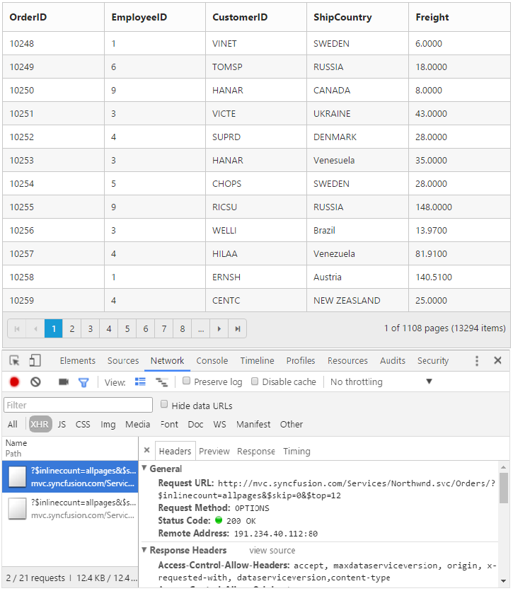

---
layout: post
title: DataBinding with Grid widget for Syncfusion Essential AngularJS
description: How to bind in-memory JSON and remote web services in Grid
platform: angular-1
control: Grid
documentation: ug
--- 
# Data binding

The Grid control uses [`ej.DataManager`](http://helpjs.syncfusion.com/js/datamanager/overview# "ej.DataManager") which supports both RESTful JSON data services binding and local JSON array binding.  The [`e-datasource`](http://help.syncfusion.com/api/js/ejgrid#members:datasource "dataSource") property can be assigned either with the instance of [`ej.DataManger`](http://help.syncfusion.com/api/js/ejdatamanager# "ej.DataManager") or JSON data array collection. It supports different kinds of data binding methods such as

1. Local data
2. Remote data

## Local Data

To bind local data to the Grid, you can assign a JSON array to the [`e-datasource`](http://help.syncfusion.com/api/js/ejgrid#members:datasource "dataSource") property.

The following code example describes the above behavior.



     

          

             

             

             

             

             

          

     

 




	syncApp.controller('dataBindCtrl', function ($scope,$rootScope) {
       //The datasource "window.gridData" is referred from 'http://js.syncfusion.com/demos/web/scripts/jsondata.min.js'
        $scope.data = window.gridData;
     });



The following output is displayed as a result of the above code example.

N> 1. There is no in-built support to bind the XML data to the grid. But you can achieve this requirement with the help of [custom adaptor] concept. 
N> 2. Refer this [Knowledge Base link](http://www.syncfusion.com/kb/3377/how-to-process-xml-data-from-server-using-datamanager-and-bound-to-grid#) for bounding XML data to grid using custom adaptor. 

## Remote Data

To bind remote data to Grid Control, you can assign a service data as an instance of [`ej.DataManager`](http://help.syncfusion.com/api/js/ejdatamanager# "DataManager") to the [`e-datasource`](http://help.syncfusion.com/api/js/ejgrid#members:datasource "dataSource") property.

### OData

OData is a standardized protocol for creating and consuming data. You can provide the [OData service](http://www.odata.org/#) URL directly to the [`ej.DataManager`](http://help.syncfusion.com/api/js/ejdatamanager# "DataManager") class and then you can assign it to Grid [`e-datasource`](http://help.syncfusion.com/api/js/ejgrid#members:datasource "datasource").

The following code example describes the above behavior.



     

          

             

             

             

             

             

          

     

 




	
        var dataManger = ej.DataManager({
          url: "http://mvc.syncfusion.com/Services/Northwnd.svc/Orders";
	  });

      syncApp.controller('dataBindCtrl', function ($scope,$rootScope) {
          $scope.data = dataManger;
      }); 



The following output is displayed as a result of the above code example.

N> By default , if no adaptor is specified for ej.DataMananger and only the url link is mentioned it will consider as ODataService.