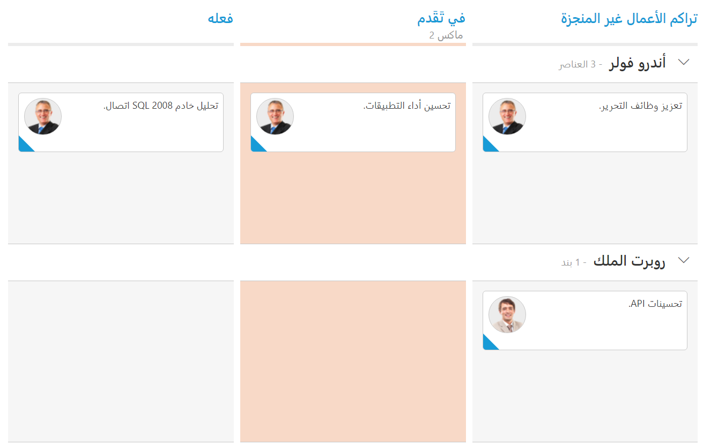

# Localization

## Localization

All text in Kanban can be localized using `ej.Kanban.Locale` object. Please find the table with list of properties and its value in locale object.

<table>
<tr>
<th>
Locale key words </th><th>
Text</th></tr>
<tr>
<td>
EmptyCard
</td><td>
No cards to display
</td></tr>
<tr>
<td>
SaveButton
</td><td>
Save
</td></tr>
<tr>
<td>
CancelButton
</td><td>
Cancel
</td></tr>
<tr>
<td>
EditFormTitle
</td><td>
Details of
</td></tr>
<tr>
<td>
AddFormTitle
</td><td>
Add New Card
</td></tr>
<tr>
<td>
SwimlaneCaptionFormat
</td><td>
"- {{:count}}{{if count == 1 }} item {{else}} items {{/if}}"
</td></tr>
<tr>
<td>
FilterSettings
</td><td>
Filters:
</td></tr>
<tr>
<td>
Min
</td><td>
Min
</td></tr>
<tr>
<td>
Max
</td><td>
Max
</td></tr>
<tr>
<td>
FilterOfText
</td><td>
Of
</td></tr>
<tr>
<td>
Cards
</td><td>
Cards
</td></tr>
<tr>
<td>
ItemsCount
</td><td>
Items Count :
</td></tr>
<tr>
<td>
Unassigned
</td><td>
Unassigned
</td></tr>
<tr>
<td>
AddCard
</td><td>
Add Card
</td></tr>
<tr>
<td>
EditCard
</td><td>
Edit Card
</td></tr>
<tr>
<td>
DeleteCard
</td><td>
Delete Card
</td></tr>
<tr>
<td>
TopofRow
</td><td>
Top of Row
</td></tr>
<tr>
<td>
BottomofRow
</td><td>
Bottom of Row
</td></tr>
<tr>
<td>
MoveUp
</td><td>
Move Up
</td></tr>
<tr>
<td>
MoveDown
</td><td>
Move Down
</td></tr>
<tr>
<td>
MoveLeft
</td><td>
Move Left
</td></tr>
<tr>
<td>
MoveRight
</td><td>
Move Right
</td></tr>
<tr>
<td>
MovetoSwimlane
</td><td>
Move to Swimlane
</td></tr>
<tr>
<td>
HideColumn
</td><td>
Hide Column
</td></tr>
<tr>
<td>
VisibleColumns
</td><td>
Visible Columns
</td></tr>
<tr>
<td>
PrintCard
</td><td>
Print Card
</td></tr>
<tr>
<td>
Search
</td><td>
Search
</td></tr>
</table>

The following code example describes the above behavior.



<!DOCTYPE html>
<html xmlns="http://www.w3.org/1999/xhtml" lang="en" ng-app="KanbanApp">
<head>
    <title>Essential Studio for AngularJS: Kanban</title>
</head>
<body ng-controller="KanbanCtrl">
    

        

            

            

            

        

    

    
</body>
</html>



The following output is displayed as a result of the above code example.

## Right to Left (RTL)

By default, Kanban render its text and layout from left to right. To customize Kanban’s direction, you can change direction from LTR to RTL by using `enableRTL` as true.

The following code example describes the above behavior.



<!DOCTYPE html>
<html xmlns="http://www.w3.org/1999/xhtml" lang="en" ng-app="KanbanApp">
<head>
    <title>Essential Studio for AngularJS: Kanban</title>
</head>
<body ng-controller="KanbanCtrl">
    

        

            

            

            

        

    

    
</body>
</html>



The following output is displayed as a result of the above code example.

