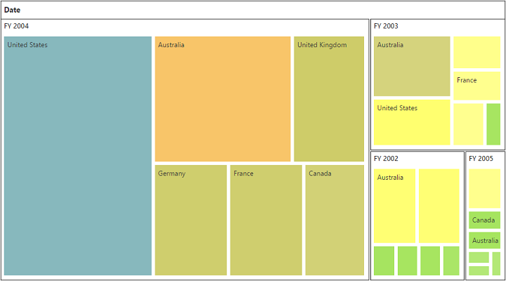

# Color Mapping

You can customize the colors of the leaf nodes of PivotTreeMap using the color mapping support. 

Color mapping is categorized into two different types such as,

* Normal
* Range

You can color all the leaf nodes with the different colors by setting the `color` value of the `rangeColorMapping` property.

### Normal Color Mapping

You can customize the nodes based on number of leaf items using different color ranges. You can also define the color value range using `from` and `to` properties.

The following code sample explains how to customize PivotTreeMap appearance using **Normal** mode (i.e., differentiate color based on number of the leaf items in each header).



<body>
    

        

        <!--Tooltip labels can be localized here-->
           
    

    
</body>



### Range Color Mapping

You can customize the nodes based on its value and color ranges using **Range** color. You can also define the color value range using `from` and `to` properties.

The following code sample explains how to customize PivotTreeMap appearance using **Range** mode (i.e., differentiate color for leaf items based on values).





