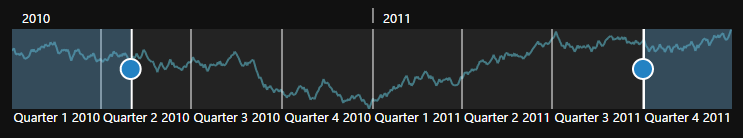

# Appearance and Styling

**JavaScript RangeNavigator** is enriched with lots of customization options for labels, gridlines and slider to develop high quality graphic rich control.

## Customize labels

The labels are found along the range, displaying the value of the data it correspond, both on (higher level label) and below (lower level label) the **RangeNavigator**. **RangeNavigator** labels are further customized using "**font**" property in label Settings. 



<html xmlns="http://www.w3.org/1999/xhtml" lang="en" ng-app="RangeApp">
    <head>
        <title>Essential Studio for AngularJS: RangeNavigator</title>
        <!--CSS and Script file References -->
    </head>
    <body ng-controller="RangeCtrl">
       

       <ej-rangenavigator  e-labelsettings-higherlevel-style-font-color="#ff0000"
       e-labelsettings-higherlevel-style-font-style="normal" 
       e-labelsettings-higherlevel-style-font-weight="regular" 
       e-labelsettings-higherlevel-style-font-size="12px" 
       e-labelsettings-higherlevel-style-font-opacity="1" 
       e-labelsettings-lowerlevel-style-font-color="#ff0000" 
       e-labelsettings-lowerlevel-style-font-size="12px"  
       e-labelsettings-lowerlevel-style-font-opacity="1" 
       e-labelsettings-lowerlevel-style-font-style="normal" 
       e-labelsettings-lowerlevel-style-font-weight="normal">
       </ej-rangenavigator>
       

    
   </body>
</html>

  


 

## Label Placement

Labels in **RangeNavigator** are placed inside or outside of the control. You can customize both the higher and lower level labels using **labelPlacement** property in label setting of **RangeNavigator**. By default **labelPlacement** is "outside" for the both higher and lower level labels.

The following screen shot illustrates both the lower and higher level labels that are placed outside the control with **labelPlacement** specified as outside.


<html xmlns="http://www.w3.org/1999/xhtml" lang="en" ng-app="RangeApp">
    <head>
        <title>Essential Studio for AngularJS: RangeNavigator</title>
        <!--CSS and Script file References -->
    </head>
    <body ng-controller="RangeCtrl">
       

       <ej-rangenavigator  e-labelsettings-higherlevel-labelplacement="inside"
       e-labelsettings-lowerlevel-labelplacement="inside"></ej-rangenavigator>
       

    
   </body>
</html>



The following screenshot illustrates a **RangeNavigator** with labels inside the control after specifying the **labelPlacement** as inside.

 

## Customize RangeNavigator

RangeNavigator is customized using **navigatorStyleSettings** properties. You can customize the selected and unselected region color using **selectedRegionColor**, **unselectedRegionColor** in **navigatorStyleSettings** and the thumb of the slider using **thumbColor, thumbRadius** and **thumbStroke** in **navigatorStyleSettings.  majorGridLineStyle** and **minorGridLineStyle**  are used to customize the grid line color and visibility.



 <html xmlns="http://www.w3.org/1999/xhtml" lang="en" ng-app="RangeApp">
    <head>
        <title>Essential Studio for AngularJS: RangeNavigator</title>
        <!--CSS and Script file References -->
    </head>
    <body ng-controller="RangeCtrl">
       

       <ej-rangenavigator e-navigatorstylesettings-unselectedregioncolor="white" 
       e-navigatorstylesettings-selectedregioncolor="#5EABDE" 
       e-navigatorstylesettings-thumbcolor="white"
       e-navigatorstylesettings-thumbradius="10" 
       e-navigatorstylesettings-thumbstroke="#303030" 
       e-navigatorstylesettings-background="transparent" 
       e-navigatorstylesettings-border-color="black" 
       e-navigatorstylesettings-border-width="3" 
       e-navigatorstylesettings-majorgridlinestyle-color="transparent"
       e-navigatorstylesettings-minorgridlinestyle-color="transparent"
       e-labelsettings-higherlevel-style-font-color="black" 
       e-labelsettings-higherlevel-style-font-size="13px" 
       e-labelsettings-higherlevel-style-font-opacity="1"
       e-labelsettings-higherlevel-style-horizontalalignment="left" 
       e-labelsettings-higherlevel-intervaltype="years" 
       e-labelsettings-higherlevel-labelplacement="inside"
       e-labelsettings-lowerlevel-style-font-color="black" 
       e-labelsettings-lowerlevel-style-font-size="12px" 
       e-labelsettings-lowerlevel-style-font-opacity="1" 
       e-labelsettings-lowerlevel-style-horizontalalignment="center" 
       e-labelsettings-lowerlevel-intervaltype="quarters" 
       e-labelsettings-lowerlevel-labelplacement="inside">
       </ej-rangenavigator>
       

    
   </body>
</html>



 

## Themes

**RangeNavigator** theme is a set of pre-defined options that are applied to the control before each **RangeNavigator** is instantiated. Following predefined themes are available in JavaScript **RangeNavigator**.

1. flatlight
2. flatdark
3. gradientlight 
4. gradientdark 
5. azure                      
6. azuredark               
7. lime 
8. limedark
9. saffron
10. saffrondark
11. gradientazure
12. gradientazuredark
13. gradientlime
14. gradientlimedark
15. gradientsaffron
16. gradientsaffrondark



<html xmlns="http://www.w3.org/1999/xhtml" lang="en" ng-app="RangeApp">
    <head>
        <title>Essential Studio for AngularJS: RangeNavigator</title>
        <!--CSS and Script file References -->
    </head>
    <body ng-controller="RangeCtrl">
       

       <ej-rangenavigator e-theme="azuredark"></ej-rangenavigator>
         

    
   </body>
</html>



 
