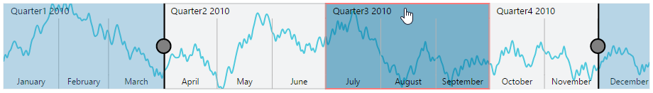

# User Interactions

## Highlight

EjRangeNavigator provides highlighting supports to the intervals on mouse hover. To enable the highlighting option, set the [`enable`](../api/ejrangenavigator#members:navigatorstylesettings-highlightsettings-enable) property to true in the [`highlightSettings`](../api/ejrangenavigator#members:navigatorstylesettings-highlightsettings) of [`navigatorStyleSettings`](../api/ejrangenavigator#members:navigatorstylesettings).



   <html xmlns="http://www.w3.org/1999/xhtml" lang="en" ng-app="RangeApp">
    <head>
        <title>Essential Studio for AngularJS: RangeNavigator</title>
        <!--CSS and Script file References -->
    </head>
    <body ng-controller="RangeCtrl">
       

       <ej-rangenavigator e-navigatorstylesettings-highlightsettings-enable="true"></ej-rangenavigator>
         

    
    </body>
</html>



 

### Customize the highlight style

To customize the highlighted intervals, use color, border and opacity options in the [`highlightSettings`](../api/ejrangenavigator#members:navigatorstylesettings-highlightsettings).



   <html xmlns="http://www.w3.org/1999/xhtml" lang="en" ng-app="RangeApp">
    <head>
        <title>Essential Studio for AngularJS: RangeNavigator</title>
        <!--CSS and Script file References -->
    </head>
    <body ng-controller="RangeCtrl">
       

       <ej-rangenavigator e-navigatorstylesettings-highlightsettings-enable="true" e-navigatorstylesettings-highlightsettings-color="#006fa0" 
       e-navigatorstylesettings-highlightsettings-border-color="red" e-navigatorstylesettings-highlightsettings-border-width="2"></ej-rangenavigator>
         

    
    </body>
</html>



## Selection

EjRangeNavigator provides selection supports to the intervals by, clicking and dragging the highlighted intervals. To enable the selection option, set the [`enable`](../api/ejrangenavigator#members:navigatorstylesettings-selectionsettings-enable) property to true in the [`selectionSettings`](../api/ejrangenavigator#members:navigatorstylesettings-selectionsettings).



   <html xmlns="http://www.w3.org/1999/xhtml" lang="en" ng-app="RangeApp">
    <head>
        <title>Essential Studio for AngularJS: RangeNavigator</title>
        <!--CSS and Script file References -->
    </head>
    <body ng-controller="RangeCtrl">
       

       <ej-rangenavigator e-navigatorstylesettings-selectionsettings-enable="true" ></ej-rangenavigator>
         

    
    </body>
</html>
  



 

### Customize the selection style

To customize the selected intervals, use color, border and opacity options in the selectionSettings.



  <html xmlns="http://www.w3.org/1999/xhtml" lang="en" ng-app="RangeApp">
    <head>
        <title>Essential Studio for AngularJS: RangeNavigator</title>
        <!--CSS and Script file References -->
    </head>
    <body ng-controller="RangeCtrl">
       

       <ej-rangenavigator e-navigatorstylesettings-selectionsettings-enable="true" e-navigatorstylesettings-selectionsettings-color="#27e8e5" 
       e-navigatorstylesettings-selectionsettings-border-color="red" e-navigatorstylesettings-selectionsettings-border-width="2"></ej-rangenavigator>
         

    
    </body>
</html>



## Scrollbar

* To render the Scrollbar in RangeNavigator, you need to enable [`enableScrollbar`](../api/ejrangenavigator#members:enablescrollbar) option.
 
* [`scrollRangeSettings`](../api/ejrangenavigator#members:scrollrangesettings) of  rangenavigator [`start`](../api/ejrangenavigator#members:scrollrangesettings-start) and [`end`](../api/ejrangenavigator#members:scrollrangesettings-end) value is used to set the minimum and maximum datasource value to be added in the rangenavigator.
 
* Based on the scrollRangeSettings *start, end* value and dataSource *start, end* value scrollbar will be adjust.

* When you change the scrollbar position, [`scrollEnd`](../api/ejrangenavigator#events:scrollend) event returns the current position of start and end range value.



 <html xmlns="http://www.w3.org/1999/xhtml" lang="en" ng-app="RangeApp">
    <head>
        <title>Essential Studio for AngularJS: RangeNavigator</title>
        <!--CSS and Script file References -->
    </head>
    <body ng-controller="RangeCtrl">
       

       <ej-rangenavigator e-enablescrollbar="true" e-scrollrangesettings-start="2010/0/1" e-scrollrangesettings-end="2011/10/31" e-scrollend="onScrollbarchange"></ej-rangenavigator>
         

    
    </body>
</html>
      



