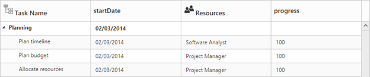
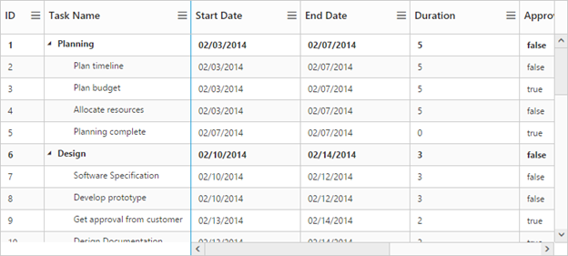
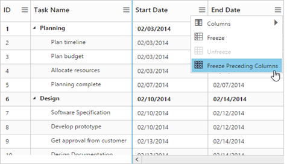
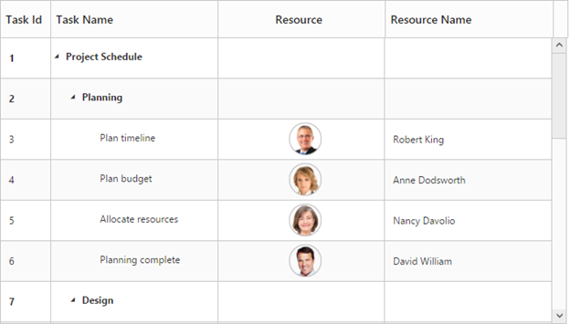
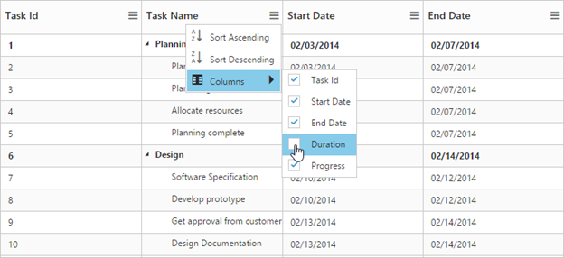
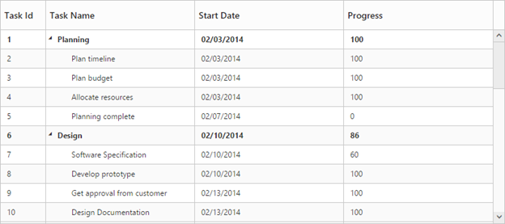

# Columns

Column definitions, specified in the **e-columns** option, define how the data in the **e-datasource** have to be displayed, formatted and edited in TreeGrid. The values in the **e-datasource** can be mapped to the appropriate column using the **‘field’** property of the corresponding column object.

## Formatting

The values in each column can be formatted using the **‘format’** property of the column object.

The following example shows how to specify the numeric format string to display currency, percentage symbols and date values in a column,



<!doctype html>
<body ng-controller="TreeGridCtrl">
    <!--Add  treegrid control here-->
    

    

    
</body>



Note: For more numeric format strings, please refer this [link](https://msdn.microsoft.com/library/dwhawy9k(v=vs.100).aspx).

For more date format strings, please refer this [link](https://msdn.microsoft.com/library/az4se3k1(v=vs.100).aspx).

## Headers

### Header text

Using **e-columns.headerText** property, you can provide the title for a specific column. The below code snippet is shows how to set header text for the columns,



<!doctype html>
<body ng-controller="TreeGridCtrl">
    <!--Add  treegrid control here-->
    

    

    
</body>



### Text wrapping

It is possible to wrap the header text or the title for the column, when the content exceeds the column width using the **e-headertextoverflow** property. By default this property is set to **none**. To enable wrapping of header text, you have to set **e-headertextoverflow** property to **‘wrap’**. The below code snippet demonstrates this,



<!doctype html>
<body ng-controller="TreeGridCtrl">
    <!--Add  treegrid control here-->
    

    

</body>



### Header Template

Using **e-columns.headerTemplateID** property, you can specify the Id of the script element, which contains the JsRender template, to the specific column.

Following code snippet shows how to set the header template,



<body ng-controller="TreeGridCtrl">
    
    
    <!--Add  treegrid control here-->
    

    

    
</body>
    



The below screenshot depicts column headers with custom templates,

## Frozen Columns

Specific columns can be frozen by enabling **e-columns.isFrozen** property of the respective column object. The columns which are frozen remain static while scrolling the content horizontally. You can also freeze or unfreeze a column during runtime, by selecting Freeze or Unfreeze menu item in the column menu. These set of menu options will be displayed in all the columns when **e-columns.isFrozen** property is enabled in any of the columns. However you can control the visibility of these menu options in a particular column by enabling/disabling the **e-columns.allowFreezing** property of that specific column.



<body ng-controller="TreeGridCtrl">
    <!--Add  treegrid control here-->
    

    

    
</body>



The below screenshot depicts TreeGrid with frozen columns,

It is also possible to freeze all the preceding columns by choosing *Freeze Preceding Columns* option in the column menu.

## Resizing

You can resize the column width to view the hidden text of the cell. This feature can be enabled by setting **allowColumnResize** property to true.



<body ng-controller="TreeGridCtrl">
    <!--Add  treegrid control here-->
    

    

</body>



## Column Template

Columns can be customized either by using JsRender templates or by AngularJS templates,

Using **e-columns.templateID** property, you can specify the Id of the script element, which contains the template for the column. However, you need to enable **e-columns.isTemplateColumn** property for the specific column to display the custom template instead of default template.

Following code example show how to define template for the column,



<body ng-controller="TreeGridCtrl">
    <!--Add  TreeGrid control here-->
    

    

    
</body>



## Column Menu

Column menu can be displayed in column header by enabling **‘e-showcolumnchooser’**.

Following are the items displayed in the column menu,

* **Column Chooser** – Display all the column names; you can enable or disable a column by select or deselect the respective column name in the column chooser menu.
* **Sort Ascending & Sort Descending** – Used to sort the items in the column. These menu options will be displayed only when you enable **e-allowsorting** property to true. To perform multilevel sorting, the **‘e-allowmultisorting’** property should be enabled.
* **Freeze, Unfreeze & Freeze Preceding Columns** – Used to freeze or unfreeze the columns. These set of menu options will be displayed in all the columns when **e-columns.isFrozen** property is enabled in any of the columns. However you can control the visibility of these menu options in a particular column by enabling/disabling the **e-columns.allowFreezing** property of that specific column.



<body ng-controller="TreeGridCtrl">
    <!--Add  TreeGrid control here-->
    

    

    
</body>



## Changing position of expander column

The position of the expander column, which acts as tree column, can be changed using the **‘e-treecolumnindex’** property,

Following code example shows how to change the position of the expander column,



<body ng-controller="TreeGridCtrl">
    <!--Add  treegrid control here-->
    

    

</body>



## Visibility

Columns can be hidden on loading by setting the **‘e-columns.visible’** property as false,

Following code example explains how to hide the fourth column,



<body ng-controller="TreeGridCtrl">
    <!--Add  TreeGrid control here-->
    

    

    
</body>



## Read-only

A column can be made read-only by setting the **e-columns.allowEditing** property as false,

Note: By setting columns.allowEditing as false, that specific column alone is made as read only, and by setting editSettings.allowEditing as false, the entire TreeGrid is made read only.

The below code snippet demonstrates this,



<body ng-controller="TreeGridCtrl">
   <!--Add  TreeGrid control here-->
   

   

   
</body>

