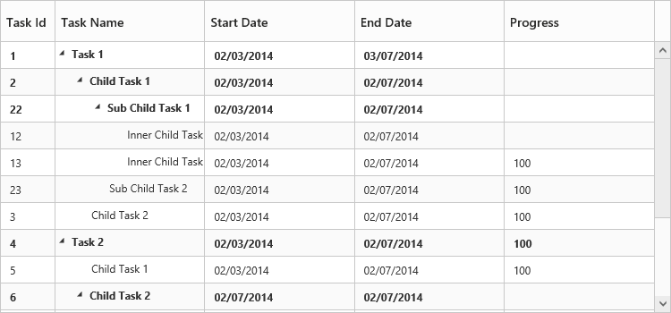

# Data Binding

Data Binding is the process that establishes a connection between the application and different kinds of data sources such as business objects.

## Local Data Binding

In Local Data Binding, datasource for rendering the TreeGrid control is retrieved from the same application locally.

Two types of Data Binding are possible with TreeGrid control, 

* Hierarchical Datasource Binding
* Self-Referential Data Binding (Flat Data)

### Hierarchy Datasource Binding

The following code example shows you how to bind the hierarchical local data into the TreeGrid control.



<body ng-controller="TreeGridCtrl">
    <!--Add  treegrid control here-->
    

    

    
</body>



The output of the above steps is as follows:

###Self-Referential Data Binding (Flat Data)

TreeGrid is rendered from Self-Referential data structures by providing two fields: **ID** field and **parent ID** field.

* **ID Field** - This field contains unique values used to identify nodes. Its name is assigned to the [`e-idmapping`](/api/js/ejtreegrid#idmappingspan-classtype-signature-type-stringstringspan "idMapping") property.
* **Parent ID Field** - This field contains values that indicate parent nodes. Its name is assigned to the [`e-parentidmapping`](/api/js/ejtreegrid#parentidmappingspan-classtype-signature-type-stringstringspan "parentIdMapping") property.



<body ng-controller="TreeGridCtrl">
    <!--Add  treegrid control here-->
    

    

    
</body>



The following screenshot shows the output of the above steps,

