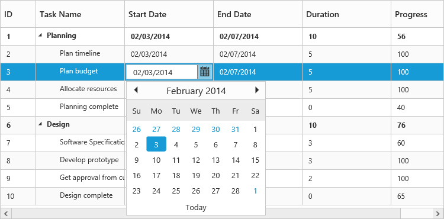

# Editing

The TreeGrid control provides built-in support for editing cell items. 

## Cell Editing

Update the task details through cell editing by setting [`editMode`](/api/js/ejtreegrid#editsettingseditmodespan-classtype-signature-type-stringstringspan "editSettings.editMode") as `cellEditing`.

The following code example shows you how to enable `cellEditing` in TreeGrid control.



<body ng-controller="TreeGridCtrl">
    <!--Add  treegrid control here-->
    

    

    
</body>


The output of the TreeGrid with `cellEditing` is as follows.

