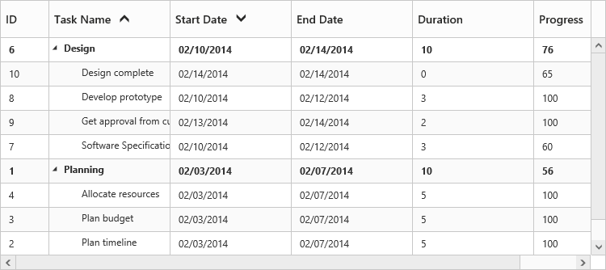

# Sorting

The TreeGrid control for JavaScript has built-in support for Sorting one or more columns.

### Sorting Columns

TreeGrid allows the items to be sorted in ascending or descending order based on the selected column by enabling the [`e-allowsorting`](/api/js/ejtreegrid#allowsortingspan-classtype-signature-type-booleanbooleanspan "allowSorting") property in TreeGrid control. The following code example shows you how to enable Sorting in TreeGrid control.



<body ng-controller="TreeGridCtrl">
    <!--Add  treegrid control here-->
    

    

</body>


### Multicolumn sorting

TreeGrid allows you to sort multiple columns by clicking the desired column headers while holding the `Ctrl` key. The following code example shows you how to enable **Multicolumn sorting** in TreeGrid control.



<body ng-controller="TreeGridCtrl">
    <!--Add  treegrid control here-->
    

    

</body>


The following screenshot shows the output of multicolumn sorting in TreeGrid control.

