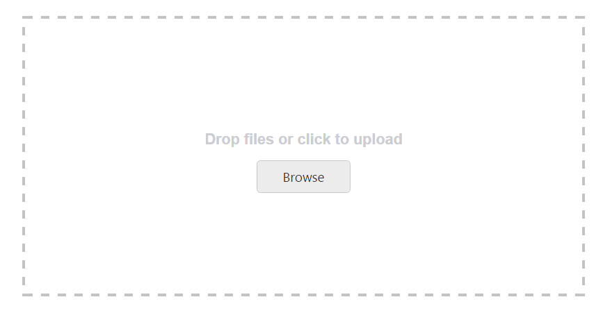

# Drag and Drop Support

The **Uploadbox** control provides the drag and drop support. You can simply drag-and-drop files, directly from the computer and can be dropped into the droppable area. A list of files can be dragged and dropped when you enable the [multipleFilesSelection](https://help.syncfusion.com/api/js/ejuploadbox#members:multiplefilesselection).

The following screenshot displays the drag and drop support.

 

## Enable drag and drop 

You can enable or disable drag and drop by using the [allowDragAndDrop](https://help.syncfusion.com/api/js/ejuploadbox#members:allowdraganddrop) property. By default, the **allowDragAndDrop** property is set as **False** in the **Uploadbox** control. You can enable drag and drop by setting the [allowDragAndDrop](https://help.syncfusion.com/api/js/ejuploadbox#members:allowdraganddrop) property as **True**. When you want to drag and drop multiple files, you can enable multiple file selection by setting **multipleFilesSelection** as **True** in the **Uploadbox** control.

The following steps explain how to enable the drag and drop in the **Uploadbox** control.

In the HTML page, add a **&lt;div&gt;** element to enable the drag and drop in Uploadbox control.



    

        

    





    angular.module('UploadboxApp', ['ejangular'])
    .controller('UploadboxCtrl', function ($scope) {
        $scope.save = "saveFiles.ashx";
        $scope.remove= "removeFiles.ashx";
    });



In CSS, configure the custom styles for drag and drop.





The following screenshot displays the output for the above code.

 

## Drag Area text

You can change the drag area text by using the **dragAreaText** property.  By default, the **dragAreaText** (string) property is **Drop files or click to upload** in the Uploadbox control.

In the **HTML** page, add a **&lt;div&gt;** element to enable the drag and drop in the **Uploadbox** control.



    

        

    





    angular.module('UploadboxApp', ['ejangular'])
        .controller('UploadboxCtrl', function ($scope) {
            $scope.save = "saveFiles.ashx";
            $scope.remove= "removeFiles.ashx";
    });



In CSS, configure the custom styles for drag and drop.





 The following screenshot displays the output for the above code.

 

## Adjust Drop area size

The **Uploadbox** control provides the ability to change or adjust the drop area size. The [dropAreaHeight](https://help.syncfusion.com/api/js/ejuploadbox#members:dropareaheight) and [dropAreaWidth](https://help.syncfusion.com/api/js/ejuploadbox#members:dropareawidth) properties in the **Uploadbox** control allows you to set the maximum height and maximum width for the drop area. The value set to this property is **string** or **number** type.

The following steps explain you on how to adjust the Drop Area Size.

In the **HTML** page, add a **&lt;div&gt;** element to enable the drag and drop in **Uploadbox** control.



    





  angular.module('UploadboxApp', ['ejangular'])
        .controller('UploadboxCtrl', function ($scope) {
            $scope.save = "saveFiles.ashx";
            $scope.remove= "removeFiles.ashx";
   });



The following screenshot displays the output for the above code.

 

## Drop area with Browse button behavior

You can click anywhere in the droppable area to browse and upload the files. The droppable area behaves like a browse button.

### Droppable area behavior

Enable the **allowDragAndDrop** property to achieve this feature. Next, set the [showBrowseButton](https://help.syncfusion.com/api/js/ejuploadbox#members:showbrowsebutton) as **False** in Uploadbox Control.

The following steps explain the droppable area containing the browse button behavior.

In the **HTML** page, add a **&lt;div&gt;** element to enable drag and drop in the **Uploadbox** control.



    

        

    





    angular.module('UploadboxApp', ['ejangular'])
        .controller('UploadboxCtrl', function ($scope) {
            $scope.save = "saveFiles.ashx";
            $scope.remove= "removeFiles.ashx";
    });



In CSS, configure the custom styles for drag and drop.





The following screenshot displays the output for the above code.

